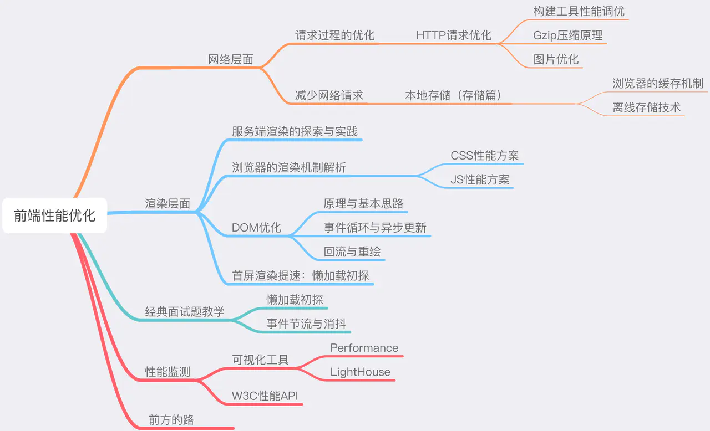

# Web 性能优化

web 应用性能优化一般在于产品交付的阶段，当然在开发周期允许的情况下，有意识对可能导致性能问题提前考虑是大大有利的。 web 应用的性能优化包括服务端与客户端（浏览器），服务端在于响应速度，客户端则在于渲染交互，前端的优化往往能起到立竿见影的效果。另外对于开发过程的优化也属于性能优化的范畴，例如利用 webpack 进行开发如何提升工作效率。

本次的研究是以浏览器端的性能优化为主，整体思路是：从浏览器输入URL 到页面渲染出来经历的过程。

<!-- 具体的计划如下： -->
<!-- 
- 工具监控篇（在后面所有的篇章都会涉及到，因此先放到前面）
  - [x] 常见性能指标 fps
  - [x] 通用测试工具—— Chrome Performane、LightHouse 与性能API、PhantomJS
  - [ ] 微观性能优化工具（针对算法）jsperf
- 网络篇
  - [x] 《从浏览器输入 URL 到页面加载完成的过程》所涉及到性能相关的内容总览。
  - [x] 图片优化——图片格式、在线生成图片等。
  - [ ] 打包工具性能优化——webpack、Gzip 压缩、如何减少打包时间、减少打包后的文件体积。
- 缓存篇
  - [x] 浏览器缓存机制——缓存位置、强缓存、如何避免缓存静态资源。
  - [x] 浏览器本地存储——cookie、storage、indexDB。
- 渲染篇
  - [x] 理解浏览器背后的渲染原理——如何解析一个 HTML 页面。
  - [x] DOM 优化——优化原理、回流与重绘。
  - [x] Event Loop 与异步更新策略（这部分的原理可以看这个仓库[JS 事件循环与异步更新](https://jecyu.github.io/JS-Event-Loop/)，这次侧重于性能方面，worker、抽离出来异步更新的优越性（不同时改））。
- 应用篇
  - [ ] 内存管理——JS 栈、堆
  - [ ] 框架性能优化——Vue 应用优化相关知识、VueCli 的性能相关设置、首屏优化、微前端的性能知识。（review vue-source-code 系列）
  - [x] 编码优化——CSS、JS（事件的节流与防抖）、耗性能操作和时间复杂度。
  - [x] 大数据量下的渲染优化策略 -->

<!-- 每部分都要对应的文章讲解。 -->
<!-- 相信使用过 Vue 开发应用的同学，肯定用过 nextTick 这个手法来处理异步视图 更新的问题，例如获取一个。我以前也常常用 vue nextTick 这么做，由于我并不明白为什么要这么做，导致就是有时候管用，有时候不管用。不管用的时候，于是我去 Google 了一番 “nextTick”，看到不少文章里都提到了<strong>事件循环</strong>，提到**宏任务**，**微任务**这些？一头雾水，当时我妄图想通过一两篇文章来快速搞懂这些东西，结果后面很快又忘了。

归根结底，还是我的计算基础不够扎实。而事件循环系对于前端er 来说，是非常重要的。于是，今次我就这方面的内容，从计算机 CPU 的相关基础知识到浏览器层面的事件循环系统梳理，希望给对事件循环理解不够透彻的同学带来点帮助。当然，在此也非常感谢网上的优秀文章、视频等资源，让我节省不少学习的时间。

本电子书的目标是让前端开发者知道什么是进程与线程、浏览器的JS 单线程机制等，当他写代码的时候，能够预知异步代码的运行时机及如何使用异步的代码来实现业务功能，视图 DOM 的更新。本书内容分享围绕着三部分：事件循环，异步，DOM 渲染。

- Given
一个对事件循环半懂不懂的人🚶
- When
当他🚶看完并练习本电子书后
- Then
  - 他能够把`Given/When/Then`的套路学会。
  - 他能够描述出并发及并行的区别。、
  - 他清晰地描述出进程与线程的区别以及 JS 单线程带来的好处。
  - 当他写代码的时候，他能够预知异步代码的运行时机及如何使用异步的代码来实现业务功能，DOM 的更新。
  - 他知道什么情况下浏览器会阻塞页面，当遇到页面卡顿时，他能够使用浏览器性能监测工具定位原因。 -->
<!--  -->

<!-- ## 章节目录

为了让同学们系统地理解事件循环的知识，分为栈和队列、CPU、浏览器、事件循环、Vue、chrome 性能六个章节，如下图：

**第一章：回顾硬核知识：栈、队列**

讲解了栈和队列的相关概念以及它们的基本用法，为后面的知识打下基础。

**第二章：说说 CPU 层面的运作**

描述了下CPU线程、进程、阻塞、非阻塞、并发、并行、i/o 读写。

**第三章：谈谈浏览器背后的运行机制**

详细讲解了浏览器背后的运作原理，从浏览器多进程架构到浏览器内核的组成部分。

**第四章：深入剖析 JS 事件循环原理**

讲解了从 Event loop 谈 JS 的运行机制到 宏任务（macrotask）与微任务（microtask）。

**第五章：Vue 异步更新策略：nextTick**

结合 Vue 的响应式源码，主要讲解了 Vue 是如何异步更新DOM的。

**第六章：扩展应用：chrome 性能监测**

结合前面几章学到的知识，分析下如何使用 chrome 性能监测工具。 -->

## 参考资料

- [Web 性能优化资源合集（持续更新）](../reference/README.md)

## 声明

本书的内容会借鉴和参考社区优秀的文章，如有侵犯你的权益，请联系我修改删除，感谢社区的贡献🙏。

> 如果本仓库对你有帮助，请点个 star，也是对作者的鼓励。
> 