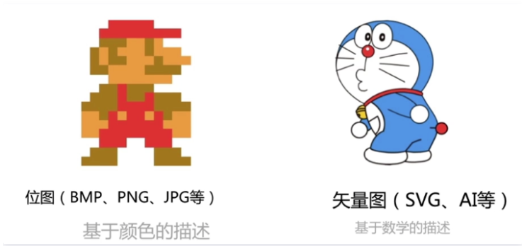
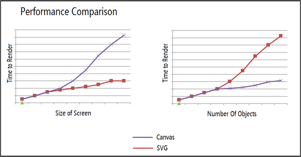

# 图表的性能优化

概要：
- 图标技术：
  - svg
  - canvas
  - webGL
- 图表库
  - echart
  - g2

## 基础

### 什么是 SVG

- 一种使用 `XML` 描述的 2D 图形的语言
- SVG 基于 XML 意味着，SVG DOM 中的每个元素都是可用的，可以为某个元素附加 JavaScript 事件处理器。
- 在 SVG 中，每个被绘制的图形均为视为对象。如果 SVG 对象的属性发生变化，那么浏览器能够自动重现。（ `svgElement.setAttribute(handle.name, handle.value`); // 改变属性）

### 什么是 Canvas

- 通过 JavaScript 来绘制 2D 图形
- 是逐`像素`进行渲染的
- 其位置发生改变，会重新进行绘制。

### 什么是 WebGL 3D？

- 说白了就是基于 Canvas 的 3D 框架
- 主要用来做 3D 展示、动画、游戏

## SVG vs Canvas

Canvas 较新，由 Apple 私有的技术发展而来。而 SVG 历史悠久，2003 年成为 W3C 标准。为什么有了 Canvas 后，还要使用 svg
？

最明显的原因是，因为svg 是不依赖于终端设备的像素，可以随意缩放大小而不会失真，canvas 则会变模糊。为什么会导致这样的差别呢？因为 SVG 的渲染原理是<u>通过对图形的数学描述来绘图的。</u>例如：以下多啦 A 梦的头型的思路是，我们先画一个贝塞尔函数，然后填充颜色。

而 Canvas 的渲染原理是<u>通过对每个像素颜色的填充，最后组成图形。</u>例如，以下马里奥的帽子我们可以看出，其实帽子的形状是由一个个像素填充出来的。

另外 Canvas 渲染出来的图叫位图，SVG 渲染出来的图叫矢量图。

是不是所有图形都用 SVG 画就好了，位图就淘汰了（目前来说是不可能的，像照相机的出图都是 jpg、png 等位图）。SVG 也有它的缺点。

### 详细对比

### 性能对比

性能对比要看场景。从底层来看，Canvas 的性能受画布尺寸影响更大，而 SVG 的性能受图形元素影响更大。下图是微软 MSDN 上给的一个对比图：

比较流行的看法是 SVG 做定制和交互更有优势，

Canvas 是个像素库，绘制完了基本不用记录过长，更快。svg 建立了一大堆可交互对象，本性长于交互，但性能会弱些。但是可以对 Canvas 封装一层，可以让 Canvas 像 svg 一样操作和交互。

<!-- demo -->

### 为什么 Arcgis 4.0 采用了 Canvas 替代了 SVG 显示地图

SVG 的渲染成本比较高，因为 dom 节点过多。而 canvas 呢？

## webGL 性能优化

## 图表库的选择与性能对比

<!-- 如何选择图表库 -->

## 小结
