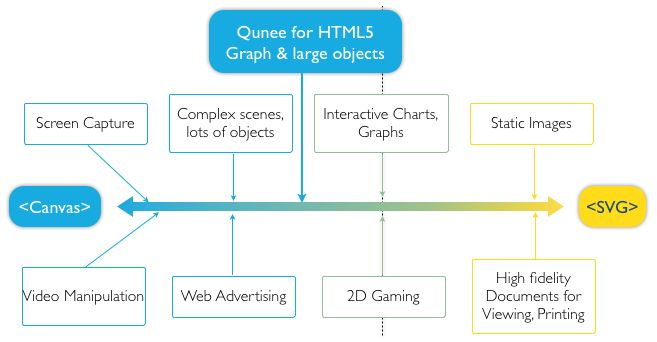
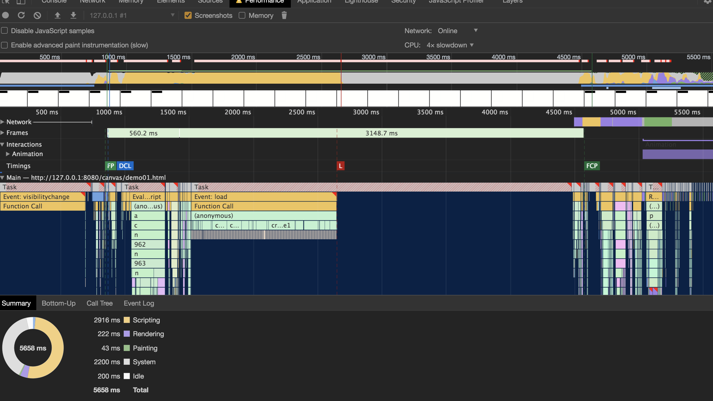
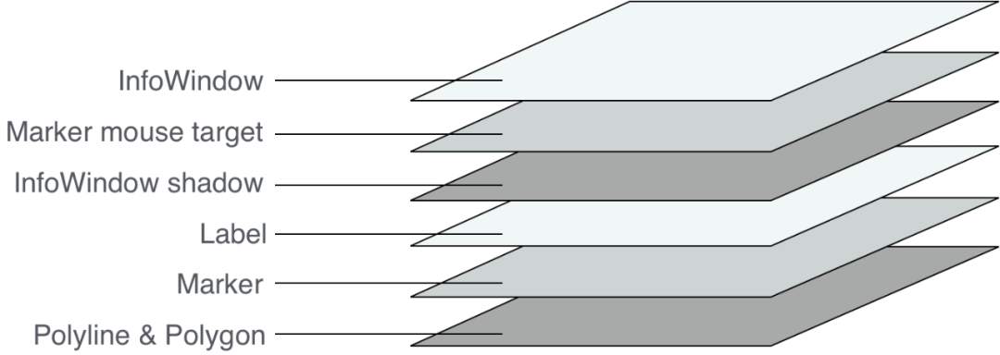

# 图表的性能优化

## 前言

有人听说 SVG 和 Canvas 的同学吗？能够说说他们的区别否？

图表的性能优化也离不开两个方面：渲染速度 + 交互响应。
策略离不开：懒加载、按需（即局部）

概要：
- 绘图技术：
  - SVG
  - Canvas
  - WebGL
- 图表库
  - Echart
  - G2（AntV 团队）
  - d3
- 地图引擎
  - 百度地图
  - Arcgis
  - OpenLayers

## 基础

### 什么是 SVG

- 一种使用 `XML` 描述的 2D 图形的语言
- SVG 基于 XML 意味着，SVG DOM 中的每个元素都是可用的，可以为某个元素附加 JavaScript 事件处理器。
- 在 SVG 中，每个被绘制的图形均为视为对象。如果 SVG 对象的属性发生变化，那么浏览器能够自动重现。（ `svgElement.setAttribute(handle.name, handle.value`); // 改变属性）

### 什么是 Canvas

- Canvas 通过 JavaScript 来绘制 2D 图形。
- Canvas 是逐像素进行渲染的。
- 在 canvas 中，一旦图形被绘制完成，它就不会继续得到浏览器的关注。如果其位置发生变化，那么`整个场景也需要重新绘制`，包括任何或许已被图形覆盖的对象。

### 什么是 WebGL？

WebGL 既可以绘制 2D 图形，也可以绘制 3D 图形。

- 基于 Canvas 的 3D 框架
- 主要用来做 3D 展示、动画、游戏

## SVG vs Canvas

Canvas 较新，由 Apple 私有的技术发展而来。而 SVG 历史悠久，2003 年成为 W3C 标准。为什么有了 Canvas 后，还要使用 svg
？

最明显的原因是，因为svg 是不依赖于终端设备的像素，可以随意缩放大小而不会失真，canvas 则会变模糊。为什么会导致这样的差别呢？因为 SVG 的渲染原理是<u>通过对图形的数学描述来绘图的。</u>例如：以下多啦 A 梦的头型的思路是，我们先画一个贝塞尔函数，然后填充颜色。

而 Canvas 的渲染原理是<u>通过对每个像素颜色的填充，最后组成图形。</u>例如，以下马里奥的帽子我们可以看出，其实帽子的形状是由一个个像素填充出来的。

另外 Canvas 渲染出来的图叫位图，SVG 渲染出来的图叫矢量图。

是不是所有图形都用 SVG 画就好了，位图就淘汰了（目前来说是不可能的，像照相机的出图都是 jpg、png 等位图）。SVG 也有它的缺点。

### 详细对比

Canvas
- 依赖分辨率
- 不支持事件处理器
- 弱的文本渲染能力
- 能够以 `·png` 或 `.jpg` 格式保存结果图像
- 最适合图像密集型的游戏，其中的许多对象会被频繁重绘

SVG
- 不依赖分辨率
- 支持事件处理器
- 最适合带有大型渲染区域的应用程序（比如谷歌地图）
- 复杂度高会减慢渲染速度（任何过度使用 DOM 的应用都不快）
- 不适合游戏应用

对于开发人员：
- 对于画在 Canvas 上的部件，你需要处理重绘。而 SVG 则不用，你修改 SVG DOM 则浏览器会自动帮你重绘。
- Canvas 不负责帮你侦测鼠标/触摸事件发生在哪一个图形元件上，而 SVG 可以。

SVG 可以理解为一个个的图形放到页面上，而 Canvas 则是使用画笔一个个的绘制图形。

### 性能对比

性能对比要看场景。从底层来看，Canvas 的性能受画布尺寸影响更大，而 SVG 的性能受图形元素影响更大。下图是微软 MSDN 上给的一个对比图：

比较流行的看法是 SVG 做定制和交互更有优势，

Canvas 是个像素库，绘制完了基本不用记录过长，更快。svg 建立了一大堆可交互对象，本性长于交互，但性能会弱些。但是可以对 Canvas 封装一层（例如 zRender ），可以让 Canvas 像 svg 一样操作和交互。

- 移动端优选 SVG
  - （内存和CPU，Canvas 占内存多）
- 图表个数很多时优选 SVG
- 导出小文件高清晰时使用 SVG
- 部分特殊渲染效果只有 Canvas 支持
- 数据量特别大时推荐使用 Canvas 渲染

<!-- demo，这里是简单的对比。更具体的优化：可以看 https://zhuanlan.zhihu.com/p/110495143-->
<!-- 简单的统计图表性能方面没啥差别，但是在关系分析这种场景下，svg 也就是千这个规模的，canvas 能提高 1-2 个数量级 1W-10W 是可以做到流畅交互的。底层封装了上层使用 svg 还是 canvas 没有差别 -->

SVG必须维护对它呈现的每个对象的引用。您创建的每个SVG / VML元素都是DOM中的真实元素。默认情况下，这可以让您更好地跟踪您创建的元素，并且默认情况下更容易处理鼠标事件，但是当存在大量对象时，它会显着减慢速度

HTML5 Canvas只是位图的绘图表面。你设置绘制(用颜色和线条粗细说)，绘制那个东西，然后画布不知道那个东西：它不知道它在哪里或者你刚刚绘制的是什么，它是只是像素。如果你想绘制矩形并让它们四处移动或可选择，那么你必须从头开始编写所有这些代码，包括记住你绘制它们的代码。

关于javascript：HTML5 Canvas vs. SVG vs. div
- https://www.codenong.com/5882716/

##### 大数据量渲染

首次渲染时，canvas 比 svg 渲染速度更快

同样渲染 10 万个圆，在 cpu 为 4x （模拟移动端）的情况下，svg 需要 15 秒，而 canvas 只需 5 秒多。

SVG

Canvas

再次更新

对于 SVG 的图形来说，直接修改对应标签的属性即可，有浏览器控制刷新图形。但是对于 Canvas 来说需要清除整个画布，重新绘制所有的图形，也就是说 Canvas 画布上有 10W 个图形，仅仅更新一个图形时，其他 99999 个图形也需要重新绘制。这个性能如何处理的？（TODO）

[提高 HTML5 画布性能](https://www.html5rocks.com/zh/tutorials/canvas/performance/#toc-perf)

##### 大尺寸渲染

#### 小结

而简单的统计图表性能方面没啥差别，但是在关系分析这种场景下，svg 也就是千这个规模的，canvas 能提高 1-2 个数量级 1W-10W 是可以做到流畅交互的。底层封装了上层使用 svg 还是 canvas 没有差别。

### 为什么 Arcgis 4.0 采用了 Canvas 替代了 SVG 显示地图

地图引擎的核心能力包括：
- 负责地图图像的展现。
- 地图上能够叠加点、线、面覆盖物以及其他图层。
- 地图可以支持拖拽移动、放大缩小操作、叠加元素支持点击的交互。

这里是参考百度地图技术的演变[web 地图引擎的技术演进](https://mp.weixin.qq.com/s/U8wGi85BavBxFa8DcxAurw)，Arcgis 的情况跟它很类似。

#### web 引擎 1.0

地图图像的实现

地图初始化确定了`中心点`和`级别`，根据这两个信息就能计算出当前视野需要哪些网络，具体过程如下：

覆盖物的实现

图层与覆盖物容器

性能优化
- 对点抽稀
- 线剪

SVG 的渲染成本比较高，由于是 DOM 方式实现，添加大量覆盖物时，性能比较差。

#### Web 引擎 2.0

相比图片`矢量数据`要小得多，且与屏幕像素密度无关，这能大大降低网络加载的耗时，同时数据在前端绘制的耗时也可接受，总体加载耗时要比图片的方案小很多。

#### Web 引擎 3.0

使用 WebGL 实现二三维效果，webGL 的渲染是在 GPU 中进行，可以显著的提升渲染效率。canvas 呢？

## WebGL 性能优化

- 顶点相关的优化
- CPU 优化
- 像素优化

## 图表库的选择与性能对比

## 小结
-