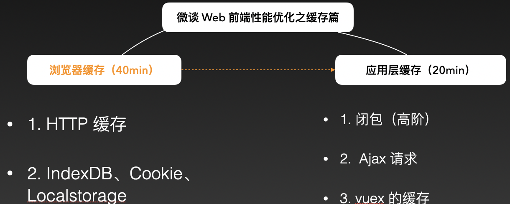

# 介绍

## 前言

- 在 HTTP 请求流程中，为什么很多站点第二次打开速度会很快？
- 平时清除缓存，到底清除了哪些东西？包括 DNS 吗？为什么服务器部署资源的 hash 值更改了，刷新前端页面还是读取旧的资源，而不是最新服务器资源呢？为什么一定要手动清除缓存，才能使改变生效？

如果有人问你，你能够明确回答上面的问题吗？如果不能，你可以从缓存篇中对缓存的分析获得启发。

显然，在客户端发起资源请求时，最终一个资源经过资源生成器 -> 数据库（数据库缓存） -> 服务器（服务器缓存） -> 客户端缓存（内存或磁盘），最终展示给用户。当客户端再次发起相同资源的请求时，这个时候为了提升客户端的响应速度，节省用户带宽，获取的资源很可能是从缓存中获取，至于缓存是从数据库还是服务器、内存、磁盘就看具体情况而说。

总的来说，Web 缓存的类型包括以下四种类型：

- 数据库数据缓存
- 服务器端缓存
  - 代理服务器缓存
  - CDN 缓存
- 浏览器端缓存
- Web 应用层面缓存
  - 应用层缓存指的是从代码层面上，通过代码逻辑和缓存策略，实现对数据，页面，图片等资源的缓存，可以根据实际情况选择将数据存在文件系统或者内存中，减少数据库查询或者读写瓶颈，提高响应效率。

作为前端开发者，我们主要关注**浏览器缓存**以及 **Web 前端应用层面的缓存**。

<!-- 整体路线：提出一个问题，为什么资源的 hash 值更改了，还是读取缓存，而不是最新的资源？分析问题，需要了解哪些知识，最后解决问题，如何让它符合预期行为。

- web 缓存包括哪些，重点关注哪些？
- 浏览器方面的缓存机制
- 应用层的缓存

## 一个资源的生命周期

资源生成 -> 存入数据库 -> 服务器 -> 客户端缓存（内存或磁盘） -> 再次请求

是否缓存？（浏览器根据响应头进行决定）

资源失效，就从缓存中清除，类似一个哈希表。 -->

<!-- 永远不要加载相同的资源两次

- 离线指南
- 缓存

- 是否一定要刷新，才能拿取资源
- 能否在资源更新后，服务器自动通知浏览器拿取最新资源，或者提醒用户进行刷新。 -->

<!-- 。

DNS解析的过程是什么，求详细的？ - wuxinliulei的回答 - 知乎
https://www.zhihu.com/question/23042131/answer/66571369

可以通过 在浏览器中地址栏输入：chrome://net-internals，删除 DNS 缓存。再次使用 lookup。

如何删除主机上的缓存

ArcGIS 地图 API 是否请求地图 URL 时，做了缓存的处理？

## 前言

那么，哪些数据会被缓存呢？从上面介绍的核心请求路径可以发现，DNS缓存和页面资源缓存这两块数据是会被浏览器缓存的。其中，DNS缓存比较简单，它主要就是在浏览器本地把对应的IP和域名关联起来，这里就不做过多分析了。

- 缓存与缓冲
- WEB 开发者们为缩短用户等待时间做出了一系列方案，以期「短益求短」。比如用 PWA 缓存更多可用的离线资源，让网页应用打开更快；借助 WebAssembly 规范缩小资源体积，提高执行效率。
- 用户硬件

## 缓存策略

如何有效利用浏览器缓存

内存 - 浏览器沙箱 - 磁盘（chrome 83）

哪些资源适合（不适合）缓存

<!-- webStorage、cookie、indexDB、主机内存 是开发者可以设置 的缓存，其他则是浏览器设置的缓存。怎么使用css、js、base64-->
