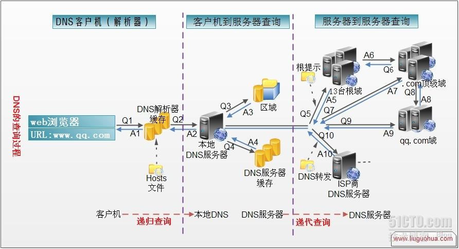

# 永远不要加载相同的资源两次

- 离线指南
- 缓存

平时清除缓存，到底清除了哪些东西？包括 DNS 吗？为什么一定要清除缓存，才能使改变生效。正常来说，应用刷新就自动更新资源。

DNS解析的过程是什么，求详细的？ - wuxinliulei的回答 - 知乎
https://www.zhihu.com/question/23042131/answer/66571369

可以通过 在浏览器中地址栏输入：chrome://net-internals，删除 DNS 缓存。再次使用 lookup。

如何删除主机上的缓存

ArcGIS 地图 API 是否请求地图 URL 时，做了缓存的处理？

## 前言

HTTP请求流程：为什么很多站点第二次打开速度会很快？

那么，哪些数据会被缓存呢？从上面介绍的核心请求路径可以发现，DNS缓存和页面资源缓存这两块数据是会被浏览器缓存的。其中，DNS缓存比较简单，它主要就是在浏览器本地把对应的IP和域名关联起来，这里就不做过多分析了。

- 缓存与缓冲
- WEB 开发者们为缩短用户等待时间做出了一系列方案，以期「短益求短」。比如用 PWA 缓存更多可用的离线资源，让网页应用打开更快；借助 WebAssembly 规范缩小资源体积，提高执行效率。
- 用户硬件

- web 缓存的类型
  - 数据库数据缓存
  - 服务器端缓存
    - 代理服务器缓存
    - CDN 缓存
  - 浏览器端缓存
  - Web 应用层面缓存
    - 应用层缓存指的是从代码层面上，通过代码逻辑和缓存策略，实现对数据，页面，图片等资源的缓存，可以根据实际情况选择将数据存在文件系统或者内存中，减少数据库查询或者读写瓶颈，提高响应效率。

## 一个资源的生命周期

资源生成 -> 存入数据库 -> 服务器 -> 客户端缓存（内存或磁盘） -> 再次请求

是否缓存？（浏览器根据响应头进行决定）

资源失效，就从缓存中清除，类似一个哈希表。

## 缓存策略

如何有效利用浏览器缓存

内存 - 浏览器沙箱 - 磁盘（chrome 83）

哪些资源适合（不适合）缓存

<!-- webStorage、cookie、indexDB、主机内存 是开发者可以设置 的缓存，其他则是浏览器设置的缓存。怎么使用css、js、base64-->

## 小结