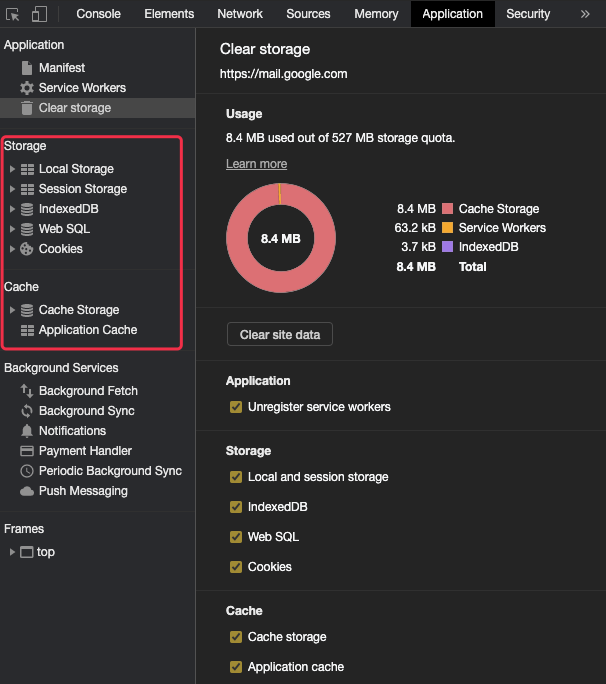
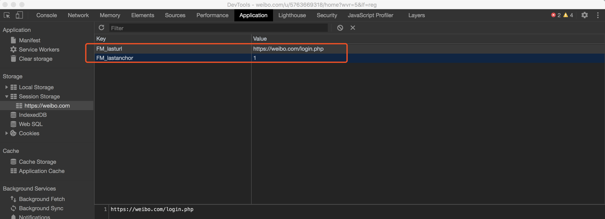
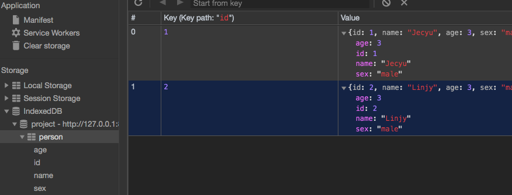

# 浏览器本地存储，给你的网页加个马达

头脑风暴

- 在单页面应用，切换不同的路由时。或多页面应用切换路由时，对于过大的资源可以在首次访问临时缓存下，其他页面就可以直接使用了。
- 资源除了打开关闭后，另外切换页面的使用，也可以存储起来，只要是持久化的作用。
- 浏览器设置的内存跟使用 webStorage、cookie、indexDB
  的区别在哪里？
- Vue 应用中，哪些东西应该存到本地存储技术上。
- 跟 chrome 官方文档的区别，实战场景结合？
- 抓重点说，剩下才是其他的处理。
- 比如实现单点登录把东西放到持久化的缓存。

## 前言

除了浏览器的 HTTP 缓存外，利用浏览器的本地存储技术（比如 LocalStorage、IndexDB）也能大大提升 web 应用的性能，让它向 Native 应用更进一步。

**目标读者**：对浏览器提供本地存储的技术没有一个全局了解<!--（广度）-->，不知道在 Web 应用哪里使用它们去提升性能，也不清楚如何提升这些 API 的读取性能<!--（jsperf）（深度，说清楚细节）-->。

<!-- 实用方面
  - 主要是针对持久化，介绍是什么，如何 CRUD，用在哪？
  - 统一介绍特性，再分别说明。重点讲
除了实用性能优化方面，如何提升性能 -->

<!-- IndexDB
- 是什么（配合 devtool）
- 如何 CRUD
- 可以用在 Web 应用哪里提升性能，如何跟服务端保持同步更新
- 如何提升这些 API 的读取性能 -->
<!--  -->
<!-- 既有广度，又有深度。 -->

<!-- 流程是：IndexDB 是什么，如何用，已有的应用场景在哪？目前系统可以使用的地方，比如填报系统，留言状态关闭 -->

<!-- 本地存储需要考虑两个问题：
- 实用问题（存取及时，容易更新，过期策略需要开发者处理）
  - 时效性
  - 维护性
- 安全问题
  - 是否容易被攻击 -->

<!-- localStorage 可以用于反馈管理系统，比如 Disqus，是一个非常流行的反馈管理系统 -->

<!-- 说清楚 IndexDB、Cookie、LocalStorage 的作用与实践的例子。结合南宁的实践。 -->

**文章大纲**：先全局了解存储分类，然后再具体介绍如何使用以及怎样利用它们提升 web 应用的性能。

- 网页存储概览
- Cookie
- Web Storage
  - LocalStorage
  - SessionStorage
- IndexDB

**阅读时长**：20 min

**浏览器版本**：Google Chrome 版本 85.0.4183.121（正式版本）（64 位），使用“隐身模式”不会再计算机上留下您访问网站的任何痕迹，包括缓存文件、Cookie、历史记录、下载记录等等，以及不受插件的影响。对于保存的缓存而言，意味着退出隐身模式即自动清除所有缓存。

<!-- 手动清除浏览器，会把 Cookie、持久化的缓存统统清理掉，包括 LocalStorage 的东西 -->

## 网页存储概览

打开浏览器 Chrome 调试工具，进入 Application 面板，可以看到红色框则为浏览器本地存储技术模块。



对于以上的存储模块，可以通过数据模型、持久化、浏览器支持、事务处理、同步/异步等指标进行分类。

### 存储分类

#### 数据模型

用于存储数据单元的模型可确定在内部组织数据的方式，这会影响存储的易用性、成本和性能以及检索请求。

- **结构化**：在具有预定义字段的表格中存储数据，与典型的基于 SQL 的数据库管理系统一样，非常适用于灵活的动态查询。
- **键/值**：键/值数据储存储区和相关的 NoSQL 数据库让你可以存储和检索唯一键值索引的非结构化的数据。
- **字节流**：这个简单模型以可变长度、不透明的字节字符串形式存储数据，将任意形式的内部组织置于应用层。此模型特别适合文件系统和其他按层次结构组织的数据块。

#### 持久化（Persistence）

网络应用的存储方法，可根据使数据持久化的作用域进行分析：

<!-- 这里的会话指的是 http 的 tcp 通信下 ？-->

- **会话持久化（Session Persistence）**：仅在一个网页会话或浏览器标签处于活动状态时保留此类别的数据。
- **设备持久化（Device Persistence）**：在特定设备中中跨会话和浏览器标签/窗口保留此类别中的数据。
- **全局持久化 （Global Persistence）**：跨会话和设备保留此类别中的数据，它是最可靠的数据持久形式，比如 Google 的云端存储。

#### 浏览器支持

基于项目开发问题选择最合适的 API，并且要考虑到 API 的规范标准化，也就是该 API 的使用寿命、支持是否广泛，生态系统比如第三方库是否丰富。

#### 事务处理

所谓的事务就是一系列的操作必须全部执行，而不能仅执行一部分。例如一个转账工作。

```sql
-- 从 id=1 的账户给 id=2 的账户转账 100 元
-- 第一步：将 id = 1 的 A 账户余额减去 100
UPDATE accounts SET balance = balance - 100 WHERE id = 1;
-- 第二步：将 id=2 的 B 账户余额加上 100
UPDATE accounts SET balance = balance + 100 WHERE id = 2;
```

通常，它对于是否能以原子方式成功手机相关存储操作非常重要。

#### 同步/异步

由于存储或检索请求会阻止当前活动的线程（网页主线程）直到请求已完成，因此，某些存储 API 是同步的。这在网页浏览器中是特别沉重的负担，其中存储请求会与 UI 共享主线程。出于效率和性能的考虑，将异步存储 API 作为首选。

### 一张图表格对比

| API                                                                                     | 数据模型 | 持久化 | 浏览器支持                                        | 事务处理 | 同步/异步 |
| --------------------------------------------------------------------------------------- | -------- | ------ | ------------------------------------------------- | -------- | --------- |
| [File system](https://developer.mozilla.org/en-US/docs/Web/API/FileSystem)              | 字节流   | 设备   | [52%](https://cloud.google.com/storage/?hl=zh-cn) | 不支持   | 异步      |
| [Local Storage](https://developer.mozilla.org/en-US/docs/Web/API/Window/localStorage)   | 键/值    | 设备   | [93%](https://caniuse.com/namevalue-storage)      | 不支持   | 同步      |
| [Session Storage](https://developer.mozilla.org/en-US/docs/Web/API/Window/localStorage) | 键/值    | 会话   | [93%](https://caniuse.com/namevalue-storage)      | 不支持   | 同步      |
| [Cookie](https://developer.mozilla.org/en-US/docs/Web/HTTP/Cookies)                     | 结构化   | 设备   | 100%                                              | 不支持   | 同步      |
| [WebSQL](https://www.w3.org/TR/webdatabase/)                                            | 结构化   | 设备   | [77%](http://caniuse.com/#feat=sql-storage)       | 支持     | 异步      |
| [Cache](https://developer.mozilla.org/en-US/docs/Web/API/CacheStorage)                  | 键/值    | 设备   | [60%](http://caniuse.com/#feat=serviceworkers)    | 不支持   | 异步      |
| [IndexedDB](https://developer.mozilla.org/en-US/docs/Web/API/IndexedDB_API)             | 混合     | 设备   | [83%](http://caniuse.com/#feat=indexeddb)         | 支持     | 异步      |
| [cloud storage](https://cloud.google.com/storage/?hl=zh-cn)                             | 字节流   | 全局   | 100%                                              | 不支持   | 两者皆有  |

<!-- 这里的百分比如何得出来的，后续需要验证。 -->

最好选择在尽可能多的浏览器上受广泛支持的 API，其可提供异步调用模型，以最大程度提高与 UI 的互操作性。

- 对于设备本地键/值存储：使用 Cache API。
- 对于设备本地结构化存储：使用 IndexDB
- 对于全局字节流存储：使用云端存储服务。

实验性功能：

- File system

W3C 舍弃的功能：

- WebSQL
  <!-- 
  有没有官方规范文档说一下

1. W3C 舍弃 Web SQL database 草案,而且是在 2010 年年底，规范不支持了，浏览器厂商已经支持的就支持了，没有支持的也不打算支持了，比如 IE 和 Firefox。
2. 为什么要舍弃？因为 Web SQL database 本质上是一个`关系型数据库`，后端可能熟悉，但是前端就有很多不熟悉了，虽然 SQL 的简单操作不难，但是也得需要学习。
3. SQL 熟悉后，真实操作中还得把你要存储的东西，比如对象，转成 SQL 语句，也挺麻烦的。 -->

如上所述，除去 File System 和 WebSQL，以及云端存储，接下来会详细讲解与前端息息相关的本地存储 API ，Cookie、Web Storage、IndexDB 以及 Cache API。

## Cookie

对浏览器提供本地存储的技术没有一个全局了解<!--（广度）-->，不知道在 Web 应用哪里使用它们去提升性能，也不清楚如何提升这些 API 的读取性能<!--（jsperf）（深度，说清楚细节）-->

<!--
- 是什么，
- 如何 CRUD 工作、CRUD
- 可以用在 Web 应用哪里提升性能，如何跟服务端保持同步更新
- 如何提升这些 API 的读取性能（深度）
- - 实用问题（存取及时，容易更新，过期策略需要开发者处理）
  - 时效性
  - 维护性
- 安全问题（只作为提一下，不重点讲解。）
  - 是否容易被攻击
- -->

打开 Chrome 浏览器，我们可以 Application 面板中展开 Cookie 查看。


Cookie 的本职工作并非本地存储，而是“维持状态”，HTTP 协议是一个无状态协议，服务器接收客户端的请求，返回一个响应，故事到此就结束了，服务器并没有记录关于客户端的任何信息。那么下次请求的时候，如何让服务器知道“我是谁”呢？

在这样的背景下，Cookie 应运而生。

Cookie 说白了就是一个存储在浏览器里的一个小小的文本文件，它附着在 HTTP 请求上，在浏览器和服务器之间“飞来飞去”。它可以携带用户信息，当服务器检查 Cookie 的时候，便可以获取客户端的状态。相当于一种人为的记录 Cookie，解决 HTTP 协议无状态记录的问题。

总的来说，Cookie 主要有三个作用：

- 会话管理
  - 登录、购物车等
- 用户个性化
  - 用户偏好设置、主题等
- 用户跟踪
  - 记录和分析用户行为

### 如何工作

服务器首先通过 `Set-Cookie` HTTP 响应头告诉客户端存储 Cookie 键值对。

```sh
HTTP/2.0 200 OK
Content-Type: text/html
Set-Cookie: yummy_cookie=choco
Set-Cookie: tasty_cookie=strawberry

[page content]
```

后续每一次当网页发起 http 请求时，浏览器都会先检查是否有相应的 cookie，有则自动添加在 request header 中的 cookie 字段中。

```sh
GET /sample_page.html HTTP/2.0
Host: www.example.org
Cookie: yummy_cookie=choco; tasty_cookie=strawberry
```

测试例子：cache/local/cookie/demo01

测试步骤：

1. 查看 Application 无 cookie
2. 初次 login 后，服务端进行 Set-Cookie，302 重定向到首页
   ```sh
   Set-Cookie: name=Jecyu;Expires=Thu, 22 Oct 2020 03:58:48 GMT;HttpOnly;Path=/
   ```
3. 首页发起请求会自动携带 Cookie，供服务端认证。

#### 如何进行读写操作 CRUD

##### 创建

**服务器设置**

不管你是请求一个资源文件（如 html/js/css/图片），还是发送一个 ajax 请求，服务端都会返回 response。而 response header 中有一项 set-cookie，是服务端专门用来设置 cookie 的。

格式：

```sh
# Set-Cookie 消息头是一个字符串，其格式如下（中括号中的部分是可选的）
Set-Cookie: value[; expires=date]
```

示例：

```sh
Set-Cookie: name=Jecyu;Expires=Thu, 22 Oct 2020 04:44:50 GMT;HttpOnly;Path=/
Set-Cookie: job=web development
```

【注意】：一个 Set-Cookie 字段只能设置一个 cookie，当你想要设置多个 cookie，需要添加同样多的 Set-Cookie。服务端可以设置 cookie 的所有选项：expires、domain、path、secure、HttpOnly、SameSite。通过 Set-Cookie 指定的这些可选项只会在浏览器端使用，而不会被发送到服务器。

**客户端设置**

```sh
# document.cookie = 'key=value'
document.cookie = 'username=Jecyu;'
```

【注意】：客户端可以设置 cookie 的下列选项：expires、domain、path、secure（有条件：只在 https 协议的网页中，客户端设置 secure 类型的 cookie 才能成功），但无法设置 HttpOnly 选项。

**测试例子**：cache/local/cookie/demo02


<!--


不限制域，其他网址也可以发送？？ -->

| 字段值类型     | 字段名称                  | 字段描述                                                                                                           |
| -------------- | ------------------------- | ------------------------------------------------------------------------------------------------------------------ |
| string         | name                      | Cookie 的名称                                                                                                      |
| string         | value                     | Cookie 的值                                                                                                        |
| string         | domain                    | The domain of the cookie (e.g. "www.google.com", "example.com").                                                   |
| boolean        | hostOnly                  | True if the cookie is a host-only cookie (i.e. a request's host must exactly match the domain of the cookie).      |
| string         | path                      | The path of the cookie.                                                                                            |
| boolean        | secure                    | True if the cookie is marked as Secure (i.e. its scope is limited to secure channels, typically HTTPS).            |
| boolean        | httpOnly                  | True if the cookie is marked as HttpOnly (i.e. the cookie is inaccessible to client-side scripts).                 |
| SameSiteStatus | sameSite                  | Since Chrome 51.The cookie's same-site status (i.e. whether the cookie is sent with cross-site requests).          |
| double         | (optional) expirationDate | The expiration date of the cookie as the number of seconds since the UNIX epoch. Not provided for session cookies. |

**【Expire/Max-Age】**

如果我们想长时间存放一个 cookie。需要在设置这个 cookie 的时候同时给它设置一个过期的时间。如果不设置，cookie 默认是临时存储的，当浏览器关闭进程的时候自动销毁。

```sh
注意：document.cookie = '名称=值;expires=' + UTC 格式的日期型字符串; 
```

一个设置 cookie 时效性的例子：

```js
const expires = new Date();
expires.setMinutes(expires.getMinutes() + 1); // we set the cookie that expires in 1 minute
res.writeHead(302, {
  Location: "/",
  "Set-Cookie": `name=${encodeURIComponent(
    name
  )};Expires=${expires.toUTCString()}`,
});
```

expires 是 http/1.0 协议中的选项，在新的 http/1.1 协议中 expires 已经由 max-age 选项代替。expires 的值是一个时间点（cookie 失效时刻= expires），而 max-age 的值是一个以秒为单位的时间段（cookie 失效时刻= 创建时刻 + max-age）。

另外，max-age 的默认值是 -1 （即有效期为 session）；max-age 有三种可能值：负数、0、正数。
- 负数：有效期 session（即关闭 tab 页面，则过期）
- 0：删除 cookie
- 正数：有效期为创建时刻 + max-age 

**【domain】**

domain 指定了 cookie 将要被发送到哪个或哪些域中。默认情况下，domain 会被设置为创建该 cookie 的页面所在的域名，所以当给相同域名发送请求时该 cookie 会被发送至服务器。

浏览器会把 domain 的值与请求的域名做一个尾部比较（即从字符串的尾部开始比较），并将匹配的 cookie 发送至服务器。

<!-- 补充一个 demo：带有两个以上 iframe 的，客户端如何 CRUD、iframe 页面如何读取和设置等 -->

`客户端设置`

document.cookie = "username=Jecyu;path=/;domain=qq.com"

如上：“www.qq.com” 与 “sports.qq.com” 公用一个关联的域名 “qq.com”，我们如果想让 “sports.qq.com” 下的 cookie 被 “www.qq.com” 访问，我们就需要用到 “cookie” 的 domain 属性，并且需要把 path 属性设置为 “/”。

`服务端设置`

```sh
Set-Cookie: username=Jecyu;path=/;domain=qq.com
```

注意：一定是同域之间的访问，不能把 domain 的值设置成非主域的域名。（客户端JS 脚本 document.cookie 也不能）


【path】

【secure】

【HttpOnly】

【总结】

##### 读取

##### 删除

##### 更新

感兴趣的话，可以看 chrome cookie 管理代码模拟实现：https://developer.chrome.com/extensions/examples/api/cookies/manager.js

### Cookie 可以用在 Web 应用哪里提升性能

#### Cookie 不够大

Cookie 是有体积上限的，它最大只能有 4KB。当 Cookie 存储图片超过 4KB 时，它将面临被裁切的命运。这样看来，Cookie 只能用来存取少量的信息。

#### 过量的 Cookie 会带来巨大的性能浪费

Cookie 是紧跟域名的。我们通过响应头里的 Set-Cookie 指定要存储的 Cookie 值。默认情况，domain 被设置为设置 Cookie 页面的主机名，我们也可以手动设置 domain 的值：

```bash
Set-Cookie: name=jecyu; domain=jecyu.com
```

同一个域名下的所有请求，都会携带 Cookie。如果此刻仅仅是请求一张图片或者一个 CSS 文件，我们也要携带一个 Cookie 跑来跑去（关键是 Cookie 里存储的信息我现在并不需要）。Cookie 虽然小，请求却可以很多，随着请求的叠加，这样的不必要的 Cookie 带来的开销是无法想象的。

随着前端应用复杂度的提供，Cookie 也渐渐演化为了一个“存储多面手”——它不仅仅被用于维持状态，还被塞入了一些乱七八糟的其他信息。（例如行政区划 regionKey）

### 如何解决 Cookie 带来的性能问题

浏览器最初使用 Cookie 的目的就是为了解决 HTTP 无状态的问题，因此存储在 cookie 的数据，每次都会被浏览器自动放在 http 请求中，如果这些数据是每个请求都需要发给服务端的数据（比如身份证信息），浏览器的自动处理就大大免去重复添加操作。如果这些数据不是必须的，就会增加了网络开销。

因此可以通过以下几个方式减少 Cookie 带来的性能问题：

- 去除不必要的 Cookie，只放置必要的数据（身份认证）。
- 使 Cookie 体积尽量小以减少用户响应的影响。
- 注意在适应级别的域名上设置 Cookie 以便使子域名不受影响。
- 设置合理的过期时间。较早地 Expire 时间和不要过早去清除 Cookie，都会改善用户的响应时间。

<!-- 测试例子：cache/local/cookie/demo03 -->
<!-- 南宁项目有没有实践这些例子了，如何实现在项目中实践。js-cookies -->

<!-- 不使用 cookie，使用 JWT 方案来提升性能，这个可以扩展说一下。这个是解决服务端的性能问题，可以放链接。这里就不展开说了。 -->

## Web Storage

为了弥补 Cookie 的局限性，让“专业的人做专业的事情”，Web Storage 出现了。Web Storage 是 HTML5 专门为浏览器存储而提供的数据存储机制。它又分为 `Local Storage` 与 `Session Storage`。

### Local Storage 与 Session Storage 的区别

两者的区别在于`生命周期`与`作用域` 的不同。

- **生命周期**：Local Storage 是持久化的本地存储，存储在其中的数据是永远不会过期的，使其消失的唯一办法是手动删除。
- **作用域**：Local Storage、Session Storage 和 Cookie 都遵循`同源策略`（这里具体还可以细分）。但 Session Storage 特别的一点在于，即便是相同域名的两个页面，只要他们不在同一个浏览器标签页内打开，那么他们的 Session Storage 内容便无法共享，（标签内的 iframe 可以共享也受同源策略的影响。）

#### Web Storage 的特性

- 存储容量大：Web Storage 根据浏览器的不同，存储容器可以达到 5-10 M 之间。
- 仅位于浏览器端，不与服务器发生通信。（这样就不会把不必要的信息传送给服务端）

#### Web Storage 核心 API 使用

Web Storage 保存的数据内容和 Cookie 一样，是文本内容，以键值对的形式存在。Local Storage 与 Session Storage 在 API 方面无异，这里我们以 localStorage 为例：

- 存储数据：setItem()

```bash
localStorage.setItem('user_name', 'xiuyan')
```

- 读取数据： getItem()

```bash
localStorage.getItem('user_name')
```

- 删除某一键名对应的数据： removeItem()

```bash
localStorage.removeItem('user_name')
```

- 清空数据记录：clear()

```bash
localStorage.clear()
```

### 应用场景

#### Local Storage

Local Storage 在存储方面没有什么特别的限制，理论上 Cookie 无法胜任的、可以用简单的键值对来存取的数据存储任务，都可以交给 Local Storage 来做。

举个例子，考虑到 Local Storage 的特点之一是`持久`，有时我们更倾向于用它来存储一些内容稳定的资源。比如图片内容丰富的电商网站会用它来存储 Base64 格式的图片字符串：


有的网站还会用它来存储一些不经常更新的 CSS、JS 等静态资源。（例如 normalize.css）

<!-- 这就是为什么访问较多的网站后，chrome 浏览器占用的内存越来越多 -->

#### Session Storage

Session Storage 更适合用来存储生命周期和它同步的`会话级别`的信息。这些信息只存在当前会话，当你开启新的会话时，它也需要相应的更新或释放。比如微博的 Session Storage 就主要是存储你本次会话的浏览足迹：



lastUrl 对应的就是你上一次访问的 URL 地址，这个地址是即时的。当你切换 URL 时，它随之更新，当你关闭页面时，留着它也没有什么意义，就释放它。

Web Storage 是否能 hold 住所有的存储场景呢？

答案是否定的。Web Storage 是一个从定义到使用都非常简单的东西，它使用键值对的形式进行存储，这种模式有点类似对象，但它只能存储字符串，要想存储对象，我们还需要对对象进行序列化。

说到底，Web Storage 是对 Cookie 的拓展，它只能用于存储少量的简单数据。当遇到大规模的、结构复杂的数据时，Web Storage 也爱莫能助了。

<!-- 主要说明应用场景 -->

### Web Storage

#### Web Storage 的特性

- 存储容量大：Web Storage 根据浏览器的不同，存储容器可以达到 5-10 M 之间。
- 仅位于浏览器端，不与服务器发生通信。（这样就不会把不必要的信息传送给服务端）

#### Web Storage 核心 API 使用

Web Storage 保存的数据内容和 Cookie 一样，是文本内容，以键值对的形式存在。Local Storage 与 Session Storage 在 API 方面无异，这里我们以 localStorage 为例：

- 存储数据：setItem()

```bash
localStorage.setItem('user_name', 'xiuyan')
```

- 读取数据： getItem()

```bash
localStorage.getItem('user_name')
```

- 删除某一键名对应的数据： removeItem()

```bash
localStorage.removeItem('user_name')
```

- 清空数据记录：clear()

```bash
localStorage.clear()
```

## IndexDB

IndexDB 是一个<u>运行在浏览器上的非关系型数据库。</u>既然是数据库了，就不是 5M、10M 这样小打小闹的级别了。理论上来说，IndexDB 是没有存储上限的（一般来说不会小于 250 M）。它不仅可以存储`字符串`，还可以存储`二进制数据`。


### IndexDB 的基本使用流程

```js
// 1. 打开/创建一个 IndexDB 数据库
// 后面的回调中，我们可以通过event.target.result拿到数据库实例
const databaseName = "project";
// 第一个参数：数据库名，param2：版本号
// 参数1位数据库名，参数2为版本号
const DBRequestLink = window.indexedDB.open(databaseName, 1);
// 使用IndexedDB失败时的监听函数
DBRequestLink.onerror = function(event) {
  console.log("无法使用IndexedDB");
};
// 成功
DBRequestLink.onsuccess = function(event) {
  console.log("你打开了IndexedDB");
};

// 2. 创建一个 object store （object store 对标到数据库中的 “表” 单位）
// onupgradeneeded事件会在初始化数据库/版本发生更新时被调用。如果存储
DBRequestLink.onupgradeneeded = function(event) {
  const db = event.target.result;
  let objectStore;
  // 创建一个数据库存储对象，并指定主键
  // if (!db.objectStoreNames.contains("person")) {
  objectStore = db.createObjectStore("person", {
    keyPath: "id",
    autoIncrement: true,
  });
  // }
  /* 定义存储对象的数据项
   * 第一个参数是创建的索引名称，可以为空
   * 第二个参数是索引使用的关键名称，可以为空
   * 第三个参数是可选配置参数，可以不传，常用参数之一就是 unique ，表示该字段是否唯一，不能重复
   */

  objectStore.createIndex("id", "id", {
    unique: true,
  });
  objectStore.createIndex("name", "name");
  objectStore.createIndex("age", "age");
  objectStore.createIndex("sex", "sex");

  // 3. 向数据库中添加数据
  // 构建一个事务来执行一些数据库操作，像增加或提取数据等
  // 创建事务，指定表格名称和读写权限
  // 这里的 dbInstance 就是第二步中的 dbInstance 对象，
  // transaction api 的第一个参数是数据库名称，第二个参数是操作类型
  // 使用事务的 oncomplete 事件确保在插入数据前对象仓库已经创建完毕
  objectStore.transaction.oncomplete = function(event) {
    // 将数据保存到新创建的仓库
    let transaction = db.transaction(["person"], "readwrite");
    const personObjectStore = transaction.objectStore("person");
    let newItem1 = {
      id: 1,
      name: "Jecyu",
      age: 3,
      sex: "male",
    };
    let newItem2 = {
      id: 2,
      name: "Linjy",
      age: 3,
      sex: "male",
    };
    // 添加到数据对象中, 传入javascript对象
    personObjectStore.add(newItem1);
    personObjectStore.add(newItem2);

    // 4. 通过监听正确类型的事件以等待操作完成
    // 操作成功时的监听函数
    transaction.oncomplete = function(event) {
      console.log("操作成功");
    };
    // 操作失败时的监听函数
    transaction.onerror = function(event) {
      console.log("这里有一个Error");
    };
  };
};
```



- 在线 Demo https://codepen.io/gwx-code/pen/KKKqejN?editors=1111

### IndexDB 的应用场景

- 一些博客类网站，进行对文章草稿的存储。
- 可视化搭建系统的撤销前进。

## Cache API

<!-- ## Web 应用案例实战，总结分析 -->

<!-- 因为在前面讲解各个 API 的时候，肯定会说到性能的应用场景以及例子的，因此这里可以是总结，或者一个综合的例子，先不考虑。先把前面晚上。这里可以是 Vue 项目应用的缓存策略，再说了。 -->
<!-- 从 xxx 应用/开源项目学到了哪些存储技术 -->
<!-- 打开 Gmail 可以看到哪些东西-->
<!-- 微前端 -->
<!-- 综合应用 -->

<!-- Vue 应用

- Cookie
- LocalStorage

针对哪些应用，可以使用哪些东西提升性能？

Vue 应用中如何提升性能。 -->
<!-- 拿到所有图层服务的信息 -->

测试例子：https://storage-quota.glitch.me/

## 总结
