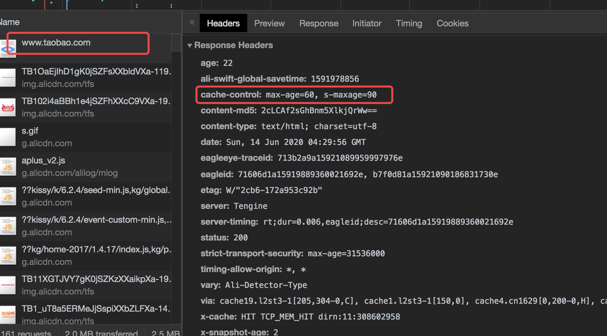

# 浏览器缓存

## 前言

缓存可以减少网络 IO 消耗，提高访问速度。`浏览器缓存`是一种操作简单、效果显著的前端性能优化手段。Chrome 官方的解释：
> 通过网络获取内容既速度缓慢又开销巨大。较大的响应需要在客户端与服务器之间进行多次往返通信，这会延迟浏览器获得和处理内容的时间，还会增加访问者的流量费用。因此，缓存并重复利用之前获取的资源的能力成为性能优化的一个关键方面。

## 浏览器缓存机制

- Memory Cache
- Service Worker Cache
- HTTP Cache 
- Push Cache
- DNS Cache


## HTTP 缓存机制探秘

HTTP 缓存分为`强缓存`和`协商缓存`。优先级较高的是强缓存，在命中强缓存失败的情况下，才会走协商缓存。

### 强缓存的特征

强缓存是利用 `http` 头中的 `Expires` 和 `Cache-Control` 两个字段来控制。强缓存中，当请求再次发出时，浏览器会根据其中的 expires 和 cache-control 判断目标资源是否“命中”强缓存，若命中则直接从缓存中获取资源，**不会再与服务端发生通信**。

### 强缓存的实现：从 expires 到 cache-control

实现强缓存，过去一直用 `expires`:

```bash
expires: Wed, 11 Sep 2019 16:12:18 GMT
```

它是一个时间戳，接下来如果我们试图再次向服务器请求资源，浏览器就会先对比本地时间和 expires 的时间戳，如果本地时间小于 expires 设定的过期时间，那么就直接去缓存中取这个资源。

但是 expires 是有问题的，它最大的问题在于对“本地时间”的依赖。如果服务端和客户端的时间设置可能不同，或者我们直接手动去把客户端的时间改掉，那么 expires 将无法达到我们的预期。

于是 HTTP 1.1 新增了 `Cache-Control` 字段来完成 expires 的任务。

```bash
cache-control: max-age=31536000
```

在 Cache-Control 中，我们通过 `max-age` 来控制资源的有效期。`max-age` 不是一个时间戳，而是一个`时间段`。`max-age=31536000` 意味着该资源在 31536000 秒以内都是有效的，完美地规避了时间戳带来的潜在问题。

Cache-Control 相对于 expires 更加准确，它的优先级也更高。当 Cache-Control 与 expires 同时出现时，我们以 Cache
-Control 为准。

### Cache-Control 应用分析



这里的 <u>s-maxage 优先级高于 max-age，两者同时出现时，优先考虑 s-maxage。如果 s-maxage 未过期，则向代理服务器请求其缓存内容。</u>在项目不是特别大的场景下，max-age 足够用了。但在依赖各种代理的大型架构中，我们不得不考虑`代理服务器`的缓存问题。s-maxage 就是用于表示 cache 服务器上（比如 `cache CDN`）的缓存的有效时间的，并只对 `public` 缓存有效。

s-maxage 仅在代理服务器中生效，客户端我们只考虑 max-age。
`
#### public 与 private

如果我们为资源设置了 `public`，那么它即可以被浏览器缓存，也可以被`代理服务器`缓存；如果我们设置了 `private`，则该资源只能被浏览器缓存。private 为`默认值`。但多数情况下，public 并不需要我们手动设置，比如很多线上网站的 cache-control 是这样的：


设置了 `s-maxage`，没设置 public，那么 CDN 还可以缓存这个资源吗？答案是肯定的。因为明确的缓存信息（例如“max-age”）已表示响应是可以缓存的。

#### no-store 与 no-caches

`no-cahce` 绕开了浏览器：我们为资源设置了 `no-cache` 后，每一次请求都不会再去询问浏览器的缓存情况。

`no-store` 比较绝情，顾名思义就是不使用任何缓存策略。在 no-cache 的基础上，它连服务端的缓存确认也绕开了，<u>只允许你直接向服务端发送请求、并下载完整的响应。</u>

### 协商缓存：浏览器与服务器合作之下的缓存策略

协商缓存依赖于服务端与浏览端之间的通信。

协商缓存机制下，<u>浏览器需要向服务器去询问缓存的相关信息，</u>进而判断是`重新发起请求下载完整的响应`，还是从`本地获取缓存的资源`。

如果服务端提示缓存资源未改动（Not Modified），资源会被重定向到浏览器缓存，**这种情况下网络请求对应的状态码是 304。**


### 协商缓存的实现：从 Last-Modified 到 Etag

`Last-Modified` 是一个时间戳，如果我们启用了协商缓存，它会在首次请求时随着 Response Headers 返回：

```bash
Last-Modified: Fri, 27 Oct 2017 06:35:57 GMT
```
 
随后我们每次请求时，会带上一个叫 `If-Modified-Since` 的时间戳字段，它的值正是上一次 response 返回给它的 last-modified 值：

```bash
If-Modified-Since: Fri, 27 Oct 2017 06:35:57 GMT
```

服务器接收到这个时间戳后，会比对该时间戳和资源在服务器上的最后修改时间是否一致，并在 Response Headers 中添加新的 `Last-Modified` 值；否则，返回如上图的 304 响应，Response
 Headers 不会再添加 Last-Modified 字段。

使用 Last-Modified 存在一些弊端，这其中最常见的就是这样两个场景：

- 当我们编辑了文件，但文件的内容没有变。<u>服务端并不清楚我们是否真正改变了文件，它仍然通过最后编辑时间进行判断。</u>因此在这个资源在再次被请求时，会被当作新资源，进而引发一次完整的响应——不该重新请求的时候，也会重新请求。
- 当我们修改文件的速度过快时（比如花了 100ms 完成了改动），由于 `If-Modified-Since` 只能检查到以`秒`为最小计量单位的时间差，所以它是感知不到这个改动的——该重新请求的时候，反而没有重新请求了。 

这两个场景其实指向了同一个 bug —— <u>服务器并没有正确感知文件的变化。</u>为了解决这样的问题，`Etag` 作为 Last-Modified 的补充出现了。

Etag 是由服务器为每个资源生产的唯一的`标识字符串`，这个标识字符串是基于文件内容编码的，只要文件内容不同，它们对应的 Etag 就是不同的，反之亦然。因此 Etag 能够精准地感知文件的变化。

```bash
ETag: W/"2237-1566200378000"
```

那么下一次请求，请求头里就会带上一个值相同的、名为 `if-None-Match` 的字符串供服务端比对了：

```bash
If-Noe-Match: W/"2237-1566200378000"
```

<u>Etag 的生成过程需要服务器额外开销，</u>会影响服务端的性能，这是它的弊端。因此启用 Etag 需要我们审时度势。正如我们刚刚所提到的——Etag 并不能替代 Last-Modified，它只能作为 Last-Modified 的补充和强化存在。Etag 在感知文件变化上比 Last-Modified 更加准确，优先级也更高。**当 Etag 和 Last-Modified 同时存在时，以 Etag 为准**。

## HTTP 缓存决策指南

在面对一个具体的缓存需求时，我们到底该怎么决策呢？


我们现在一起解读一下这张流程图：

当我们的资源内容不可复用时，直接为 `Cache-Control` 设置 `no-store`，拒绝一切形式的缓存；否则考虑是否每次都需要向服务器进行缓存有效确认，如果需要，那么设 `Cache-Control` 的值为 `no-cache`；否则考虑该资源是否可以被`代理服务器`缓存，根据其结果决定为 `private` 还是 `public`；然后考虑资源的过期时间，设置对应的 `max-age` 和 `s-maxage` 值；最后，配置协商缓存需要用到 `Etag`、`Last-Modified` 等参数。

给一个资源设置强缓存和协商缓存后，再次请求该资源时，会先判断 max-age 是否过期，如果不过期就从缓存拿，过期后就直接向服务器请求。这个时候会携带 Last-Modified 和 Etag 给服务器对比，如果文件改变了就重新发送，否则就返回 304，让浏览器继续从本地缓存中取。

```bash 
Cache-control: public, max-age=31536000
Last-Modified: Wed, 04 Mar 2020 18:31:22 GMT
ETag: W/"2237-1566200378000"
```

## Memory Cache

Memory Cache，是指存在内存中的缓存。从优先级上来说，它是浏览器最先尝试命中的一种缓存。从效率上来说，它是响应速度最快的一种缓存。

内存缓存是快的，也是“短命”的。它和`渲染`进程“生死相依”，当进程结束后，也就是 tab 关闭以后，内存里的数据也将不复存在。

那么哪些文件会被放入内存呢？

事实上，这个划分规则，一直以来没有定论。内存是有限的，很多时候需要先考虑即时呈现的内存余量，再根据具体的情况决定分配给内存和磁盘的资源量的比重——资源存放的位置具有一定的随机性。


我们可以总结这样的规律：资源存不存内存，`浏览器`秉承的是“节约原则”。我们发现，Base
64 格式的图片，几乎永远可以被塞进 memory cache，这可以视作浏览器节省渲染开销的“自保行为”；此外，体积不大的 JS、CSS 文件，也有较大地被写入内存的几率——相比之下，较大的 JS、CSS 文件就没有这个待遇了，内存资源是有限的，它们往往被直接甩进磁盘。

## Service Cache

Service Worker 是一种独立于主线程之外的 JavaScript 线程。它脱离于浏览器窗体，因此无法直接访问 DOM。这样独立的个性使得 Service Worker 的 “个人行为” 无法干扰页面的性能，这个“幕后工作者” 可以帮我们实现`离线缓存`、`消息推送`和 `网络代理` 等功能。我们借助 Server worker 实现的离线缓存就称为 Service Worker Cache。

Service Worker 的生命周期包括 install、active、working 三个阶段。一旦 Service Worker 被 install，它将始终存在，只会在 active 与 working 之间切换，除非我们主动终止它。这是它可以用来实现离线缓存的重要先决条件。

Server Worker 对协议是有要求的，必须以 https 协议为前提。

## Push Cache

PUsh Cache 是指 HTTP2 在 server push 阶段存在的缓存。
