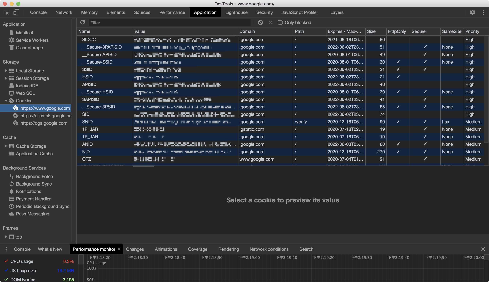

# 本地存储——Cookie、Web Storage、IndexDB

## Cookie

Cookie 的本职工作并非本地存储，而是“维持状态”。

HTTP 协议是一个无状态协议，服务器接收客户端的请求，返回一个响应，故事到此就结束了，服务器并没有记录关于客户端的任何信息。那么下次请求的时候，如何让服务器知道“我是谁”呢？

在这样的背景下，Cookie 应运而生。

Cookie 说白了就是一个存储在浏览器里的一个小小的文本文件，它附着在 HTTP 请求上，在浏览器和服务器之间“飞来飞去”。它可以携带用户信息，当服务器检查 Cookie 的时候，便可以获取客户端的状态。（相当于一种人为的记录 Cookie，解决 HTTP 无状态记录的问题。）

关于 Cookie 的详细内容，我们可以在 Chrome 的 Application 面板中看到。



### Cookie 的性能劣势

#### Cookie 不够大

Cookie 是有体积上限的，它最大只能有 4KB。当 Cookie 图片超过 4KB 时，它将面临被裁切的命运。这样看来，Cookie 只能用来存取少量的信息。

#### 过量的 Cookie 会带来巨大的性能浪费

Cookie 是紧跟域名的。我们通过响应头里的 Set-Cookie 指定要存储的 Cookie 值。默认情况，domain 被设置为设置 Cookie 页面的主机名，我们也可以手动设置 domain 的值：

```bash
Set-Cookie: name=jecyu; domain=jecyu.com
```

**同一个域名下的所有请求，都会携带 Cookie。**如果此刻仅仅是请求一张图片或者一个 CSS 文件，我们也要携带一个 Cookie 跑来跑去（关键是 Cookie 里存储的信息我现在并不需要）。Cookie 虽然小，请求却可以很多，随着请求的叠加，这样的不必要的 Cookie 带来的开销是无法想象的。

随着前端应用复杂度的提供，Cookie 也渐渐演化为了一个“存储多面手”——它不仅仅被用于维持状态，还被塞入了一些乱七八糟的其他信息。（例如行政区划 regionKey）

为了弥补 Cookie 的局限性，让“专业的人做专业的事情”，Web Storage 出现了。

## Web Storage

Web Storage 是 HTML5 专门为浏览器存储而提供的数据存储机制。它又分为 `Local Storage` 与 `Session Storage `。

### Local Storage 与 Session Storage 的区别

两者的区别在于`生命周期`与`作用域` 的不同。

- **生命周期**：Local Storage 是持久化的本地存储，存储在其中的数据是永远不会过期的，使其消失的唯一办法是手动删除。
- **作用域**：Local Storage、Session Storage 和 Cookie 都遵循`同源策略`（这里具体还可以细分）。但 Session Storage 特别的一点在于，即便是相同域名的两个页面，只要他们不在同一个浏览器标签页内打开，那么他们的 Session Storage 内容便无法共享，（标签内的 iframe 可以共享也受同源策略的影响。）

### Web Storage 的特性

- 存储容量大：Web Storage 根据浏览器的不同，存储容器可以达到 5-10 M 之间。
- 仅位于浏览器端，不与服务器发生通信。（这样就不会把不必要的信息传送给服务端）

### Web Storage 核心 API 使用

Web Storage 保存的数据内容和 Cookie 一样，是文本内容，以键值对的形式存在。Local Storage 与 Session Storage 在 API 方面无异，这里我们以 localStorage 为例：

- 存储数据：setItem()
```bash
localStorage.setItem('user_name', 'xiuyan')
```
- 读取数据： getItem()
```bash
localStorage.getItem('user_name')
```
- 删除某一键名对应的数据： removeItem()
```bash
localStorage.removeItem('user_name')
```
- 清空数据记录：clear()
```bash
localStorage.clear()
```

### 应用场景

#### Local Storage

Local Storage 在存储方面没有什么特别的限制，理论上 Cookie 无法胜任的、可以用简单的键值对来存取的数据存储任务，都可以交给 Local Storage 来做。

举个例子，考虑到 Local Storage 的特点之一是`持久`，有时我们更倾向于用它来存储一些内容稳定的资源。比如图片内容丰富的电商网站会用它来存储 Base64 格式的图片字符串：


有的网站还会用它来存储一些不经常更新的 CSS、JS 等静态资源。（例如 normalize.css）

<!-- 这就是为什么访问较多的网站后，chrome 浏览器占用的内存越来越多 -->

#### Session Storage

Session Storage 更适合用来存储生命周期和它同步的`会话级别`的信息。这些信息只存在当前会话，当你开启新的会话时，它也需要相应的更新或释放。比如微博的 Session Storage 就主要是存储你本次会话的浏览足迹：


lastUrl 对应的就是你上一次访问的 URL 地址，这个地址是即时的。当你切换 URL 时，它随之更新，当你关闭页面时，留着它也没有什么意义，就释放它。

Web Storage 是否能 hold 住所有的存储场景呢？

答案是否定的。Web Storage 是一个从定义到使用都非常简单的东西，它使用键值对的形式进行存储，这种模式有点类似对象，但它只能存储字符串，要想存储对象，我们还需要对对象进行序列化。

说到底，Web Storage 是对 Cookie 的拓展，它只能用于存储少量的简单数据。当遇到大规模的、结构复杂的数据时，Web Storage 也爱莫能助了。

## IndexDB

IndexDB 是一个<u>运行在浏览器上的非关系型数据库。</u>既然是数据库了，就不是 5M、10M 这样小打小闹的级别了。理论上来说，IndexDB 是没有存储上限的（一般来说不会小于 250 M）。它不仅可以存储`字符串`，还可以存储`二进制数据`。


IndexDB 的基本使用流程：

```js
// 1. 打开/创建一个 IndexDB 数据库
// 后面的回调中，我们可以通过event.target.result拿到数据库实例
const databaseName = "project";
// 第一个参数：数据库名，param2：版本号
// 参数1位数据库名，参数2为版本号
const DBRequestLink = window.indexedDB.open(databaseName, 1);
// 使用IndexedDB失败时的监听函数
DBRequestLink.onerror = function(event) {
  console.log("无法使用IndexedDB");
};
// 成功
DBRequestLink.onsuccess = function(event) {
  console.log("你打开了IndexedDB");
};

// 2. 创建一个 object store （object store 对标到数据库中的 “表” 单位）
// onupgradeneeded事件会在初始化数据库/版本发生更新时被调用。如果存储
DBRequestLink.onupgradeneeded = function(event) {
  const db = event.target.result;
  let objectStore;
  // 创建一个数据库存储对象，并指定主键
  // if (!db.objectStoreNames.contains("person")) {
    objectStore = db.createObjectStore("person", {
      keyPath: "id",
      autoIncrement: true,
    });
  // }
  /* 定义存储对象的数据项
   * 第一个参数是创建的索引名称，可以为空
   * 第二个参数是索引使用的关键名称，可以为空
   * 第三个参数是可选配置参数，可以不传，常用参数之一就是 unique ，表示该字段是否唯一，不能重复
   */

  objectStore.createIndex("id", "id", {
    unique: true,
  });
  objectStore.createIndex("name", "name");
  objectStore.createIndex("age", "age");
  objectStore.createIndex("sex", "sex");

  // 3. 向数据库中添加数据
  // 构建一个事务来执行一些数据库操作，像增加或提取数据等
  // 创建事务，指定表格名称和读写权限
  // 这里的 dbInstance 就是第二步中的 dbInstance 对象，
  // transaction api 的第一个参数是数据库名称，第二个参数是操作类型
  // 使用事务的 oncomplete 事件确保在插入数据前对象仓库已经创建完毕
  objectStore.transaction.oncomplete = function(event) {
    // 将数据保存到新创建的仓库
    let transaction = db.transaction(["person"], "readwrite");
    const personObjectStore = transaction.objectStore("person");
    let newItem1 = {
      id: 1,
      name: "Jecyu",
      age: 3,
      sex: "male",
    };
    let newItem2 = {
      id: 2,
      name: "Linjy",
      age: 3,
      sex: "male",
    };
    // 添加到数据对象中, 传入javascript对象
    personObjectStore.add(newItem1);
    personObjectStore.add(newItem2);

    // 4. 通过监听正确类型的事件以等待操作完成
    // 操作成功时的监听函数
    transaction.oncomplete = function(event) {
      console.log("操作成功");
    };
    // 操作失败时的监听函数
    transaction.onerror = function(event) {
      console.log("这里有一个Error");
    };
  };
};

```


- 在线 Demo https://codepen.io/gwx-code/pen/KKKqejN?editors=1111

### IndexDB 的应用场景

- 一些博客类网站，进行对文章草稿的存储。
- 可视化搭建系统的撤销前进。

## Web SQL

1. W3C舍弃 Web SQL database草案,而且是在2010年年底，规范不支持了，浏览器厂商已经支持的就支持了，没有支持的也不打算支持了，比如IE和Firefox。
2. 为什么要舍弃？因为 Web SQL database 本质上是一个`关系型数据库`，后端可能熟悉，但是前端就有很多不熟悉了，虽然SQL的简单操作不难，但是也得需要学习。
3. SQL熟悉后，真实操作中还得把你要存储的东西，比如对象，转成SQL语句，也挺麻烦的。

## 存储策略

一张图表格对比

在单页面应用，切换不同的路由时。或多页面应用切换路由时，对于过大的资源可以在首次访问临时缓存下，其他页面就可以直接使用了。

- 是否需要持久（决定选择内存 memory cache 还是浏览器本地存储）
- 83 可以写入硬盘

<!-- 资源除了打开关闭后，另外切换页面的使用，也可以存储起来，只要是持久化的作用。 -->

浏览器设置的内存跟使用 webStorage、cookie、indexDB
的区别在哪里？
