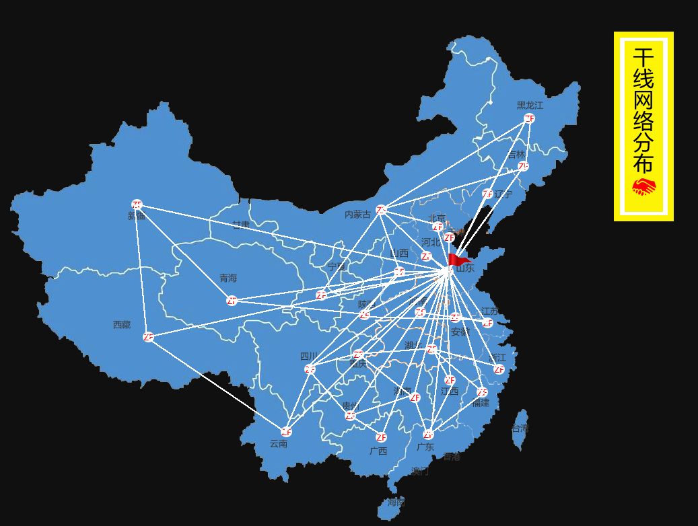
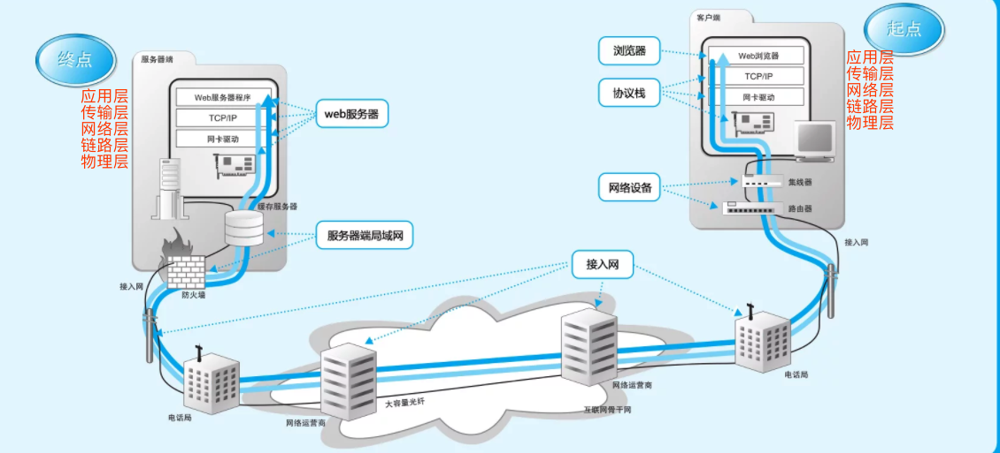
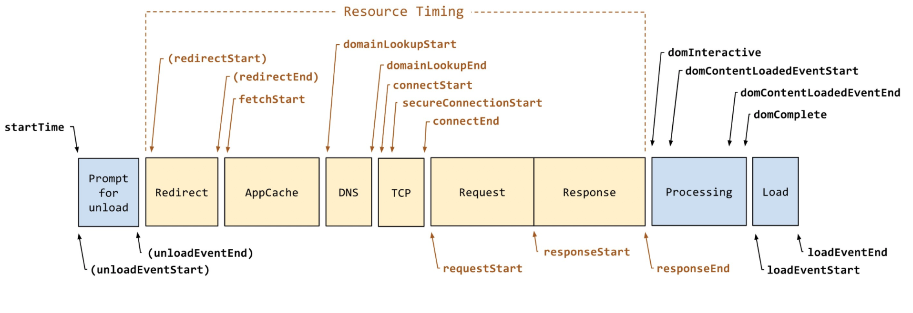
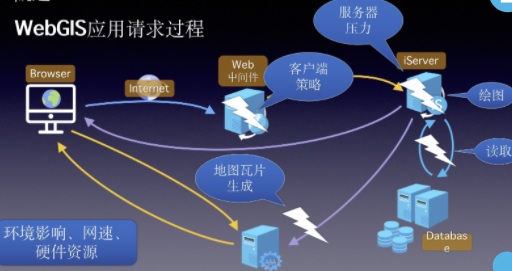

# Web 性能优化基础认知

## 前言

web 性能优化是什么？相信不少开发过 web 应用的小伙伴可能在项目上或多或少做过一些性能优化，例如前端界面的渲染优化，使用代码实现以用户的操作触发懒加载某些资源，从而提升初始页面的渲染速度。

本文通过《从浏览器地址栏输入URL 到页面渲染出来经历的过程》涉及到的性能知识这样的路线做一个概述，以此来提升读者对 web 性能优化的基础认知，给读者提供一个框架，之后读者能够就可以在这个框架上引入各种性能元素。

### 目标读者

- who：对 web 应用做过一些性能优化但没有建立对 web 性能优化的全局了解。
- when：当他读完本文后，能够对 web 网站性能优化有基础的认知，从大体上能够知道什么是性能优化、为什么要做性能优化、怎么做性能优化。

## 访问页面

在说网络传输之前，先简单回顾下因特网（internet）。什么是因特网，举个例子，程序员金木同学，今天工作时运行一个比较大的项目导致电脑卡死了，无可奈何只能重启大法。想了想，从大学到现在这个电脑已经跟随他五年了。今天刚好发工资，攒够钱的小 A 于是打开了某知名品牌电脑网站，从看中到下单不用5分钟搞掂，第二天电脑就到了手上了。这个拿货的速度得益于今天强大的快递网络，大大小小的网点、仓库，遍布在整个城市、国家，连接着全世界，它就像一个巨大的蜘蛛网一样。

为了让保证快递的速度，装有电脑的包裹会从离金木同学最近的仓库发出。

同样的，因特网也是由许许多多的部件构建一个强大的信息网络，它是连接全世界的计算机设备的网络。

图上的路径则是显示：金木同学利用他的电脑作为客户机去访问该品牌电脑商的服务器，请求下载以访问它的官方网站。

### 回顾网络传输

在复杂交错的网络中，快递包裹想要顺利发送到金木同学手上，是需要约定好接收方与发送方以及途径一些中间方的规定。

对于网络传输来说，则是网络分层模型以及它们依赖的网络协议。就拿浏览器访问 Web 网站来说，它的应用层协议是 HTTP协议，HTTP 定义了 Web 客户端向服务器请求 Web 页面的方式，它们之间发送的包（packet）会沿着图中的路线进行传输。

### 从浏览器地址栏输入 URL，页面构建

现在我们看看，金木同学在电脑的浏览器地址输入：`http(s)://www.aaa.bbb.com/product/xxx.html` 后到整个界面出现可操作的过程，经历了哪些操作呢？

一个简单的图是这样的：

再扩展开来是这样的：

根据上图，为了让浏览器与服务器成功进行通信进行 HTTP 请求响应，要经历以下步骤：

#### 1. 首先浏览器解析 URL

浏览器要成功发起一个 HTTP 应用请求，先要进行 TCP 的连接，而要进行 TCP 的连接，则需要知道目标服务器的 IP 地址，而现在浏览器只知道用户输入的 URL 地址：

因此，浏览器要先解析输入的 URL 地址： 

A. `http(s): + // + Web 服务器名 + (/ + 目录名 + / ..... + 文件名`)
- URL 开头表示访问数据源的机制，也就是协议
- “//“ 后面的字符串表示服务器的名称
- `()` 里面的则表示数据源（文件）的路径名

B. 对于上文中提到的 URL 示例，

`https://www.aaa.bbb.com/product/xxx.html`

C. 按照 A 中的元素对 B 解析的结果是：

`https: + // + www.aaa.bbb.com + / + product + / + xxx.html`

#### 2. 向 DNS 服务器查询 Web 服务器的 IP 地址

通过浏览器解析后，已经知道 `www.aaa.bbb.com` 是目标服务器的域名，之后就根据域名查询获得了服务器的 ip 地址。 

#### 3. TCP 连接、HTTP 请求抛出

既然金木的电脑获得 ip 地址后，它能够生成 TCP 套接字，与目标服务器进行三次握手成功连接后，便可向 `www.aaa.bbb.com` 发送 HTTP GET 请求了。

#### 4. 服务端处理请求，HTTP 响应返回（webserver）
 
在 `www.aaa.bbb.com` 的服务器上读取到 TCP 的套接字里面的请求报文后，会生成一个 HTTP 响应报文，并且将 `xxx.html` web 文档放入 HTTP 响应体中，并将报文发送给 TCP 套接字。 

#### 5. 浏览器拿到响应数据，解析响应内容，把解析的结果展示给用户

包含 `xxx.html` 的报文通过多个路由转发后，最终来到了金木同学的 Web 浏览器中，浏览器从 TCP 套接子读取 HTTP 响应报文，如果这个 web 文档是被压缩的（如`gzip`），还得解压下，最后对该 html 文档进行渲染显示。

多数 web 页面含有一个 HTML 基本文件，除此之外还有几个引用的对象（`js`、`image` 等）。因此在解析 `html` 的过程中，web 会依次去请求这些引用的对象（重复上面的过程），最后才完成了首次文档加载（俗称的首屏渲染），最终显示了一个完整的网页给用户金木同学。

## 文档加载完成，产生用户交互

这个时候，金木同学开始操作网页，间接地让web 程序产生四个方面：

- 用户输入，web 程序响应输出
- 动画
- 空闲时间
- 加载

## 导致页面响应缓慢的原因

到这里，我们已经了解从金木同学从浏览器地址栏输入 URL，到整个页面被浏览器加载完成，以及之后可能产生的交互的历程。而导致页面响应缓慢的原因，就是产生在每一个节点中，就好像双11快递一样，我们的快递可能被卡住某一个节点上了。

### 性能监测分析

这个是利用 [webpagetest](https://www.webpagetest.org/) 工具对淘宝网站进行分析图，可以看到各个资源请求的响应时间。

导致网络页面响应缓慢可能有以下情况：
- 网络层面
  - DNS 寻址
  - TCP 连接
  - 服务器的响应速度
  - ...
- 浏览器的渲染层面
  - 动画
  - 事件运行
  - ...
  
除了使用 webpageTest 外，我们使用最多的就是 chrome devTool 分析了，后面工具篇会讲到这部分。

<!-- TODO 这里考虑是否插入 chrome 工具面板介绍，外链，避免篇幅过长，之后在总结部分过渡。  -->

### 什么时候需要做性能优化

一个应用的发展周期中：稳定 > 安全 > 性能，先稳定，才有人用，有人用了，就需要解决安全的问题，人数多了，网络响应慢，就要解决性能的问题。但是并不代表性能方面不需要考虑。在快速制作的 web 应用原型时，稳定优先。在版本迭代稳定后，安全和性能也要跟着考虑了。

不要过早优化不能一概而论，比如某些功能在使用代码实现前就应该考虑性能上的问题，避免后续的更改成本过高。

## 如何优化

决定要做性能优化了，那应该如何优化呢？网络应用本质上是对数据的操作、显示，因此可以从下面的链路：

数据生成的效率——服务器部署——缓存技术——客户端渲染效率，例如下面的 webgis 应用：

### 优化策略

基于上面的分析，优化策略大体可以这样分：

- 多端协作
  - 内核
  - 中间件
  - 外壳
  - 前端
  - 后端
- 四种途径
  - 延迟（执行、加载）
  - 按需（加载）
  - 缓存（资源）
  - 预备（提前执行、加载）
- 基本路线
  - 缓存
  - 发送请求
  - 服务端响应
  - 页面解析与处理
  - 静态资源优化
  - `运行时`性能
  - 预`加载`
- 两个层面
  - 网络层面
  - 浏览器渲染层面

虽然这样分开很多，实际操作起来它们可能是相互混合的，基本离不开上面说的优化策略。我们直接从两个层面入手：`网络层面`和`浏览器渲染层面`。

#### 网络层面

DNS 解析花时间，能不能尽量减少解析次数或者把解析前置。能——浏览器 `DNS 缓存`和 `DNS prefetch`。TCP 每次的三次握手都急死人，有没有解决方案？有——`长连接`、`预连接`、接入 `SPDY` 协议。另外，服务端可以做负载均衡、分布式集群，把请求的资源分布到多个服务器上。

上面的过程的优化往往需要前后端协作完成，前端单方面可以做的努力有限，那么 HTTP 请求呢？前端可以减少请求`次数`和减小`体积`方面。再者，服务器越远，一次请求就越慢，那部署时就把静态资源放在离我们更近的 CDN 上是不是就能更快一些。

#### 渲染层面

- 资源加载优化
- 服务端渲染
- 浏览器缓存机制的利用
- DOM 树的构建
- 网页排版和渲染过程
- 回流与重绘
- DOM 操作的合理规避

## 总结

本文以一个简单的例子描述了从浏览器输入 URL 到 web 页面展示的流程，以及如何做性能优化，浅谈了 web 性能优化的基础认知。要想做好 web 性能优化，不仅要理解计算机网络的通信机制，也要清楚浏览器的缓存、渲染原理、运行机制。从全局上了解，可以让我们知道从哪里下手，逐一攻破。