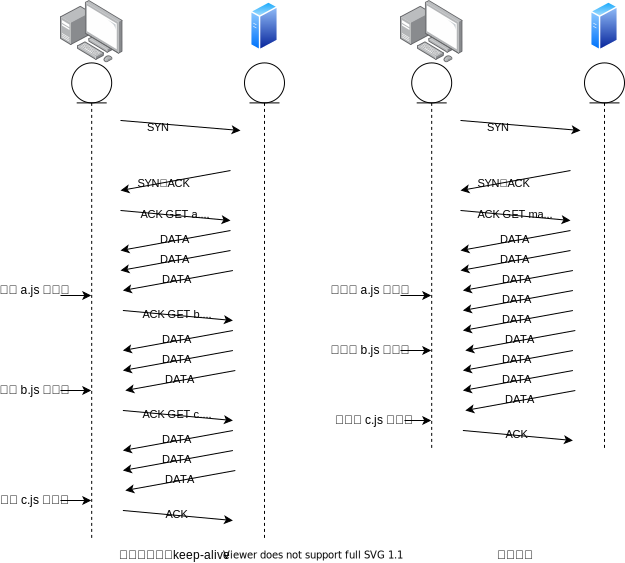
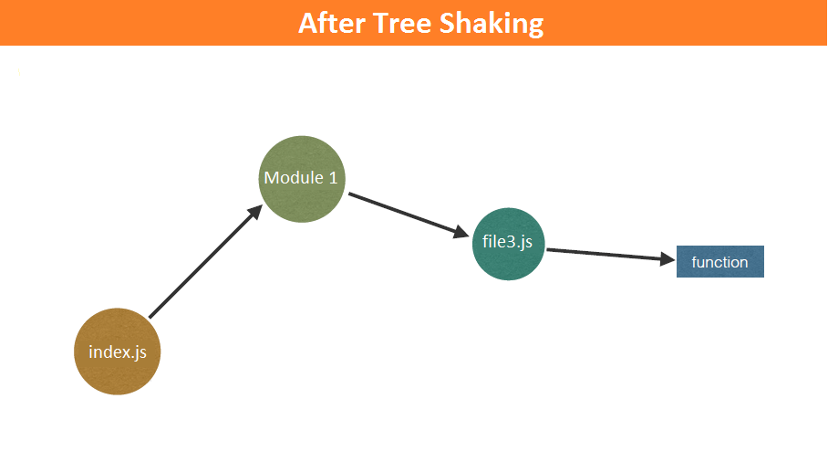
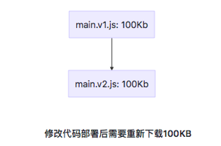
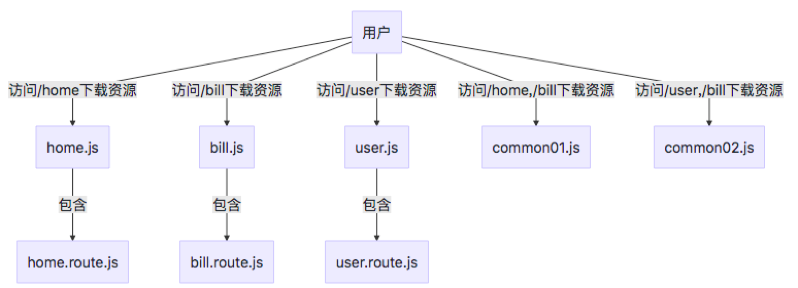
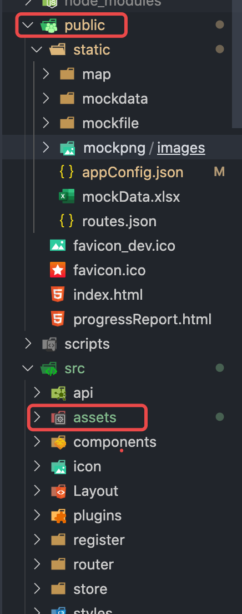

# 资源下载

## 前言

经过了一系列的网络请求过程，资源到了 Content Download 的过程，如下图的蓝色线条。


假如此时我们要优化 Web 应用的首屏渲染，从资源下载的角度应该如何入手呢？假如首屏要下载 10 个资源 5s，如何优化到 1s 内呢？

**单个资源下载的耗时 = 资源大小/用户网速**。

用户网速我们无法控制的，那么资源的瓶颈就显而易见：**资源大小**。这样只要减少单个资源的大小，就可以减少单个资源下载的耗时。另外，我们还可以设法通过合并资源以及懒加载某些资源达到请求次数的减少，从而减少总的耗时。

**总资源下载的耗时 = 资源数量 \* 单个资源下载的耗时**。

可见，HTTP 优化两个大的方向：减少请求次数和减少单次请求所花费的时间，这是全文的主要内容。文中会使用构建工具 webpack 4.x 作为说明，但对于其他构建工具来说优化思想是一致的。

**目标读者**：希望了解如何减少 Web 资源下载的时间。

**文章大纲**：

- 资源压缩与合并
- 资源拆分与按需加载
  - 文件依赖可视化分析
  - 删除冗余代码
  - 抽离公共代码
  - polyfill
    <!-- - 图片与字体资源的优化 -->
- 图片资源的优化

**阅读时长**：30min

## 资源压缩与合并

<!-- 10min -->

要减少请求次数和体积，首先要做的就是文件资源的合并与压缩。

### 压缩

我们来看看开启了资源的压缩的请求是怎么样？可以看到 size 有两个不同大小 和 Content-Encoding 值为 gzip 的列。


#### HTTP 是如何支持传输压缩文件的呢？

因为服务器会对资源进行压缩后再传输，所以浏览器需要知道服务器压缩的方法。HTTP/1.1 是通过请求头和响应头来进行协商，在发起请求时候会通过 HTTP 请求头 [Accept-Encoding](https://www.w3.org/Protocols/rfc2616/rfc2616-sec14.html) 告诉服务器它期待服务器返回的文件采取的压缩形式

```bash
# Accept: text/html 返回文件的类型
Accept-Encoding: gzip, deflate, br # 文件采用的压缩方式，优先 gzip
# Accept-Charset: ISO-8859-1, utf-8 # 文件的编码
# Accept-Language: zh-CN,zh # 文件的语言，优先中文
```

这个请求头一般是浏览器自动添加的。兼容的浏览器将在下载所需的格式前声明支持何种方法给服务器；不支持压缩方法的浏览器将下载未经压缩的数据。

服务器接收到浏览器发送过来的请求头信息之后，会根据请求头的信息来准备响应数据。不过有时候会有一些意外情况发生，比如浏览器请求的压缩类型是 gzip，但是服务器不支持 gzip，只支持 br 压缩，那么它会通过响应头中的 [Content-Encoding](https://www.w3.org/Protocols/rfc2616/rfc2616-sec14.html) 字段告诉浏览器最终的压缩类型，也就是说最终浏览器需要根据响应头的信息来处理数据。

```bash
Content-Encoding: br # 表示服务器采用了 br 的压缩方法
# Content-Type: text/html; charset=UTF-8 # 表示返回 html 文件，编码类型为 UTF-8
```

有了响应头的信息，浏览器就会使用 br 方法来解压文件，再按照 UTF-8 的编码格式来处理原始文件，最后按照 HTML 的方式来解析该文件。

<!-- 协议的通信允许传输压缩文件的传输，如何对文件进行压缩，在哪里进行压缩（服务器压缩，都是服务器压缩，前端的压缩只不过分担一部分服务器的处理），压缩的时机？ -->

<!-- Gzip 的内核就是 Deflate，目前我们压缩文件用得最多的就是 Gzip。 -->

#### 构建结果压缩

如果客户端和服务端都支持 HTTP 压缩的情况下，浏览器展示的文件包括 HTML 文本、JS 脚本以及 CSS 样式文件、图片等，这些资源在服务器发送给浏览器前就是已经压缩好的了。

一般来说，Gzip 压缩是服务器的活儿：服务器了解到我们这边有一个 Gzip 压缩的需求，它会启动自己的 CPU 去为我们完成这个任务。
下面是使用 Node.js 实现一个 demo：

```js
const DOCUMENT_ROOT = "./app";
const DIRECTORY_INDEX = "/index.html";

const port = process.env.PORT || 9993;

const zlib = require("zlib");
const http = require("http");
const path = require("path");
const fs = require("fs");

http
  .createServer(function(request, response) {
    // Remove query strings from uri
    if (request.url.indexOf("?") > -1) {
      request.url = request.url.substr(0, request.url.indexOf("?"));
    }

    // Remove query strings from uri
    if (request.url == "/") {
      request.url = DIRECTORY_INDEX;
    }
    const filePath = DOCUMENT_ROOT + request.url;

    const extname = path.extname(filePath);

    const acceptEncoding = request.headers["accept-encoding"];
    if (!acceptEncoding) {
      acceptEncoding = "";
    }

    fs.exists(filePath, function(exists) {
      if (exists) {
        fs.readFile(filePath, function(error, content) {
          if (error) {
            response.writeHead(500);
            response.end();
          } else {
            const raw = fs.createReadStream(filePath);

            if (acceptEncoding.match(/\bdeflate\b/)) {
              response.writeHead(200, { "content-encoding": "deflate" });
              raw.pipe(zlib.createDeflate()).pipe(response);
            } else if (acceptEncoding.match(/\bgzip\b/)) {
              response.writeHead(200, { "content-encoding": "gzip" });
              raw.pipe(zlib.createGzip()).pipe(response);
            } else {
              response.writeHead(200, {});
              raw.pipe(response); // 不压缩
            }
          }
        });
      } else {
        response.writeHead(404);
        response.end();
      }
    });
  })
  .listen(port);

console.log("Serving files on http://localhost:" + port);
```

压缩文件这个过程本身是需要耗费时间的，我们可以理解为<u>以服务器压缩的时间开销和 CPU 开销（以及浏览器解析压缩文件的开销）为代价，省去了一些传输过程中的时间开销。</u>

既然存在着这样的交换，那么就要求我们学会权衡。服务器的 CPU 性能不是无限的，如果存在大量的压缩需求，服务器也扛不住的的。服务器一旦因此慢下来了，用户还是要等。

说到压缩，可不只是服务端的专利。我们日常开发中，还可以在客户端构建层面比如通过 Webpack 开启 Gzip 压缩处理：

```js
// vue.config.js
const CompressionPlugin = require("compression-webpack-plugin");

const productionGzipExtensions = ["js", "css"];

new CompressionPlugin({
  filename: "[path].gz[query]",
  algorithm: "gzip", // 压缩算法
  test: new RegExp("\\.(" + productionGzipExtensions.join("|") + ")$"), // 压缩的资源
  threshold: 10240, // 资源大于 10240B = 10 KB 时会被压缩
  minRatio: 0.8, // 压缩比率
});
```


上图是 webpack 对 JS、CSS 开启了 gzip 的压缩。画框中的 JS 源文件为 1.3MB，压缩后为 343 KB，压缩率达到 70% 以上。

Webpack 中 Gzip 压缩操作的存在，事实上就是为了在构建过程中去做一部分服务器的工作，为服务器分压。

因此，这两个地方的 Gzip 压缩，谁也不能替代谁。作为开发者，我们也应该结合业务压力的实际情况，去做好其中的权衡。

##### 该不该用 Gzip

如果你的项目不是极端的迷你超小型文件，都可以试试 Gzip。

有的同学或许存在这样的疑问：压缩 Gzip，服务端要花时间；解压 Gzip，浏览器要花时间。中间节省出来的传输时间，真的那么可观吗？

答案是肯定的。如果你手上的项目是 1k、2k 的小文件，那确实是有点高射炮打蚊子的意思。但更多的时候，我们处理的都是具备一定规模的项目文件。实践证明，这种情况下压缩和解压缩带来的传输过程中节省下的时间开销来说，可以说是微不足道的。

假如一个 5M 大小的文件，在宽带速率为 500 多 k/s 的网络下，宽带速率不高的情况下，足以需要 10 s 左右。假如使用 gzip 压缩后可以减少到 2M 左右，时间上可以减少到 3、4s。

<!-- 可以根据宽带的速度来计算合适的大小。（在计算机网络中,其网络传输速率的单位用 b/s(比特每秒)表示 Byte 字节 1B = 8bit1Mb/s = 1024*1024 b/s = 1024 *1024 /8 B/s = 128KB/s 理论上:2M（即 2Mb/s）宽带理论速率是：256KB/s，实际速率大约为 150~240KB/s；（其原因是受用户计算机性能、网络设备质量、资源使用情况、网络高峰期、网站服务能力、线路衰耗，信号衰减等多因素的影响而造成的）。4M（即 4Mb/s）的宽带理论速率是：512KB/s，实际速率大约为 200~440kB，网络传输与比特为单位，而计算机读取是字节为单位） -->

##### Gzip 是万能的吗？

首先要承认 Gzip 是高效的，压缩后通常能帮我们减少响应 70% 左右的大小。

但它并非万能的。Gzip 并不保证针对每一个文件的压缩都会使其变小。（图片则不行）

Gzip 压缩背后的原理，<u>是在一个文本文件中找出一些重复出现的字符串、临时替换它们，从而使整个文件变小。</u>根据这个原理，文件中代码的重复率越高，那么压缩的效率就越高，使用 Gzip 的收益也就越大。反之亦然。详细可以参考 [gzip 原理与实现](https://blog.csdn.net/imquestion/article/details/16439)

<!-- 运维系统 -->

#### 运行时压缩

除了对构建的结果进行压缩外，还有一些是在系统运行时需要动态压缩的。比如用户上传图片、音频、视频等。


- 有损压缩
  - 主要用于图像压缩
    - 用户自拍图片
    - 验证信息的图片
  - 方式
    - 基于 canvas API，`canvas.toBlob(callback, mimeType, quality)` 可以参考 [前端图片压缩上传（压缩篇）：可能是最适合小白的前端图片压缩文章了！](https://juejin.im/post/6844903495703904263#heading-8)
- 无损压缩

  - 数据压缩，文本压缩
    - 用户操作大量数据后本地保存数据，上传数据
    - 选择文件夹上传之前进行压缩
  - 压缩原理：任意一个非随机文件都含有重复数据，这些重复数据可以通过用来确定字符出现概的统计建模来压缩。
  - 方式：
    - 遵循 [LZ-](https://en.wikipedia.org/wiki/LZ77_and_LZ78) 开头压缩算法的方案，比如开源库 jszip。
    - 利用 png 无损压缩，使用 canvas 绘制像素，输出为 png 格式。

上面提到的都是上传、下载文件之前先进行完整的压缩，那么能否边上传边压缩呢？一个取巧的方式是把大的文件分片压缩，分片传输，通过 HTTP Chunk transfer 机制。

对于边下载边解压，详细参考 [ZIP 也能边下载边解压？流式解压技术揭秘](https://mp.weixin.qq.com/s/NB12KQOHjso9wH8Ju1ueSA) 。

### 合并

<!-- 哪些文件应该进行合并呢？一般是公共的代码，比如相同页面使用的 -->
<!-- 3min 略说， 简单介绍通过 webpack 模块化进行几个文件的合并打包以及对比以前分散的几个文件。雪碧图的合并、阿里 fonts 的合并、至于为什么 svg 比 font 更好，但是会不会导致性能的问题，后面图片优化会说。图片的合并放到图片优化考虑-->

资源的压缩是为了减少文件的体积，资源的合并则是为了减少 HTTP 请求次数。假如有三个 JS 文件，分别为 a.js，b.js，c.js，现在通过 HTTP 进行传输如下图：



通过上图对比，合并请求的优点：

- 减少文件之间可能会插入其他的请求导致 TCP 队列阻塞的频率。
- 减少 HTTP 请求次数较多。

资源的合并一般是在构建阶段，使用 Node.js 进行文件合并，以 webpack 为例：

a.js

```js
export const add = (a, b) => a + b;
```

b.js

```js
export const sub = (a, b) => a - b;
```

c.js

```js
export const multiply = (a, b) => a * b;
```

main.js 作为 webpack 入口

```js
import { add } from "./a";
import { sub } from "./b";
import { multiply } from "./c";
console.log("add(1 + 2) = ", add(1, 2)); // 3
console.log("sub(1 - 2) = ", sub(1, 2)); // -1
console.log("multiply(1 + 2) = ", multiply(1, 2)); // 2
```

webpack 的配置

```js
// "webpack": "4.44.2",
// "webpack-cli": "3.3.12"
const path = require("path");
module.exports = {
  entry: "./main.js",
  output: {
    filename: "bundle.js",
    path: path.resolve(__dirname, "./dist"),
  },
};
```

通过上面的配置可以把 a、b、c 文件打包合并为一个文件，然后进行加载使用。

虽然说资源合并很有必要，但是文件的合并也有缺点。

<!-- 运维管理系统就需要拆分代码-->

- **首屏渲染问题**。特别是对于单页面应用来说，一个脚本文件过大的话会影响首次渲染的速度。（在没有做服务端渲染的情况下），另外首屏加载指的是浏览器上首次加载的页面，不仅仅是首页，有可能用户第一次浏览的是商品详情页、关于我们页等。
- **缓存失效**。假如合并前 a 文件改变只会造成 a 文件缓存失效，但是合并后，a 文件内容改变，会造成 bundle.js 文件全部内容缓存失效。

因此，我们需要在合适的场景下合并文件，比如不同页面的合并、一些公共库、工具类的合并。

## 资源拆分与按需加载

<!--阅读时长 10min -->

鉴于前面说过资源合并的一些缺点，我们有必要考虑对某些合并的资源进行拆分，一来可以减小单个合并文件的大小，二来可以对多个文件进行按需加载。

### 文件结构可视化，找出导致体积过大的原因

在做进一步的拆分优化之前，可以借助一个非常好用的可视化工具——[webpack-bundle-analyzer](https://www.npmjs.com/package/webpack-bundle-analyzer)，配置方法和普通的 plugin 无异，它会以矩形树图的形式将包内各个模块的大小和依赖关系呈现出来，格局如官方所提供这张图所示：


在使用时，我们只需要将其以插件的形式引入，注意是放到生产环境的 webpack 配置中：

```js
// webpack.config.prod.js
const BundleAnalyzerPlugin = require("webpack-bundle-analyzer")
  .BundleAnalyzerPlugin;

module.exports = {
  plugins: [new BundleAnalyzerPlugin()],
};
```

然后在 yarn build：

```bash
$ yarn build

The build folder is ready to be deployed.
Webpack Bundle Analyzer is started at http://127.0.0.1:8888
```

在 vuecli 项目中，只需要 `yarn build --report` ，也就是跑 `vue-cli-service build --report` 的命令，即可快速查看。

```json
{
  "scripts" {
    "build": "vue-cli-service build --report"
  }
}
```

### 删除冗余代码

删除冗余的代码可以通过 `Tree-Shaking`，它在保持代码运行结果不变的前提下，去除无用的代码。这样的好处是：

- 减少程序的体积。
- 减少程序执行的时间。

从 webpack2 开始，webpack 原生支持了 ES6 的模块系统，并基于此推出了 [Tree-Shaking](https://webpack.js.org/guides/tree-shaking/)（Tree Shaking 最先在 Rollup 中出现）。

> Tree shaking is a term commonly used in the JavaScript context for dead-code elimination, or more precisely, live-code import. It relies on ES2015 module import/export for the static structure of its module system.

由于 Tree-Shaking 是基于静态模块分析的，意思像 CommonJS、AMD 模块这种运行时（导出对象）是不支持的，但支持基于 import/export（导出代码） 的语法，Tree-Shaking 可以在编译的过程中获悉哪些模块并没有真正被使用，这些没用的代码，在最后打包的时候会被去除。关于 ES6 模块化，可以看 [Module 的语法](https://es6.ruanyifeng.com/#docs/module)。




<!-- 为什么一定要基于 import/export，这里需要补充学习下 import/export 跟 es5 的区别，tree-shaking是基于es modules 静态分析实现的，所以其他模块化方案是不行的。包括 UMD，被打包为umd模块的包用tree-shaking就相当于没用了。因为 ES 的模块是静态的引用，而不是运行时。-->

拿前面资源合并的例子来说：

a.js

```js
export const add = (a, b) => a + b;
```

b.js

```js
export const sub = (a, b) => a - b;
```

c.js

```js
export const multiply = (a, b) => a * b;
```

main.js

```js
import { add } from "./a";
import { sub } from "./b";
import { multiply } from "./c";
console.log("add(1 + 2) = ", add(1, 2)); // 3
console.log("sub(1 - 2) = ", sub(1, 2)); // -1
// console.log("multiply(1 * 2) = ", multiply(1, 2)); // 2
```

因为 multiply 没有被用到，所以打包的结果里会把 multiply 的部分去掉。

**那么要如何接入 Tree Shaking 呢？**

Tree Shaking 具体的过程分为两步：

1. webpack 负责对代码进行标记，把 import & export 标记为 3 类。
   - 所有 import 标记为 / harmony /
   - 被使用过的 export 标记为 / harmony export ([type])/，其中 [type] 和 webpack 内部有关，可能是 binding，immutable 等。
   - 没被使用过的 import 标记为 / harmony export [FuncName]，其中 [FuncName] 为 export 的方法名称。
2. 然后在 Uglifyjs（或其他类似的工具）进行代码精简，把没用的代码删掉。

配置如下：

```js
const path = require("path");
module.exports = {
  entry: "./main.js",
  output: {
    filename: "bundle.js",
    path: path.resolve(__dirname, "./dist"),
  },
  mode: "development",
  //   mode: "production",
  optimization: {
    usedExports: true,
  },
};
```

然后进行打包命令输出如下（其中可以通过 --display-used-exports 参数在命令行查看 export 使用的情况）：

```js
// ....
"use strict";
eval("/* harmony export (binding) */ __webpack_require__.d(__webpack_exports__, \"a\", function() { return add; });\nconst add = (a, b) => a + b;\n\n//# sourceURL=webpack:///./a.js?");

/***/ }),

"./b.js":
/***/ (function(module, __webpack_exports__, __webpack_require__) {

"use strict";
eval("/* harmony export (binding) */ __webpack_require__.d(__webpack_exports__, \"a\", function() { return sub; });\nconst sub = (a, b) => a - b;\n \n\n//# sourceURL=webpack:///./b.js?");

/***/ }),

/***/ "./c.js":
/***/ (function(module, __webpack_exports__, __webpack_require__) {

"use strict";
eval("/* unused harmony export multiply */\nconst multiply = (a, b) => a * b;\n\n\n//# sourceURL=webpack:///./c.js?");

/***/ }),
// ... 省略
```

之后再通过 Uglifyjs 处理即可，Webpack Tree shaking 会对多层调用的模块进行重构，提取其中的代码，简化函数的调用结构：

```js
//
function(e, t, r) {
    "use strict";
    r.r(t);
    console.log("add(1 + 2) = ", 1 + 2),
      console.log("sub(1 - 2) = ", ((e, t) => e - t)(1, 2));
  }
  //
```

在生产环境下配置如下：

```js
const config = {
  mode: "production", // 会进行 Tree Shaking 和压缩代码
  optimization: {
    usedExports: true,
  },
};
```

这里提一下，我们引入第三方库时，不要引入整个 JavaScript 对象，而是按需引入包。

```js
// Import everything (NOT TREE-SHAKBLE)
import _ from "lodash";
// Import named export (CAN BE TREE SHAKEN)
import { debounce } from "lodash";
// 或者这样引入 (CAN BE TREE SHAKEN)
import debounce from "lodash/lib/debounce";
```

<!-- 注意的是，有一些操作可能导致 Tree-Shaking 不起作用，详细可以参考这篇文章。你的Tree-Shaking并没什么卵用 https://juejin.im/post/6844903549290151949#heading-7-->

<!-- UglifyJsPlugin 跟 Gzip 作用不一样的，它只能压缩 JS，并且可以去除无用代码，比如 console.log debugger 、删除注释等 -->

<!-- 5min -->

### 抽离公共代码

去掉无用的代码后，我们要考虑如何抽离页面中公共的代码，主要针对**单页面应用**，包括三部分：

- 抽离第三方库
- 业务代码的处理
- polyfill

#### 抽离第三方库

第三方库一般比较稳定，而业务代码可能会频繁变更。

所以，如果不抽离打包，业务变动后，用户需要重新下载全部的代码：



而抽离第三方库进行打包则只需要下载变更的业务代码，因为第三方库的 hash 值没有变化，就会从缓存中获取。


在 vue-cli 中，只要是通过 node_module 引入的模块，都被打包进类似 `chunk-vendors-hash` 的文件里，如果引入的第三方依赖很多，这个文件也会很大，这个时候可以借助 webpack-bundle-analyzer 进行分析是否有没必要的依赖（包括检查依赖的依赖，像国际化之类的文件）。


实际上的 vuecli 中 webpack 配置如下：

```js
// code splitting
if (process.env.NODE_ENV !== "test") {
  webpackConfig.optimization.splitChunks({
    // 找到 chunk 中共享的模块,取出来生成单独的 chunk
    cacheGroups: {
      // 缓存公共代码
      vendors: {
        // 抽离第三方插件
        name: `chunk-vendors`,
        test: /[\\/]node_modules[\\/]/, // 指定是node_modules下的第三方包
        priority: -10, // 抽取优先级，数值越大越优先处理
        chunks: "initial", // async表示抽取异步模块，all表示对所有模块生效，initial表示对同步模块生效 a
      },
    },
  });
}
```

<!-- TODO，看情况是否补充 webpack 例子。 -->

#### 拆分业务代码按需加载

在 SPA 单页面应用中，一般情况下都会存在很多路由，而我们每次访问其实只访问一个路由，因此可以将代码按路由代码拆分并进行按需加载，这样就减少了首屏资源加载的数量。


如何配置呢？

懒加载函数：

```js
function getComponent() {
  // 这里的注释会被 webpack 自动识别处理
  return import(/* webpackChunkName: "lodash" */ "lodash")
    .then(({ default: _ }) => {
      const element = document.createElement("div");

      element.innerHTML = _.join(["Hello", "webpack"], " ");

      return element;
    })
    .catch((error) => "An error occurred while loading the component");
}
```

webpack 配置如下：

```js
const path = require("path");
module.exports = {
  entry: "./main.js",
  output: {
    filename: "[name].bundle.js",
    `chunkFilename: '[name].bundle.js'`, // 动态加载
    path: path.resolve(__dirname, "./dist"),
  },
  mode: "production",
  optimization: {
    usedExports: true,
  },
};
```

更多配置可以参考 webpack 官网 [code-splitting](https://webpack.js.org/guides/code-splitting/#root)

可以看这个例子。/network/demo03

<!-- 在 vuecli 中都是封装好的了。直接使用即可。 -->

<!-- 按需加载的原理后续补充，就是一个回调函数。 https://juejin.im/book/6844733750048210957/section/6844733750102720526，需要补充，因为这里比如-->

#### 抽离业务代码的公共模块

前面提到单页面应用按路由拆分模块包，其中存在一个问题是，如果存在公共模块，那么在每一个拆分出来的路由模块都会加载这个公共模块。


<!-- 抽离公共业务代码，一般针对多页面应用，也就是 webpack 中多个 entry 入口。 -->



具体配置如下

```js
module.exports = {
  mode: "production",
  optimization: {
    splitChunks: {
      //分割代码块
      cacheGroups: {
        //缓存组 缓存公共代码
        common: {
          name: `chunk-common`,
          minChunks: 2,
          priority: -20,
          chunks: "initial",
          reuseExistingChunk: true,
        },
      },
    },
  },
};
```

<!-- TODO，看情况是否补充例子，路由，分享完有时间再补充 -->
<!-- todo 补充 load.js 懒加载原理 -->
<!-- #### 拆分资源 dll 后续研究再添加 -->

### polyfill

现在 ES2020 发布了，但是依然有许多老旧浏览器占领市场，所以我们依然需要对这部分浏览器作兼容性处理。

优化方案可以：

- @babel/preset-env 按需加载
- @babel/plugin-transform-runtime。
  - babel 在每个需要的文件的顶部都会插入一些 helpers 代码，这可能会导致多个文件都会有重复的 helpers 代码。 @babel/plugin-transform-runtime 的 helpers 选项就可以把这些模块抽离出来

具体优化可以参考：[Show me the code，babel 7 最佳实践！](https://github.com/Weiyu-Chen/blog/issues/5)

## 图片资源的优化

<!-- 10 min -->

前面说的均是对代码资源进行处理，虽然说 JS 和 CSS 更快下载完成很重要，但是让图片这种用户直观可见的资源更快展示也至关重要。

<!-- ### 图片资源 -->

对于图片资源的优化来说，我们更多是在成像质量与体积做选择。

<!-- 图像大小采用分辨率描述，由多个像素组成。分辨率指屏幕上像素的数目，为了控制像素的亮度和彩色深度，每个像素需要很多个二进制位来表示，如果要显示 256 种颜色，则每个像素至少需要 8 位（`一个字节`）来表示，即 2 的 8 次方等于 256；当显示[真彩色](https://baike.sogou.com/v727368.htm)时，每个像素需要 `3个字节`的[存储量](https://baike.sogou.com/v68223633.htm)。

在计算机中，像素用二进制数来表示。不同的图片格式中像素与二进制之间的对应关系是不同的。一个像素对应的二进制位数越多，它可以表示的颜色种类就越多，成像效果就越细腻，文件体积相应也会越大。

一个二进制位表示两种颜色（0|1 对应 黑|白），如果一种图片格式对应的二进制位数有 n 个，那么它就可以诚信 2^n 种颜色。

那对于矢量图形如 svg 来说，它的像素是计算可以完全模拟出来的？ -->

<!-- | 文件类型 | 优缺点|应用场景|
|--|--|--|
| PNG      | 通常用于万维网。无损压缩，带透明通道                                                                                           |
| JPEG/JPG      | 通常用于万维网。有损压缩、体积小、加载快。无透明通道。JPG 格式以 `24` 位存储单个图，可以呈现多达 1600 万种颜色，足以应对大多数场景下对色彩的要求。|                                                                                        |
| GIF      | 通常用于万维网。有损压缩，无透明通道（在技术上将，损耗并不是压缩造成的，而是当图片转为八位时导致数据丢失。最终和压缩一样损耗） |
| BMP      | Windows 上默认的图像格式。无压缩，无透明通道。                                                                                 |
| TGA      | 通常用于 3D 图形。其他地方不常用。无损压缩或不压缩，带透明通道。                                                               |
| TIFF     | 通常用于数字相片和出版。无损压缩或不压缩，无透明通道。                                                                         |
| PICT     | 旧 Macs 系统上的默认图像格式。有损压缩，无透明通道。                                                                           |
| PSD      | Photoshop 原生文件格式。无压缩，有                                                                                             |
| SVG      |                                                                                                                                |
| Base64   |                                                                                                                                |
| WebP     |                                                                                                      -->

#### JPEG/JPG

关键字：有损压缩、体积小、加载快、不支持透明

##### JPG 的优点

JPG 最大的特点是**有损压缩**。这种高效的压缩算法使它成为了一种非常轻巧的图片格式。另一方面，即使被称为“有损”压缩，JPG 的压缩方式仍然是一种高质量的压缩方式：当我们把图片体积压缩至原有体积的 50% 以下时，JPG 仍然可以保持住 60% 的品质。此外，JPG 格式以 24 位存储单个图，可以呈现多达 1600 万种颜色，足以应对大多数场景下对色彩的要求，这一点决定了它压缩前后的质量损耗并不容易被我们人类的肉眼所察觉——前提是你用对了业务场景。

##### 使用场景

JPG 使用于呈现色彩丰富的图片，在我们日常开发中，JPG 图片经常作为大的背景图、轮播图或 Banner 图出现。

可以查看京东首页和淘宝首页。

#### JPG 的缺陷

有损压缩在上文所展示的轮播图上确实很难露出马脚，但当它处理**矢量图形**和 **Logo** 等线条感较强、颜色对比强烈的图像时，人为压缩导致的图片模糊会相当明显。

此外，JPEG 图像不支持透明度处理，透明图片需要召唤 PNG 来呈现。

### PNG-8 与 PNG-24

关键字：无损压缩、质量高、体积大、支持透明

#### PNG 的优点

PNG（可移植网络图形格式）是一种无损压缩的高保真的图片格式。8 和 24，这里都是二进制数的位数。我们前置知识提到的对应关系，8 位的 PNG 最多支持 256 种颜色，而 24 位的可以呈现约 1600 万种。

PNG 图片具有比 JPG 更强的色彩表现力，对`线条` 的处理更加细腻，对透明度有良好的支持。它弥补了上文我们提到的 JPG 的局限性，唯一的 BUG 就是**体积太大。**

#### PNG-8 与 PNG-24

如何确定一张图片是该用 PNG-8 还是 PNG-24 去呈现呢？好的做法是把图片先按照这两种格式分别输出，看 PNG-8 输出的额吉锅是否带来肉眼可见的质量损耗，并且确认这种损耗是否在我们（尤其是 UI 设计师）可接受的范围内，基于对比的结果去判断。

##### 应用场景

前面我们提到的，复杂的、色彩层次丰富的图片，用 PNG 来处理的话，成本（体积大）会比较高，我们一般会交给 JPG 去存储。

考虑到 PNG 在处理`线条`和`颜色对比度`方面的优势，我们主要用它来呈现小的 Logo、颜色简单且对比强烈的图片或背景等。（这里是否更应该使用 svg 呢？）

淘宝首页、

#### SVG

关键字：文本文件、体积小、不失真、兼容性好。

##### SVG 的特性

和性能关系最密切的一点就是：SVG 与 PNG 和 JPG 相比，<u>文件体积更小，可压缩性更强。</u>

当然，作为矢量图，它最显著的优势还是在于<u>图片可无限放大而不失真</u>这一点上。这使得 SVG 即使被放到视网膜屏幕上，也可以一如既往地展现比较好的成像品质——1 张 SVG 足以适配 n 种分辨率。（jpg、png 得输出多个大小的图片）

此外，<u>SVG 是文本文件</u>。我们既可以像写代码一样定义 SVG，把它写在 HTML 里、成为 DOM 的一部分，也可以把图形的描述写入以 `.svg` 为后缀的独立文件（SVG 文件在使用上与普通图片文件无异）。这使得 SVG 文件可以被非常多的工具读取和修改，具有较强的`灵活性`。

SVG 的局限性，<u>一方面是它的渲染成本比较高，这点对性能来说是很不利的。</u>另一方面，SVG 存在着其他图片格式所没有的学习成本。（它是可编程的）。

#### 应用场景

SVG 是文本文件，我们既可以像写代码一样定义 SVG，把它写在 HTML 里、成为 DOM 的一部分，也可以把对图形的描述写入以 .svg 为后缀的独立文件（SVG 文件在使用上与普通图片文件无异）。

将 SVG 写入 HTML：

```html
<!DOCTYPE html>
<html lang="en">
  <head>
    <meta charset="UTF-8" />
    <title></title>
  </head>
  <body>
    <svg xmlns="http://www.w3.org/2000/svg" width="200" height="200">
      <circle cx="50" cy="50" r="50" /><circle>
    </svg>
  </body>
</html>
```

将 SVG 写入独立文件后引入 HTML:

```html

```

<!-- - 将 SVG 写入 HTML。（arcgis for js 3.0）
- 将 SVG 写入独立文件后引入 HTML
  ```html
  
  ``` -->

<!-- 实际开发中，使用更多的是后者。关于 svg 与 canvas 的性能问题，可以看 [图表的性能优化](../action/chart.md) -->

<!-- svg 与 iconfont 的对比，作为图标 -->

#### Base64

关键字：文本文件、依赖编码、小图标解决方案

Base64 并非一种图片格式，而是一种编码方式。Base64 和雪碧图一样，是作为小图标解决方案而存在的。

<!-- Base64 还可以避免跨域问题。 -->

和雪碧图一样，Base64 图片的出现，也是为了<u>减少加载网页图片时对服务器的请求次数，</u>从而提升网页性能。**Base64 是作为雪碧图的补充而存在的**。

Base64 是一种用于传输 8 Bit 字节码的编码方式，通过对图片进行 Base64 编码，`我们可以直接将编码结果（base64字符）写入 HTML 或 CSS，从而减少 HTTP 请求的次数`。

浏览器自动将 Base64 字符串解码为一个图片，而不需要再去发送 HTTP 请求。

为什么不把大图也换成 base64 呢？这是因为 base64 编码后，图片大小会膨胀为原文件的 4/3（这是由 Base64 的编码原理决定的）。如果我们把大图也编码到 HTML 或 CSS 文件中，后者的体积会明显增加，基本我们减少了 HTTP 请求，也无法弥补这庞大的体积带来的性能开销，得不偿失。（可以通过 performance 测试）

在传输非常小的图片时候，Base64 带来的体积膨胀、以及`浏览器解析 Base64` 的时间开销，与它节省掉的 HTTP 请求开销相比，可以忽略不计，这时候才真正体现出它在性能方面的优势。

<!-- Base64 编码工具推荐-webpack url -->

##### Base64 编码工具推荐

这里最推荐的是利用 webpack 来进行 Base64 的编码——webpack 的 url-loader 非常聪明，它除了具备基本的 Base64 转码能力，还可以结合文件大小，帮我们判断图片是否有必要进行 Base64 编码。

### webp

Webp 像 JPEG 一样对细节丰富的图片信手拈来，像 PNG 一样支持透明，像 GIF 一样可以显示动图——它集多种图片文件格式的优点于一身。

IE11+，我们不得不考虑对浏览器兼容性对预判。

<!-- ### 应用场景 -->

### vue 项目如何更好地导出蓝湖上的图片、图标

- 雪碧图（后续修改不好维护）
- svg 文本文件。
- base64
- iconf

对于小的图标、矢量图，直接导出 svg 为首，结合 `svg-sprite-loader` 处理，容易维护管理。

而对于大的图片，需要透明度则考虑 png，否则采取 jpg，做进一步的压缩。

<!-- 对于线框图，svg 小图标也容易维护。ps 输出的图标。ai 输出 svg。

svg-sprite-loader 是直接 svg 写入 html 中。 -->

#### 图片的优化

##### 图片压缩

一般 ui 设计师导出来的图片都是超高清的，放到网站时需要进行一定的压缩，避免图片过大，不应该超过 1M。

**在线压缩网站**

- https://www.picdiet.com/zh-cn Picdiet 是一款在线批量压缩图片神器，它不需要后端服务器或者 API 的支持，仅通过你的浏览器来压缩图片大小，这意味着它压缩图片极快并且不会导致隐私或敏感图片泄漏。
- 熊猫 https://tinypng.com/，压缩比很高。

**webpack 构建时压缩**

更好的方案是在 Webpack 构建时进行压缩，通过 loader 或者 plugin 来处理。

可以使用 [image-webpack-loader](https://www.npmjs.com/package/image-webpack-loader) 或 [imagemin-webpack-plugin](https://www.npmjs.com/package/imagemin-webpack-plugin)。

通过 webpack loader 或 plugin 构建时压缩挺好的，不过会可能会拖慢打包时间，特别是自动化部署时，线上安装压缩包的依赖慢（image-webpack-loader 3.56MB）。

另外对于 vuecli 项目中，只有在 src 里的文件才会经过打包处理，换言之，在 public 里的图片是不会被打包压缩的。



因此需要多方考虑，比如可以通过 tinypng 批量压缩项目里的图片文件，约定使用压缩图的规范。或让设计师直接导出分辨率相对低点的图片。

##### 图片加载

图片加载优化有两种方式，如下图。


项目中常见是使用懒加载的模式，具体思路：
将非首屏的图片的 src 属性设置一个默认值，监听事件 scroll、resize、orientationchange 等事件，判断元素进入视口 viewport 时则把真实地址赋予到 src 上。

```html

```

如上，data-_属于自定义属性， ele.dataset._ 可以读取自定义属性集合
img.srcset 属性用于设置不同屏幕密度下，image 自动加载不同的图片，比如``

这里有个简单的 [demo](http://hilongjw.github.io/vue-lazyload/)，

<!-- css 背景图片 -->

<!--后续可以考虑封装成一个 vue 组件  -->


<!-- 后面补充 -->

<!-- 参考资料 【性能优化】手把手实现图片懒加载+Vue封装 https://github.com/amandakelake/blog/issues/46-->
<!-- 涉及的项目模块
- 规划分析评价产品
- 模型首页 -->

<!-- - 同一个图片，是否只请求一次，然后采用相同的链接。 -->
<!-- [嗯，手搓一个 TinyPng 压缩图片的 WebpackPlugin 也 SoEasy 啦](https://mp.weixin.qq.com/s/5LzXEb7d9-F8XB_LqyNYVg) -->

<!-- ### 字体资源

系统不支持的字体才需要考虑如何优化
对于字体资源如何优化，这是之前看 ArcGIS 字体使用的总结，核型思想就是分片请求 + 懒加载。

为什么使用 .pbf 格式，通常的字体库都是以 ttf 等格式的，但是 ttf 文件通常都比较大，比如宋体的 ttf 文件大小为 17.3 M，每次请求都要加载 17.3 M 的数据并且还要去解析，这个对于客户端以及服务端的压力都非常大。而 pbf（protocol buffer 是 google 的一个开源项目，用于结构化数据串行化。）分批请求，大大减小请求压力。

如果你认真的看下前面的图，你可以发现一些规律，0-255、40448-40703 等，以 255 的间隔去分割。这是根据字符编码范围进行分段的，Unicode
采用 2 个字节编码，所以字符的范围是 [0, 65525]，然后每一段的字体请求的命名方式为 `start-end.pdf`。

更多的字体优化可以参考：https://web.dev/fast/#Optimize%20WebFonts。 -->

<!-- ## 总结 -->

<!-- ## vite

## snowpack -->

## 参考资料

- [Web 性能优化资源合集（持续更新）](../reference/README.md#网络)
