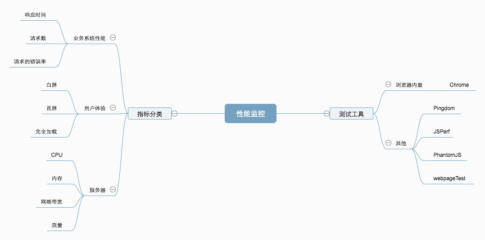

# 介绍

以从浏览器输入 URL 到网页显示发生了什么的路线来认识一个 Web 应用的展示所经历的路径中，其中我们会使用到各种监控工具来协助性能分析。

在本篇中，主要介绍如何使用性能调试工具（比如 chrome 调试工具）对 Web 网页进行性能分析，在介绍性能调试监控工具前，先会介绍下调试监控的指标，主要是对响应、动画、空闲时间、加载、以用户为中心等大的指标的细分。

<!-- 主要以 chrome 工具为主，而 chrome 则会介绍使用频率最高的功能，也说下 webpageTest 这些工具什么时候才会用到 -->

<!-- 如何讲才更有干货呢？不应该要全，重点在于频率高的指标。比如 FPS、CPU 使用率等、多点实战干货、少点理论

先说指标，然后如何提高该指标、然后再引出调试工具。 -->

<!-- ## 导航

- [解读指标]()
- [] -->

<!-- - 被监测的主体
如何
- 定制迷你监测平台

如何更好地阐述工具篇，不需太全，但要有实践干货。对于扩展的，可以抛出来。先把能说的先处理。

微谈前端性能优化，肯定是前端占主体。

- 浏览器内置工具
- 第三方拓展工具
- 定制迷你监测平台（拓展） -->
