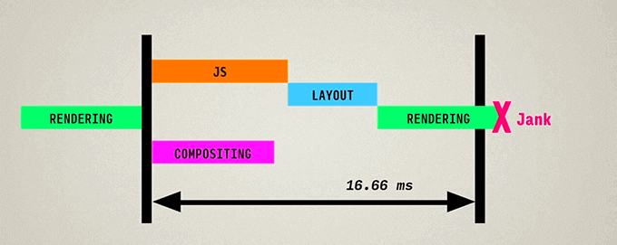

# 页面访问速度

## 重排和重绘

**网页生成的时候，至少会渲染一次。用户访问的过程中，还会不断重新渲染。**

以下三种情况，会导致网页重新渲染。
- 修改 DOM
- 修改样式表
- 用户事件（比如鼠标悬停、页面滚动、输入框输入文字、改变窗口大小等等）

**重新渲染，就需要重新生成布局和重新绘制。前者叫做“重排”（reflow），后者叫做“重绘”（repaint）。**

需要注意的是，**“重绘”不一定需要“重排”**，比如改变某个网页元素的颜色，就只会触发“重绘”，不会触发“重排”，因为布局没有改变。但是，**“重排”必然导致“重绘”**，比如改变一个网页元素的位置，就会同时触发“重排”和“重绘”，因为布局改变了。

## 刷新率

很多时候，密集的重新渲染是无法避免的，比如 scroll 事件的回调函数和网页动画。

**网页动画的每一帧（frame）都是一次重新渲染。**每秒低于24帧的动画，人眼就能感受到停顿。**一般的网页动画，需要达到每秒30帧到60帧的频率，才能比较流畅。**如果能达到每秒70帧甚至80帧，就会极其流畅。

帧率为25fps，即一秒变化25次，而帧率为 100 fps，即一秒变化100次，虽然基于时间的运动速度是一样，但是帧率低的由于变化次数少，变化的速率太慢骗不过眼睛，会让玩家明显感觉画面卡顿不流畅。

大多数显示器的刷新频率是60Hz，为了与系统一致，以及节省电力，浏览器会自动按照这个频率，刷新动画（如果可以做到的话）。

所以，如果网页动画能够做到每秒60帧，就会跟显示器同步刷新，达到最佳的视觉效果。这意味着，**一秒之内进行60次重新渲染，每次重新渲染的时间不能超过 16.66 毫秒。**

**一秒之间能够完成多少次重新渲染，这个指标就被称为“刷新率”，英文为 FPS（frame per second）**。60次重新渲染，就是60 FPS。

如果想达到60帧的刷新率，就意味着 JavaScript 线程每个任务的耗时，必须少于 16 毫秒。一个解决办法就是使用 Web Worker，主线程只用于 UI 渲染，然后跟 UI 渲染不相干的任务，都放在 Worker 线程。

### 问题

#### 1. 正常情况下，浏览器不会一直刷新帧率渲染？只会在动画方面或下面提及的三种情况才会重新渲染？

以下三种情况，会导致网页重新渲染。
- 修改 DOM
- 修改样式表 
- 用户事件（比如鼠标悬停、页面滚动、输入框输入文字、改变窗口大小等等）

（针对这句话：提高网页性能，就是要降低"重排"和"重绘"的频率和成本，尽量少触发重新渲染。前面提到，DOM变动和样式变动，都会触发重新渲染。但是，浏览器已经很智能了，会尽量把所有的变动集中在一起，排成一个队列，然后一次性执行，尽量避免多次重新渲染。）

需要使用 chrome 开发工具分析是否会这样？（重绘与重排）预估是浏览器会刷新帧率？
http://www.ruanyifeng.com/blog/2015/09/web-page-performance-in-depth.html