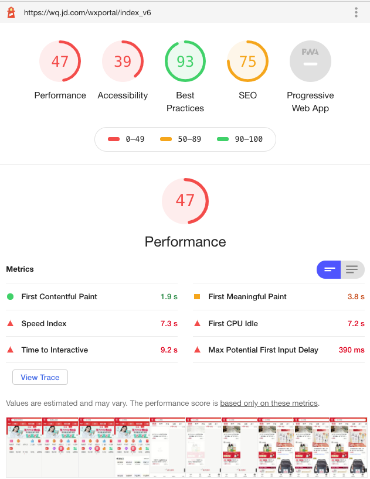
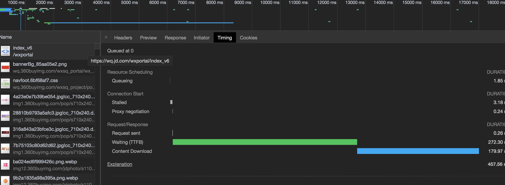

# Chrome 调试工具性能分析

## 前言

- 什么会影响你的性能
  - 网络链路
  - 服务器资源
  - 前端资源渲染
  - 用户硬件

以上的维度不是划线而治，它们更多是犬牙交错的关系。例如在渲染过程中浏览器反应很慢，有可能是脚本写得太烂遭遇性能瓶颈，也有可能是显卡杀手游戏占用了过多计算机资源；又如在分析前端资源渲染时，往往要结合[网络瀑布图](https://developers.google.com/web/tools/chrome-devtools/network/understanding-resource-timing)分析资源的获取时间，因为渲染页也是个动态的过程，<u>有些关键资源需要等待，有些则可以在渲染的同时加载。</u>

Chrome 的开发者工具各有自己的侧重点，如 Network 工具的瀑布图有着资源拉取顺序的详细信息，它的侧重点在于分析网络链路。而 Performance 工具的侧重点则在于前端渲染过程，它拥有帧率条形图、CPU 使用率面积图、资源瀑布图】主线程火焰图、事件总览等模块，它们和渲染息息相关，善用它们可以清晰地观察整个`渲染`阶段。

- chrome 版本：83

## 面板总览

## 分析面板介绍

- `Network`：页面中各种资源请求的情况，这里能看到资源的名称、状态、使用的协议（http1/http2/quic...）、资源类型、资源大小、资源时间线等情况。
- `Performance`：页面各项性能指标的火焰图，这里能看到白屏时间、FPS、资源加载时间线。
- `Memory`：可以记录某个时刻的页面内存等情况，一般用于分析内存泄漏。
- `JavaScript Profiler`：可以记录函数的耗时情况，方便找出耗时较多的函数。
- `Layers`：展示页面中的分层情况。

## 分析步骤说明

1. 隐身模式，避免插件影响。
2. 禁用缓存：disable cache
3. 调整网络情况为一般设备网络：slow 3G
4. 测试网站：输入https://wq.jd.com/wxportal/index_v6 
5. 从 Lighthouse 查看总览（总览）
6. 网络层面
   1. 从网路面板分析
7. 渲染层面
   1. 从性能面板分析
   2. 内存面板分析（内存泄漏）

一般可以按照上面的流程分析优化，如果预先知道了要分析的问题，即可直接选择对应的面板。（内存泄漏——内存面板）

## Lighthouse

LightHouse（以前版本是 Audits），LightHouse 是Google开源的一个自动化测试工具，它通过一系列的规则来对网页进行评估分析，最终给出一份评估报告。

Lighthouse 主要从 5 个方面给网页打分，在选择了设备、评估方面、网络情况等选项后，点击生成 report。

### 整体情况

性能指标：
- `First Contentful Paint`：首次内容绘制，标记的是浏览器渲染第一帧内容 **DOM** 的时间点，浏览器首次渲染任何文本，图像（包括背景图像），SVG 或者 `<canvas>` 等元素。
- `First Meaningful Paint`：首次有效绘制，标记主角元素渲染完成的时间点，主角元素可以是视频网站的视频控件，内容网站的页面框架也可以是资源网站的头图等。
- `Speed Index`：速度指标是一个页面加载性能指标，向你展示明显填充页面内容的速度，此指标的分数越低越好。
- `First CPU Idle`：首次 CPU 空闲时间。
- `Time to Interactive`：可互动时间，页面中的大多数网络资源完成加载并且 CPU 在很长一段时间都很空闲所需的时间。此时可以预期 CPU 非常空闲，可以及时的处理用户的交互操作。
- `Max Potential First Input Delay`：最大的输入延迟时间，输入响应能力对用户如何看待你应用的性能起关键作用。应用有 `100 毫秒`的时间响应用户输入。如果超过此时间，用户就会认为应用反应迟缓。

可以点击蓝色切换按钮，查看详细的信息。

### 性能指标优化建议

可以看到 Performance 方面建议，主要分为三类：Opportunities 可优化项、手动诊断项、通过的审查项。

本次例子如下：

#### 可优化项：

- 延迟视口外的图片加载。

<!-- 这个时候 webpack 的构建优化就派上用场了 -->

#### 手动诊断项：

1. 最小化主线程工作
2. 减少 JavaScript 执行时间
3. 避免 DOM 太大
4. 通过有效的缓存策略缓存一些资源
5. 避免链接关键的请求
6. 保持低请求数量和小的传输大小。

这些项目表示 LightHouse 并不能替你决定当前是好是坏，但是把详情列出来，由你手动排查每个项目的情况。这个时候就需要 `network` 和 `performance` 等面板来进一步进行分析了。

#### 通过的审查项

可以看每个条目的 showmore，从优秀的网站学习技巧，然后迁移到自己的项目上来。

## Network

使用网络面板了解请求和下载的资源文件并优化网页`加载`性能。

### 网络面板基础

1. Controls（控件）：使用这些选项可以控制 Network（网络）面板的外观和性能
2. Filters（过滤器）：使用这些选项可以控制在请求列表中显示哪些资源。
3. 细分过滤：
     - Show overview：记录各个资源请求的时间线（Waiting TTFB 和 Content Download）
     - Capture screenshots 捕获截图，双击屏幕截图放大，可以切换每一张图片。
     - 
4. Requests Table（请求列表）：此列表列出了检索的每个资源。默认情况下，此表按时间顺序排序，也就是最早的资源在顶部。单击资源名称可以获得更多信息。
5. Summary（概要）：告诉你请求的总数，传输的总数据量和加载时间。

默认情况下，请求列表显示以下列。
- `Name（名称）`：资源的名称。
- `Status（状态）`：HTTP 状态码
- `Type（类型）`：请求的资源 的 MIME 类型。
- `Initiator（发起人）`：发起请求的`对象`或`进程`。它可能有以下几种值：
  - `Parser`（解析器）：Chrome 的 HTML 解析器发起了请求。
  - `Redirect`（重定向）：HTTP 重定向启动了请求。
  - `Script`（脚本）：脚本启动了请求。
  - `Other`（其他）：一些其他进程或动作发起请求，例如用户点击链接跳转到页面，或在地址栏中输入网址。
- `Size`（尺寸）：响应头的大小（通常是几百字节）加上响应数据，由服务器提供。
- `Time`（时间）：总持续时间，从请求的开始到接收响应中的最后一个字节。
- `Waterfall（时间轴）`：`Timeline` 列显示所有网络请求的视觉

#### 查看单个资源的详细信息

- Header（标头）：与资源相关的 HTTP 头。
- Preview（预览）：预览 JSON，图片和文字资源。
- Response（响应）：HTTP 响应数据（如果有）。
- Timing（时序）：资源的请求生命周期的明细分类。

#### 查看网络时序

生命周期显示在以下类别中花费的时间：
- `Queuing`（排队）
- `Stalled`（停滞）
- 如果适用：`DNS lookup`（DNS 查找），`initial connection`（初始连接）、`SSL handshake`（SSL 握手）
- `Request sent`（请求发送）
- `Waiting`（等待）（到开始下载第一个字节的时间（TTFB））
- `Content Download`（内容下载）

也可以将鼠标悬停在资源的 Timeline（时间轴）图表上，查看此相同的信息。

### 了解资源加载时序

所有网络请求都被视为资源。当它们通过网络检索时，分为不同的生命周期。`Network （网络）面板`使用的 Resoure Timing API 提供了关于每个单独资源接收时间的详细信息。请求生命周期的主要阶段是：

### 性能分析

#### 排队或停止阻塞

很多个请求排队或被阻塞。这表示单个客户端检索的资源太多。在 HTTP 1.0/1.1 连接协议中，Chrome 限制每个域名最多执行 6 个 TCP 连接。如果你一次请求十二个资源，前 6 个将开始，后 6个开始排队。一旦其中一个请求完成，队列中的第一个请求项目将开始其请求过程。

要解决传统 HTTP 1 的此问题，你需要实现`分域`。即用多个子域名提供服务资源，将资源拆分到多个`子域`中，均匀分配。（或者 Websocket 协议）

上面说的修复 HTTP 1 连接数问题，不适合 HTTP 2 连接。如果你已部署 HTTP 2，不要对你的资源进行分域，因为它会影响 HTTP 2 的工作原理。在 HTTP 2 中，TCP 连接`多路复用`连接的。这消除了 HTTP 1 的 6 个连接限制，并且可以通过单个连接同时传输多个资源。

#### 接收第一个字节的时间很慢

TTFB就是等待第一个响应字节的时间，建议在200ms以下，以下情况可能会导致高TTFB:

客户端和服务器之间的网络条件差，
要么，服务器端程序响应很慢。

为了解决高 TTFB，首先要去除尽可能多的网络连接。其次，提供服务端应用的响应速度，比如数据库查询、缓存、web 服务器配置等。
  
#### 加载缓慢

如果你看到 Content Download（内容下载）阶段花费了很多时间，提高服务响应速度、并行下载等优化措施帮助不大。主要的解决方案是<u>发送更少的字节</u>。（比如，下载一张高质量的大图，可能是几兆，这个时候你需要优化图片）。

<!-- 这里可以联系到 webpack 工具的打包优化 -->

## Performance

Performance 工具的侧重点则在于前端渲染过程，进行时间轴录制来分析在`网页加载`或`用户互动`后发生的每个事件，它拥有帧率条形图、CPU 使用率面积图、资源瀑布图】主线程火焰图、事件总览等模块，它们和渲染息息相关，善用它们可以清晰地观察整个`渲染`阶段，以此参考来提升`运行时性能`。

- 如何查看性能
- 分析运行时性能

### 如何查看性能

Too long; didn't read

TL；DR
- 进行时间轴录制来分析在网页加载或用户互动后发生的每个事件
- 在 `Overview` (概览)窗格中查看 FPS、CPU 和网络请求。
- 单击 `Flame Chart` （火焰）图表中的事件可查看其详细信息。
- 放大录制的一部分，使分析更容易。

这是 Performance 的默认引导页面。
1. 第一句提示语表示的操作为立即开始记录当前发生的所有事件，点击停止按钮才会记录。
2. 第二句对应的操作则是重载页面并记录事件，工具会自动在页面加载完毕处于`可交互状态时`停止记录，两者最终都会生成报告（生成报告需要大量运算，会花费一些时间）。

#### 进行录制

#### Performance 面板概述

图中的四个区域：
1. 控制面板，用来控制工具的特性。
   - `Network` 与 `CPU`：分别限制网络和计算资源，模拟不同终端环境，可以更容易观察到性能瓶颈。
   - `Disable JavaScript samples` 选项开启会使工具忽略 JS 的调用栈
   - 打开 `Enable advanced paint instrumentation` 则会详细记录某些渲染事件的细节。
2. 概览面板
   - 描述帧率（FPS）：描绘每秒钟渲染多少帧图像的指标，帧率越高则在观感上更流畅。
   - 网络资源情况：以瀑布图的形式呈现，图中可以观察到各资源的加载时间与顺序。
   - CPU（使用率）：一张连续的堆积柱状图。
     - 
     - 其中纵轴是 CPU 使用率，横轴是时间，不同的颜色代表不同的事件类型
       - 蓝色：加载（Loading）事件 
       - 黄色：脚本运算（Scripting）事件
       - 紫色：渲染（Rendering）事件
       - 绿色：绘制（Painting）事件
       - 灰色：其他（Other）
       - 闲置：浏览器空闲。
     - 第一列：总 CPU 使用率为 18，加载事件（蓝色）和脚本运算事件（黄色）各占了一半（9）。随着时间增加，脚本运算事件的 CPU 使用率逐渐增加，而加载事件的使用率在 600ms 左右降为 0；另一方面渲染事件（紫色）的使用率先升后降，在 1100ms 左右降为 0。整张图可以清晰地体现哪个时间段什么事件占据 CPU 多少比例的使用率。
3. 线程面板，用以观察细节事件。
4. 详情面板

#### 查看录制详情

#### 分析 JavaScript

##### 火焰图

### 分析运行时性能

## Memory

- JavaScript CPU 分析器
- 内存栈区分析器

## JavaScript Profiler

<!-- ## Application

## Elements

## Sources -->

## 更进一步

构建一个网站性能监控平台，利用开发者工具提供的 API，进行记录上传信息。
