# 唯快不破，Chrome DevTools 性能优化手把手教学


<!-- - 头脑风暴
  - 重点 network 和 performance 可以分别用一个例子来说明详细分析下。
  - 至于 其他工具则简单介绍使用。 -->
<!-- - network 这块可以说下清远的。
- performacne 可以说下模型。demo说明 -->

performance 和 network、memory 要体现出跟官方文档不一样的地方，实战为主。而不是文档的照搬。

## 前言

什么因素会影响 Web 应用的性能，如何使用即时监测工具 ChromeDevTools 来分析呢？

影响 Web 应用性能的因素有很多，比如

- 网络链路
- 服务器资源
- 前端资源渲染
- 用户硬件
- ...

以上的维度不是划线而治，它们更多是犬牙交错的关系。例如在渲染过程中浏览器反应很慢，有可能是脚本写得太烂遭遇性能瓶颈，也有可能是显卡杀手游戏占用了过多计算机资源；又如在分析前端资源渲染时，往往要结合 performance 分析资源的获取时间，因为渲染页也是个动态的过程，<u>有些关键资源需要等待，有些则可以在渲染的同时加载。</u>

Chrome 的开发者工具各有自己的侧重点，如 Network 工具的瀑布图有着资源拉取顺序的详细信息，它的侧重点在于分析网络链路。而 Performance 工具的侧重点则在于前端渲染过程，它拥有帧率条形图、CPU 使用率面积图、资源瀑布图】主线程火焰图、事件总览等模块，它们和渲染息息相关，善用它们可以清晰地观察整个`渲染`阶段。

**目标读者**

- who：不知道如何使用 chrome 进行性能分析的前端工程师。
- when：当他读完本文后，能够使用 chromeDevTools 进行对 Web 应用的性能分析。

本文主要介绍常用的性能工具分析，更多的细节可以参考 chrome 官方文档。

本文使用的 chrome 版本为：85 版本

<!-- 写作目的：理清 network 和 performance 尽可能清楚的一切。 -->

<!-- 工具篇着重是 performance 和 network 其他的，先放下后续探索，明天先完成 performance 的-->
<!-- 把 network、performance、memory 三者最前 -->

**文章大纲**

- 分析面板介绍
- 分析步骤说明
- 性能优化高频面板
  - Lighthouse
  - Network
  - Performance
  - Memory
- 实时监控

<!-- Network 首屏细节？ -->

## 分析面板介绍

Chrome 开发者工具是一套内置于 Google Chrome 中的 Web 开发和调试工具，可用来对网站进行迭代、调试和分析。

### 打开 Chrome 开发者工具

首先打开 Chrome 开发者工具，有以下三种方式：

- 在 Chrome 菜单中选择 更多工具 > 开发者工具
- 在页面元素上右键点击，选择 “检查”
- 使用快捷键 Ctrl + Shift + I（window）或者 Cmd + Opt + I（Mac）

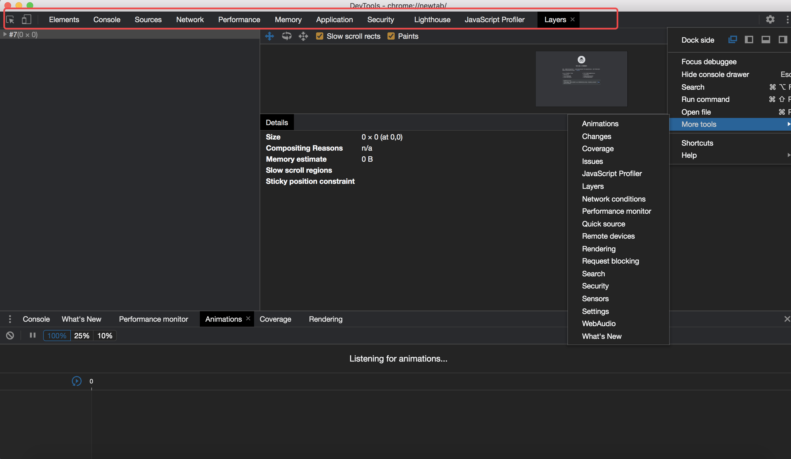

上图中对应的面板说明如下：

#### `设备模式「__」`

可以测试网站在不同分辨率下的显示情况，包括移动设备。

#### `Element`

DOM 检查允许用户动态检查网页的 DOM 结构，对嵌套进行展开折叠等操作。在网页中选中内容，在开发者工具就能 自动选中对应的 DOM 节点。在选中 DOM 节点的同时，用户能够编辑该节点的 CSS。

#### `Console`

在控制台功能中，用户可以查看网页中使用 console 命令输出的信息，这个应用调试和代码跟踪提供了极大的方便。同时，用户还可以直接在控制台中执行 JS 代码，在网页加载完毕后手动调用网页中定义的函数或者访问网页中的变量等。

#### `Sources`

源码查看，用户能够安装域名分组查看网页加载的所有资源内容，静态对代码进行检查。对于 JS 代码，还能在该功能中对代码设置断点，进行单步调试和跟踪，设置跟踪变量，查看调用函数调用栈，查看事件侦听等。
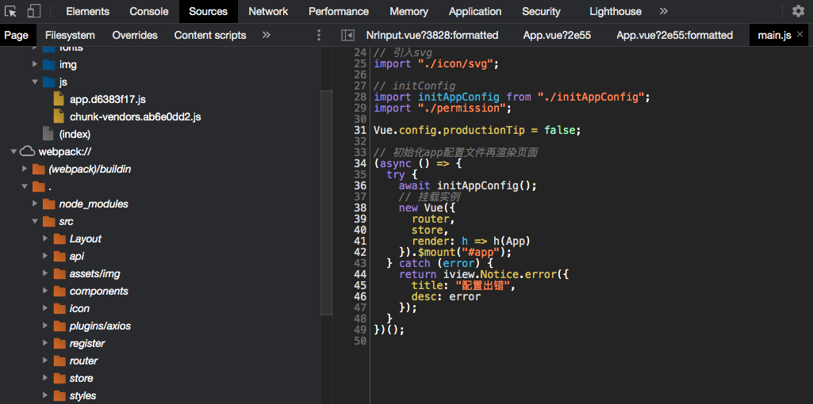

#### `Network`

网络瀑布图，网络瀑布图中为用户详细记录了网页所发出的每一个请求，并且默认按照发起的先后顺序进行排序。在网络瀑布图中，展示了每个请求所花费的时间和每个请求的头信息，为网页调试和性能调优提供强有力的支持。
在这里能看到资源的名称、状态、使用的协议（http1/http2/quic...）、资源类型、资源大小、资源时间线等情况。

#### `Performance`

页面各项性能指标的火焰图，这里能看到白屏时间、FPS、资源加载时间线。

#### `Memory`

可以记录某个时刻的页面内存等情况，一般用于分析内存泄漏。

#### `Application`


在资源管理功能中，按照资源类型对网页中的所有资源进行了分类管理，资源包括图片、JS、CSS、文档、WebSQL、IndexDB、LocalStorage、SessionStorage、Cookies、Cache 和 Service Worker 等。

#### `Security`

用于检测当前页面的安全性。

- 如果被请求的页面通过 HTTP 提供服务，那么这个主源就会被标记为不安全。
- 如果被请求的页面是通过 HTTPS 获取的，但这个页面接着通过 HTTP 继续从其他源检索内容，那么这个页面仍然被标记为不安全。

#### `Lighthouse`

来自 Google 的描述： Lighthouse 是一个开源的自动化工具，用于改进网络应用的质量。 您可以将其作为一个 Chrome 扩展程序运行，或从命令行运行。 您为 Lighthouse 提供一个您要审查的网址，它将针对此页面运行一连串的测试，然后生成一个有关页面性能的报告
会对页面的加载进行分析，然后给出提高页面性能的建议。

#### `JavaScript Profiler`

可以记录函数的耗时情况，方便找出耗时较多的函数。

#### `Layers`

展示一个页面中的分层情况，一个 web 页面由很多层叠加而成。

如前面所示，Chrome 的分析面板有很多，由于性能优化中常用的面板主要是 Network、Performance、Memory，接下来主要讲解这几个面板，至于其他的工具面板建议直接阅读 [Chrome 官方文档](https://developers.google.com/web/tools/chrome-devtools)。

## 分析步骤说明

下面是性能分析需要一些准备工作和分析步骤。

1. 进入隐身模式，这是为了避免浏览器的插件影响。
2. 在 network 面板进行禁用缓存：disable cache
3. 根据网站是 PC 或者移动，调整网络情况为：fast 3G/slow 3G 。
4. 输入任意的测试网站：这里有个例子，可以使用在线页面 [https://www.bilibili.com/](https://www.bilibili.com/)，也可以测试任何项目上的地址。
5. 然后从 Lighthouse 查看总览
6. 对于网络层面的性能问题，进一步从
   1. Network 面板分析
7. 对于渲染层面的性能问题，进一步从
   1. Performance 面板分析
   2. Memory 面板分析（内存泄漏）
   3. ...

一般情况都可以按照上面的流程分析优化，如果预先知道了要分析的问题所在，即可直接跳到对应的步骤，选择关联的面板进行具体的分析，比如内存泄漏问题，可以在内存面板查看比 Performance 更多的信息。

## Lighthouse

LightHouse（以前版本是 Audits），LightHouse 是 Google 开源的一个自动化测试工具，它通过一系列的规则来对网页进行评估分析，最终给出一份评估报告。

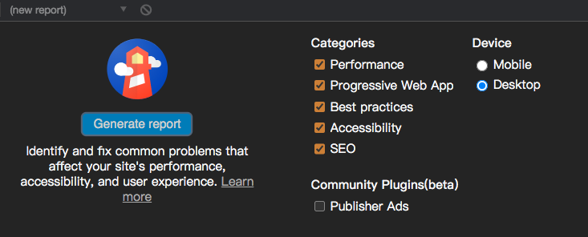

Lighthouse 主要从 性能（Performance）、无障碍使用（Accessibility）、Best Practices、SEO、Progressive Web App 五个方面给网页评估打分，在选择了设备、评估方面、网络情况等选项后，点击生成 report 。


### 整体性能指标情况

关于性能指标这块，下面是简单的解释：

- `First Contentful Paint`：首次内容绘制，标记的是浏览器渲染第一帧内容 **DOM** 的时间点，浏览器首次渲染任何文本，图像（包括背景图像），SVG 或者 `<canvas>` 等元素。
- `Speed Index`：速度指标是一个页面加载性能指标，向你展示明显填充页面内容的速度，此指标的分数越低越好。
- `Larget Contentful Paint`：表示`可视区“内容”最大的可见元素开始出现在屏幕上`的时间点。
- `Time to Interactive`：可互动时间，页面中的大多数网络资源完成加载并且 CPU 在很长一段时间都很空闲所需的时间。此时可以预期 CPU 非常空闲，可以及时的处理用户的交互操作。
- `Total Blocking Time`：
- `Cumulative Layout Shift`：衡量视觉稳定性，比如页面内容的意外移动。

可以点击蓝色切换按钮，查看详细的信息，也可以看看这篇文章 [解读 Web 性能体验和质量指标](./indicator.md)

### 性能指标优化建议

可以看到 Performance 方面建议，主要分为三类：可优化项提示、手动诊断项、通过的审查项。

本次例子如下：


#### 可优化项：

-  合适尺寸的图片。
- 排除渲染阻塞资源。
- 移除无用的 JavaScript 脚本。

这个时候可以借助 webpack 等打包工具进行分析处理。

#### 手动诊断项：

1. 最小化主线程工作
2. 减少 JavaScript 执行时间
3. 避免 DOM 太大
4. 通过有效的缓存策略缓存一些资源
5. 避免链接关键的请求
6. 保持低请求数量和小的传输大小。

这些项目表示 LightHouse 并不能替你决定当前是好是坏，但是把详情列出来，由你手动排查每个项目的情况。这个时候就需要 `network` 和 `performance` 等面板来进一步进行分析了。

#### 通过的审查项

可以看每个条目的 showMore，从优秀的网站学习技巧，然后迁移到自己的项目上来。

## Network（重点）

<!-- performance 和 network、memory 要体现出跟官方文档不一样的地方，实战为主。而不是文档的照搬，是否搬一部分还是怎么样呢？ -->

接下来我们看看你 Network 网络面板的具体细节，Network 用于了解请求和下载的资源文件并优化网页`加载`性能。

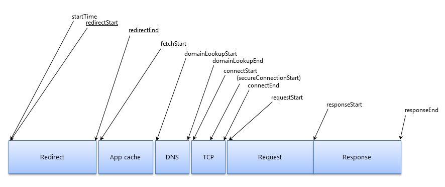

### 网络面板基础

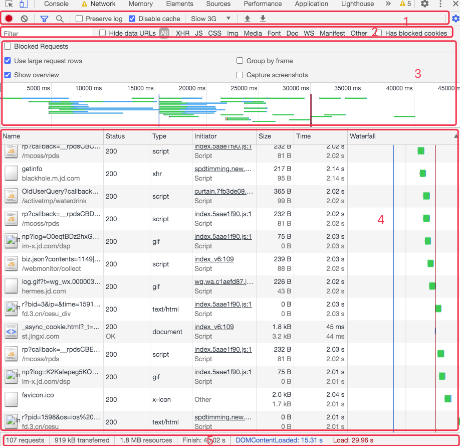

#### 1. Controls（控件）

Controls（控件）：使用这些选项可以设置网络状态、禁用缓存等。


#### 2. Filters（过滤器）

Filters（过滤器）：使用这些选项可以控制在请求列表中显示哪些资源。

可以指定以下条件进行过滤：

- `domain`: 资源所在的域，即 url 中的域名部分。
- `has-response-header`：资源是否存在响应头，无论其值是什么。如 has-response-header: Access-Control-Allow-Origin。
- `is`：当前时间点在执行的请求。比如：running。
- `large-than`：显示大于指定值大小规格的资源。单位是字节（B）、K（KB）、M（MB）等。如 larger-than: 150k。这样可以快速定位比较大的资源文件。
- `method`: 使用何种 HTTP 请求方式。如 GET。
- `mime-type`：也写作 content-type，是资源类型的标识符。如 text/html。
- `scheme`：协议规定，如 HTTPS。
- `set-cookie-name`：服务器设置的 cookie 名称。
- `set-cookie-value`：服务器设置的 cookies 的值。
- `status-code`：HTTP 响应头的状态码。

#### 3. 其他设置

- `Use large request rows`：使用大请求行，Request Table 默认情况下一个资源只显示很小的一行。开启该选项后，可以显示两个文本字段：主要字段和次要字段，这个对于 time 和 size 两个列来说对性能优化分析很有帮助。
- `Show overview`：记录各个资源请求的时间线（Waiting TTFB 和 Content Download）
- `Capture screenshots`： 捕获截图，双击屏幕截图放大，可以切换每一张图片。
  - 

#### 4. Requests Table（请求列表）

此列表列出了检索的每个资源。默认情况下，此表按时间顺序排序，也就是最早的资源在顶部。单击资源名称可以获得更多信息。

默认情况下，请求列表（request table）显示以下列。


- `Name（名称）`：资源的名称。
- `Status（状态）`：HTTP 状态码
- `Type（类型）`：请求的资源 的 MIME 类型。
- `Initiator（发起人）`：发起请求的`对象`或`进程`。它可能有以下几种值：
  - `Parser`（解析器）：Chrome 的 HTML 解析器发起了请求。
  - `Redirect`（重定向）：HTTP 重定向启动了请求。
  - `Script`（脚本）：脚本启动了请求。
  - `Other`（其他）：一些其他进程或动作发起请求，例如用户点击链接跳转到页面，或在地址栏中输入网址。
- `Size`（尺寸）：响应头的大小（通常是几百字节）加上响应数据，由服务器提供。
  - 开启大的行可以查看没被解压之前的数据大小。
- `Time`（时间）：总持续时间，从请求的开始到接收响应中的最后一个字节。
- `Waterfall（瀑布图）`：`Timeline` 列显示所有网络请求的视觉。

在标题栏如（Name 上）右键，可以添加或删除信息列。比如可以多加一列 Response Header => Content-Encoding 选项来总览页面资源的 gzip 压缩情况。

##### 重新发起 xhr 请求

除了通过刷新页面、点击按钮等方式去触发重复的 `xhr` 请求外，还可以通过 `Replay XHR` 实现。

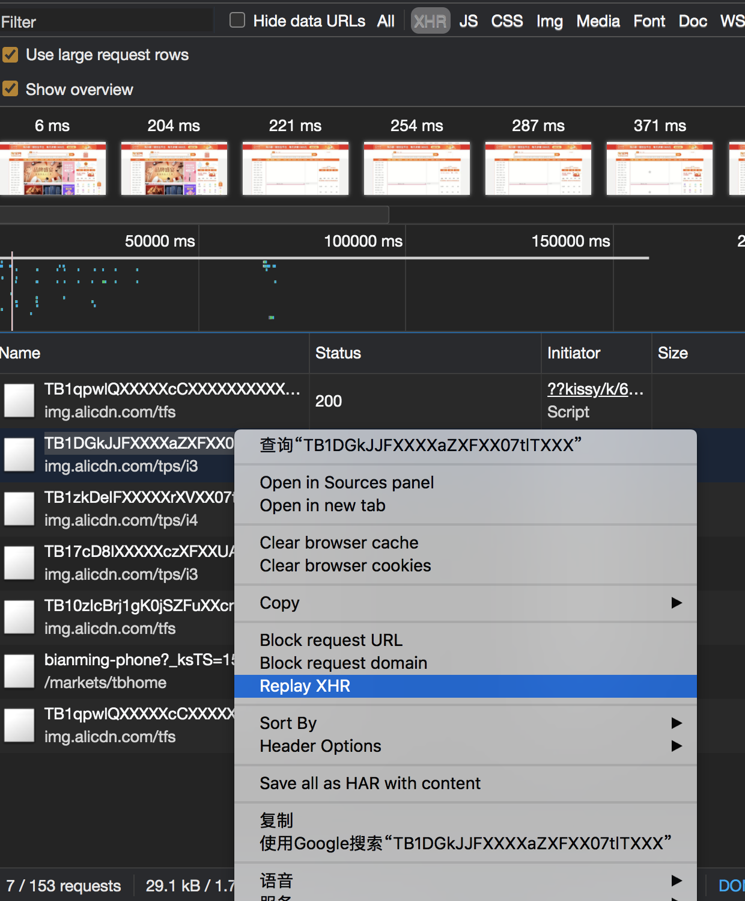

##### Size 和 Time 为什么有两行参数


###### Size 列

- 第一行表示的是数据的传输时的大小，例如上图中的 19.6kB。
- 第二行表示的是数据实际的大小 111 kB。

在服务端采取 gzip 压缩算法将原有 `111kB` 压缩至 `19.6kB`，传输大小缩短 5.6 倍，大大提供了资源传输的效率。

> 注意：`gzip` 压缩只会压缩 `响应体` 内容，所以适用于返回数据量大的时候，如果数据量太小的话，有可能会导致数据传输时的大小比实际大小要大（加入了一些额外的响应头。）

###### 关于 Time 列

- 第一行表示从客户端发送请求到服务端返回所有数据所花费的总时间，对于上图的 655 ms。
- 第二行表示的是从客户端发送请求到服务器端返回第一个字节所表示的时间（TTFB），对于上图来说就是 270ms。

> 第一行的时间代表了所有项目：例如 `解析 dns`，`建立连接`，`等待服务器返回数据`，`传输数据`等。
> 第二行的时间是`总时间`-`数据传输` 的时间。

从上面的分析中我们看到 `从客户端请求到服务器处理结束准备返回数据`花了 270ms，但是在进行`传输数据`的时候花费了 `385ms`。

对于网速慢的用户来说，可能会耗费更长的时间，所以在写代码（接口）的时候，返回的数据要尽量精简。

##### 查看单个资源的详细信息

点击某个资源会展示出详细的网络加载信息：

- Header（标头）：与资源相关的 HTTP 头。
- Preview（预览）：预览 JSON，图片和文字资源。
- Response（响应）：HTTP 响应数据（如果有）。
- Timing（时序）：资源的请求生命周期的明细分类。

##### 查看 HTTP 相关信息

查看请求信息：

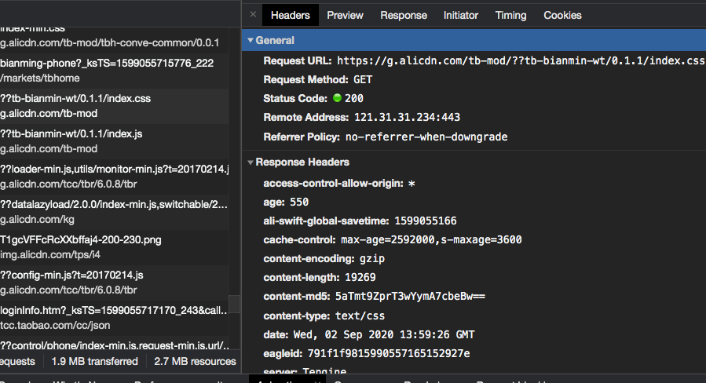

查看响应体：


##### 查看网络时序（Timing）

在生命周期显示在以下类别中花费的时间：

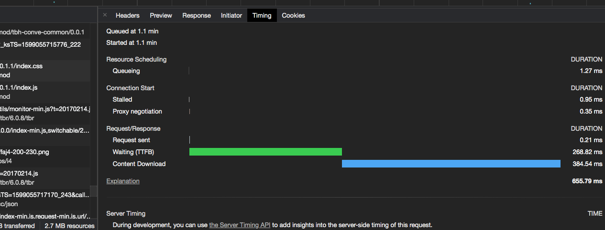

- `Queuing (排队)`

> 1. 浏览器在以下情况下对请求排队
> 2. 存在更高优先级的请求,请求被渲染引擎推迟，这经常发生在 images（图像）上,因为它被认为比关键资源（如脚本/样式）的优先级低。
> 3. 此源已打开六个 TCP 连接，达到限值，仅适用于 HTTP/1.0 和 HTTP/1.1。在等待一个即将被释放的不可用的 TCP socket 浏览器正在短暂分配磁盘缓存中的空间，生成磁盘缓存条目（通常非常快）

- `Stalled (停滞)` - 发送请求之前等待的时间。它可能因为进入队列的任意原因而被阻塞，这个时间包括代理协商的时间。请求可能会因 Queueing 中描述的任何原因而停止。
- `DNS lookup (DNS 查找)` - 浏览器正在解析请求 IP 地址，页面上的每个新域都需要完整的往返(roundtrip)才能进行 DNS 查找- - `Proxy Negotiation` - 浏览器正在与代理服务器协商请求
- `initial connection (初始连接)` - 建立连接所需的时间，包括 TCP 握手/重试和协商 SSL。
- `SSL handshake (SSL 握手)` - 完成 SSL 握手所用的时间 Request sent (请求发送) - 发出网络请求所花费的时间，通常是几分之一毫秒。
- `Waiting (等待绿色)` - 等待初始响应所花费的时间，也称为 Time To First Byte(接收到第一个字节所花费的时间)。这个时间除了等待服务器传递响应所花费的时间之外，还包括 1 次往返延迟时间及服务器准备响应所用的时间（服务器发送数据的延迟时间）
- `Content Download(内容下载-蓝色)` - 接收响应数据所花费的时间(从接收到第一个字节开始，到下载完最后一个字节结束)
- `ServiceWorker Preparation` - 浏览器正在启动 Service
- `WorkerRequest to ServiceWorker` - 正在将请求发送到
- `Service WorkerReceiving Push` - 浏览器正在通过 HTTP/2 服务器推送接收此响应的数据 Reading Push - 浏览器正在读取之前收到的本地数据。

也可以将鼠标悬停在资源的 Timeline（时间轴）图表上，查看此相同的信息。

<!-- 所有网络请求都被视为资源。当它们通过网络检索时，分为不同的生命周期。除了可视化面板外，我们也可以通过 Resoure Timing API 查看关于每个单独资源接收时间的详细信息。Timing API 这块可用于迷你监控平台

 -->

更多的 Network 面板操作细节，建议看 [Network Analysis Reference](https://developers.google.com/web/tools/chrome-devtools/network/reference#top_of_page)。

#### 5. Summary（概要）


- `requests`：告诉你请求的总数，
- `transferred`：查看请求的总大小。
- `resources`：资源
- `Finish`：所有 http 请求响应完成的时间。
- `DOMContentLoaded` 时间
- `Load` 时间

### 常见网络性能原因总结

#### 排队或停止阻塞

很多个请求排队或被阻塞。这表示单个客户端检索的资源太多。在 HTTP 1.0/1.1 连接协议中，Chrome 限制每个域名最多执行 6 个 TCP 连接。如果你一次请求十二个资源，前 6 个将开始，后 6 个开始排队。一旦其中一个请求完成，队列中的第一个请求项目将开始其请求过程。

要解决传统 HTTP 1 的此问题，你需要实现`分域`。即用多个子域名提供服务资源，将资源拆分到多个`子域`中，均匀分配。（或者使用 Websocket 协议）

上面说的修复 HTTP 1 连接数问题，不适合 HTTP 2 连接。如果你已部署 HTTP 2，不要对你的资源进行分域，因为它会影响 HTTP 2 的工作原理。在 HTTP 2 中，TCP 连接`多路复用`连接的。这消除了 HTTP 1 的 6 个连接限制，并且可以通过单个连接同时传输多个资源。

#### 接收第一个字节的时间很慢

`TTFB` 就是等待第一个响应字节的时间，建议在 `200ms` 以下，以下情况可能会导致高 TTFB:

客户端和服务器之间的网络条件差，要么，服务器端程序响应很慢。

为了解决高 TTFB，首先要去除尽可能多的网络连接。其次，提供服务端应用的响应速度，比如`数据库查询`、`缓存`、`web 服务器配置`等。

#### 加载缓慢

如果你看到 `Content Download`（内容下载）阶段花费了很多时间，提高服务响应速度、并行下载等优化措施帮助不大。主要的解决方案是<u>发送更少的字节</u>。（比如，下载一张高质量的大图，可能是几兆，这个时候你需要优化图片）、对资源进行压缩。

<!-- 这里可以联系到 webpack 工具的打包优化 -->

### 实战例子

<!-- 地图服务 -->

#### 清远首屏加载缓慢

下面为项目上解决问题思路的截图：


##### 阻塞问题分析

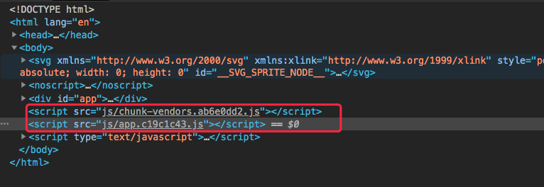

```html
<!DOCTYPE html>
<html lang="en">
  <head>
    <meta charset="UTF-8" />
    <meta name="viewport" content="width=device-width, initial-scale=1.0" />
    <title>阻塞渲染</title>
  </head>
  <body>
    <h1>Hello, Jecyu</h1>
    <h2 id="content"></h2>
    <!-- 1. 第三方库 -->
    <script src="/js/vue.min.js"></script>
    <script src="/js/iview.min.js"></script>
    <link rel="stylesheet" href="/css/iview.css" />
    <!-- 2. 渲染 js -->
    <script src="/js/main.js"></script>
    <!-- <script src="/js/vue.min.js"></script> -->
  </body>
</html>
```

浏览器解析到 script、link 标签时，会同时请求脚本和样式。但是这里它的 js 脚本不会马上执行，直到它前面的请求的资源都加载完毕空闲后，才会执行脚本。

这里可以使用 charles 拦截本地网络请求，进行模拟大脚本的加载问题，比如把 vue.min.js（注意把 localhost 改为 localhost.charlesproxy.com 才可以成功拦截。）

如果把 `vue.min.js` 放到 `main.js` 后，可以看到不影响 `main.js` 脚本的执行，从而可以进行正常的渲染。

知道这个细节后，我们可以得出：

- 把无关紧要的 js 不要放在负责渲染的 js 前面，比如首屏渲染。

<!-- 关于这部分描述：可以进一步看看《高性能 JavaScript 编程》有这部分的描述-->

<!-- 关于 prefetch\preload 的处理-->

<!-- ### 打印底图（网络阻塞、地图出错导致打印问题）

这块后面再补充，再把 performance 过了。

- 阻塞细节
- 阻塞问题 -->

<!-- 关于懒加载、动态加载、打包压缩等后续在网络篇进一步说 -->

## Performance（重点）

说完了 Network，我们再看看 Performance 工具。它的侧重点则在于前端渲染过程，进行时间轴录制来分析在`网页加载`或`用户互动`后发生的每个事件，它拥有帧率条形图、CPU 使用率面积图、资源瀑布图、主线程火焰图、事件总览等模块，它们和渲染息息相关，善用它们可以清晰地观察整个`渲染`阶段，以此参考来提升`运行时性能`。

那么如何使用 Performance 查看性能呢？

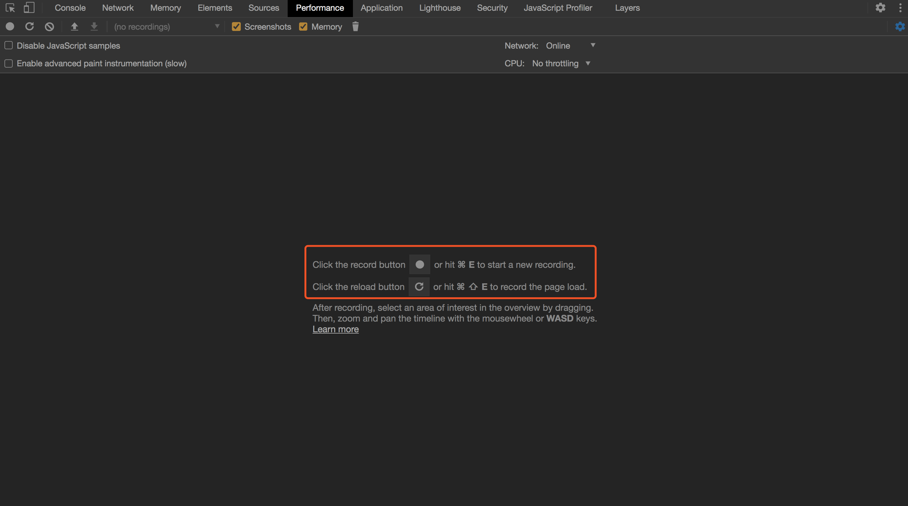

这是 Performance 的默认引导页面。

1. 第一句提示语表示的操作为立即开始记录当前发生的所有事件，点击停止按钮才会记录。
2. 第二句对应的操作则是重载页面并记录事件，工具会自动在页面加载完毕处于`可交互状态时`停止记录，两者最终都会生成报告（生成报告需要大量运算，会花费一些时间）。

### 开始记录

这里以一个简单的 HTML 文件以下，分析它从空白页面到渲染完毕的过程。

```html
<!DOCTYPE html>
<html lang="en">
  <head>
    <meta charset="UTF-8" />
    <meta name="viewport" content="width=device-width, initial-scale=1.0" />
    <meta http-equiv="X-UA-Compatible" content="ie=edge" />
    <title>Document</title>
  </head>
  <body>
    HELLO WORLD
  </body>
</html>
```

我们可以通过第一种方式：

- 点击控制条左边的第一个圆圈，开始记录日志。
- 等待几分钟（正常操作页面）
- 点击 Stop 按钮，Devtools 停止录制，处理数据，然后显示性能报告。

但是对于分析首屏渲染来说，这种手动方式不太准确。我们通过第二种方式 reload 来收集渲染数据，将 beforeunload（所有资源均未被释放） -> unload（所有资源均未被释放，可视区域一片空白） -> Send Request（第一个资源请求）-> load 的过程都记录下来。

> Tip：与台式机和笔记本电脑相比移动设备的 CPU 功率要小得多。无论何时分析页面，都使用 CPU 限制模拟页面在移动设备上的表现。

在工具自动停止记录后，我们就得到了下图的报告。


接下来，开始进行面板功能的说明。

### 面板功能说明

总览如下：

- 进行时间轴录制来分析在网页加载或用户互动后发生的每个事件
- 在 `Overview` (概览)窗格中查看 FPS、CPU 和网络请求。
- 单击 `Flame Chart` （火焰）图表中的事件可查看其详细信息。
- 放大录制的一部分，让分析更方便。

#### 1. 控制面板，用来控制工具的特性。


- `Network` 与 `CPU`：分别限制网络和计算资源，模拟不同终端环境，可以更容易观察到性能瓶颈。 
- 打开`Enable advance paint instrumention`则会详细记录某些渲染事件的细节。
- `Disable JavaScript samples` 选项开启会使工具忽略 JS 的调用栈，减少在手机运行时系统的开销，模拟手机运行时勾选。
- 打开 `Enable advanced paint instrumentation`：启用高级画图检测工具（缓慢）： 则会详细记录某些渲染事件的细节，带来显著的性能开销。

#### 2. 概览面板

简单页面的概览图：


复杂页面的概览图（为了 FPS 更加容易观察）


##### FPS（描述帧率）

描绘每秒钟渲染多少帧图像的指标，帧率越高则在观感上更流畅。绿色竖线越高，FPS 越高。FPS 图表上的红色块表示长时间帧，很可能会出现卡顿。

> FPS （frames per second）是用来分析动画的一个主要性能指标。能保持在 60 的 FPS 的话，那么用户体验就是不错的。
> 为什么是 60 fps 呢？我们的目标是保证页面要有高于每秒 60 fps 的刷新率，这和目前大多数显示器的刷新率相吻合（60Hz）。如果网页动画能够做到每秒 60 帧，就会跟显示器同步刷新，达到最佳的视觉效果。这意味着，一秒之内进行 60 次重新渲染，每次重新渲染的时间不能超过 16.66 毫秒。

##### NET（网络资源情况）

以瀑布图的形式呈现，图中可以观察到各资源的加载时间与顺序。每条横杠表示一种资源。横杠越长，检索资源所需的时间越长。每个横杠的浅色部分表示等待时间（从请求资源到第一个字节下载完成的时间）深色部分表示传输时间（下载第一个和最后一个字节之间的时间）。

- HTML：蓝色
- CSS：紫色
- JS：黄色
- 图片：绿色

对于网络性能的优化，直接使用 network 面板更直观。

##### CPU（使用率）

CPU 资源。**此面积图指示消耗 CPU 资源的事件类型。**在 CPU 图表中的各种颜色与 `Summary` 面板力的颜色是相互对应的，`Summary` 面板就在 `Performance` 面板的下方。CPU 图表中的各种颜色代表着在这个时间段内，CPU 在各种处理上所花费的时间。如果你看到了某个处理占用了大量的时间，那么这可能就是一个可以找到性能瓶颈的线索。

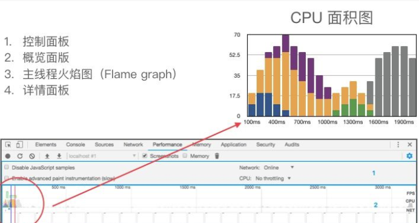

其中纵轴是 CPU 使用率，横轴是时间，不同的颜色代表不同的`事件类型`

|颜色|执行内容|
|--|--|
|<span style="color: white; background: blue;">蓝色</span>，加载（Loading）事件|网络通信和 HTML 解析|
|<span style="color: white; background: yellow;">黄色</span>：脚本运算（Scripting）事件|JavaScript 执行|
|<span style="color: white; background: purple;">紫色</span>：渲染（Rendering）事件|样式计算和布局，即重排|
|<span style="color: white; background: green;">绿色</span>：绘制（Painting）事件|更改外观而不会影响布局，重绘|
|<span style="color: white; background: gray;">灰色</span>：其他（Other）|其他事件花费的时间|
|<span style="color: black; background: white;">白色</span>：其他（Other）|空闲事件|

举例来说，示意图的第一列：总 CPU 使用率为 18，加载事件（蓝色）和脚本运算事件（黄色）各占了一半（9）。随着时间增加，脚本运算事件的 CPU 使用率逐渐增加，而加载事件的使用率在 600ms 左右降为 0；另一方面渲染事件（紫色）的使用率先升后降，在 1100ms 左右降为 0。整张图可以清晰地体现哪个时间段什么事件占据 CPU 多少比例的使用率。


#### 3. 线程面板

线程面板，用以观察细节时间，在概览面板缩小观察范围可以看到线程图的细节。


<!-- ##### 浏览器火焰图

浏览器的火焰图与标准火焰图有两点差异：它是倒置的（即调用栈最顶端的函数在最下方）；x 轴是时间轴，而不是抽样次数。y 轴是栈的调用层。

 -->

<!-- 即这里随着程序时间的运行，对应事件的运行顺序是：Animation Frame Fired -> Function call -> Recalculate Style -> Layout 。

<u>事件的宽度代表执行的次数，如果一个事件或函数的宽度越宽，就表示它被执行的时间越长。</u> -->

<!-- 这里既有 Function call 和 Recalculate Style 分别由 js 引擎线程和 GUI 线程执行的，这两个线程互斥，只有一方在执行。

也就是说，在执行 Parse HTML 的时候，如果遇到 JavaScript 脚本，那么会暂停当前的 HTML 解析而去执行 JavaScript 脚本。 -->

<!-- 而 js 引擎执行完一轮`宏任务 + 微任务`后，主线成就会只执行 GUI 的渲染任务，这个得看主线程的调度，主线程就执行 GUI 的渲染任务。
- 宏任务：script（全局任务）, setTimeout, setInterval, setImmediate, I/O, UI rendering
– 微任务：process.nextTick, Promise, Object.observer, MutationObserver. -->

<!-- #### 浏览器是如何绘制每一帧的

这里每一帧都做了任务 task 包括执行 js，计算样式、布局、绘制等，之后在 composite layer 后，调动 gui 线程进行帧涂层的绘制。

 -->

##### 帧线程时序图（Frames）和网络瀑布图（Network）


可以从时间维度和空间维度分布查看绘制的页面，灰色虚线之间记录了绘制每一帧的事件间隔。

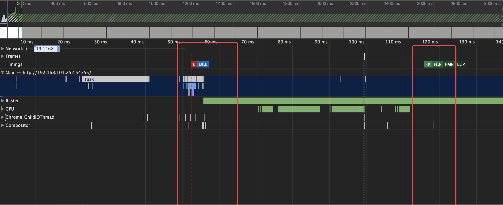

当记录一个网站加载过程中，在事件瀑布图会有三条虚线，红色线代表第一次开始绘制页面，蓝色线代表 DOM 已加载完成，绿色线表示页面加载完成（包括资源引用）。

##### Main 主线程

每个渲染进程（tab）都有一个主线程，并且主线程非常繁忙，既要处理 DOM，又要计算样式，还要处理布局，同时还需要处理 JavaScript 任务以及各种输入事件。

主线程图是用来分析渲染性能的主要图表。不同于「正常」火焰图，这里展示的火焰图是倒置的，即最上层是父函数，越往下则调用栈越浅，最底层的一小格（如果时间维度拉得不够长，看起来像是一小竖线）表示的是函数调用栈顶层。

X 轴代表着事件。每个长条代表着一个 event。长条越长就代表这个 event 花费的时间越长。

Y 轴代表了调用栈（call stack）。在栈里，上面的 event 调用了下面的 event。

Google 官方文档的例子：


如上图：click 事件触发了 `script_foot_closure.js` 第 53 行的函数调用。再看下面，Function Call 可以看到一个匿名函数被调用，然后调用 `Me()` 函数，然后调用 `Set()` 函数，依此类推。

它记录了触发的所有`事件`，这里记录的[事件](https://developers.google.com/web/tools/chrome-devtools/evaluate-performance/performance-reference#scripting_%E4%BA%8B%E4%BB%B6)来自于各个线程：JS 引擎线程解释执行 JS、GUI 线程（解析 HTML，CSS，构建 DOM 树和 RenderObject 树，布局和绘制）、http 请求线程、事件触发线程、定时触发器线程。

<!-- task 任务即是每一帧的执行任务：负责执行 Javascript, 解析 HTML/CSS，完成绘制，最后在 composite layer 合并合各个图层，将数据由 `CPU` 输出给 `GPU` 最终绘制在屏幕上。 -->

默认情况下火焰图会记录已执行 JS 程序调用栈的每层函数（精确到单个函数的粒度），非常详细。


而开启 [Disable JS Samples] 后，火焰图只会精确到`事件级别`（调用某个 JS 文件中的函数是一个事件），忽略该事件下所有的 JS 函数调用栈。


#### 4. 详情面板

Performance 工具中，所有的记录的最细粒度就是事件。这里的事件不是指 JS 中的事件，而是一个抽象概念，我们打开主线火焰图，随意点击一个方块，就可以在详情面板里看到该事件的详情，包括事件名、事件耗时 、发起者等信息。


一般要配合 `Flame Chart` 一起使用。
- `Summary` ：一个饼状图总览，汇总了各个事件类型所耗费的总时长。
- `Bottom-Up`：要查看直接花费最多时间的活动时使用。
- `Call Tree`：想查看导致最多工作的根活动时使用。
- `Event Log`：想要记录期间的活动顺序查看活动时使用。

|事件|说明|
|--|--|
|<span style="color: blue;">Parse HTML</span> |Chrome 执行其 HTML 解析|
|<span style="color: orange;">Event </span>|JavaScript 事件，（例如 「mousedown」）|
|<span style="color: purple;">Layout</span> |页面布局已被执行|
|<span style="color: purple;">Recalculate</span> |Chrome 重新计算了元素样式|
|<span style="color: green;">Paint</span>|合成的图层被绘制到显示画面的一个区域|
|<span style="color: green;">Composite</span> |Chrome 的渲染引擎合成了图像层|

这些事件其实对应着浏览器的渲染过程：


当渲染首屏时，浏览器分别解析 HTML 与 CSS 文件，生成文档对象模型（DOM）与样式表对象模型（CSSOM）；合并 DOM 与 CSSOM 成为渲染树（Render Tree）；计算样式（Style）；计算每个节点在屏幕中的精确位置与大小（Layout）；将渲染树按照上一步计算出的位置绘制到图层上（Paint）；渲染引擎合成所有图层最终使人眼可见（Composite Layers）。

如果改变页面布局，则是先通过 JS 更新 DOM 再经历计算样式到合成图像这个过程。如果仅仅是非几何变化（颜色、visibility、transform），则可以跳过布局步骤。

<!-- ##### 其他（待研究）

- Raster(光栅化)
  - Raster 线程，负责完成某个 layer 或者某些块(tile)的绘制。
- GPU
- Chrome_ChildIOThead
- Compisitor -->

<!-- #### 分析 JavaScript -->

### 常见性能原因分析及总结

#### 一些经验


1. 在性能报告中，有很多的数据。可以通过双击、拖动等动作来放大缩小报告范围，从各种时间段来观察分析报告。
2. 在事件长条的右上角处，如果出现了红色小三角，说明这个事件是存在问题的，需要特别注意。
3. 双击这个带有红色小三角的事件。在 Summary 面板会看到详细信息。注意 reveal 这个链接，双击它会让高亮触发这个事件的 event。如果点击了链接，就会跳转到对应的代码处。

#### 一些总结

#### 避免强制同步布局

- 首先 JavaScript 运行，然后计算样式，到布局。但是，可以使用 JavaScript 强制浏览器提前执行布局。这被称为`强制同步布局`。
- 在 JavaScript，来自上一帧的所有旧布局值是已知的，并且可供你查询。因此，如果你要在帧的开头写出一个元素的高度，可能编写一些以下的代码：

```js
requestAnimationFrame(logBoxHeight);
function logBoxHeight() {
  // Gets the height of the box in pixels and logs it out.
  console.log(box.offsetHeight);
}
```

- 如果在请求此框的高度之前，已更改其样式，就会出现问题，浏览器需要重新计算样式。

```js
function logBoxHeight() {
  box.classList.add("super-big");
  // Gets the height of the box in pixels and logs it out.
  console.log(box.offsetHeight);
}
```

- 正确完成时

```js
function logBoxHeight() {
  // Gets the height of the box in pixels
  // and logs it out.
  console.log(box.offsetHeight);

  box.classList.add('super-big');
}
```

大部分情况下，并不需要应用样式然后查询值；使用上一帧的值就足够了。

### 实战例子

经过上面这些知识，我们现在来看看例子。

#### 一个简单的动画例子


初始状态下，10 个方块会分别上下匀速运动，碰到浏览器边界后原路返回。「Add 10」是增加 10 个这样的方块，「Substract 10」是减少 10 个，「Stop/Start」暂停/开启所有小方块的运动，「Optimize/Unoptimize」优化/取消优化动画。

在默认状态下，我们点击

##### 浏览器是如何绘制每一帧的

在默认状态下，我们点击左上角的圆记录事件，几秒后我们可以点击 Performance 中的 Stop 产生分析数据。在概览面板中我们看到在渡过最初的几百毫秒后，CPU 面积图中各种事件占比按固定周期变化，我们点取其中一小段观察，在主线程图中可以看到一段段类似事件组。

这里每一帧任务 task 包括执行 js，计算样式、布局、绘制等，之后在 composite layer 后，调动 gui 线程进行帧涂层的绘制。


我们点开主线程火焰图的上一栏「Frames」，发现 Composite Layer 事件后不久的虚线出就是下一帧画面出现的节点。

##### 性能问题暴露

目前的动画看着没什么毛病，我们点击 30 次 「Add 10」按钮，增加方块数，可以看到动画出现了明显的卡顿，如果还不感觉卡顿，这时你可以在控制面板里降低 CPU 算力。然后，再次记录性能数据：


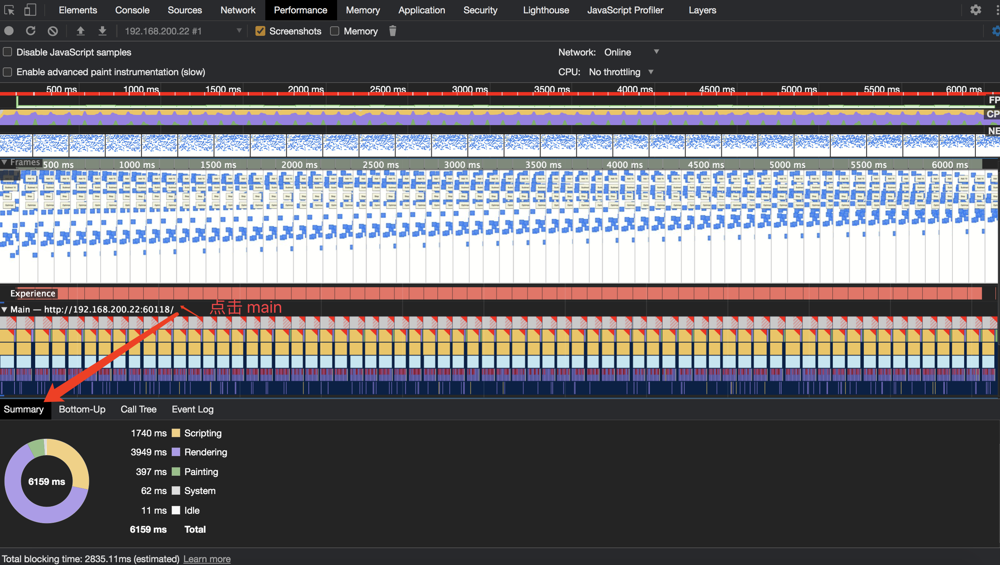

我们看到报告中有多处醒目的红色，包括帧率图上的大红杠、主线程图中的小角标。

再次按照之前的经验思路，查看主线程的细节，我们发现在 app.update 函数下发生的 Recalculate Style 和 Layout 事件都出现了警告，提示性能瓶颈的原因可能是强制重排。进入 js 文件查看详细代码，在左栏可以看到消耗了大量时间的代码行呈深黄色，那么这些代码就可能是问题所在。


##### 分析问题

通过暴露的问题，我们首先来回顾下重排与重绘。简而言之，重排（reflow）和重绘（repaint）都是改变页面样式的步骤。重排步骤包括 Recalculate Style、Layout、Update Layer Tree 等渲染类型时间，重绘步骤包括 Paint 和 Composite Layers 这些绘制类型事件。重排之后必然会造成重绘，而造成重绘的操作不一定会造成重排。

|重新渲染方式|可能造成的原因|
|--|--|
|重排（reflow）|添加、删除、更新 DOM|
||添加、删除、更新 DOM|
||display:[block, flex, inline] <=> none|
||添加样式表，调整样式属性|
||改变窗口大小、字号、滚动页面|
|重绘（repaint）|重排|
||visibility: visible <=> hidden|
||颜色改变|
||其他几何变化...|

更多事件看 https://csstriggers.com/。

由于计算布局需要大量时间，重排的开销远大于重绘，在达到相同效果的情况下，我们需要尽量避免重排。举个例子，如果 display:none 和 visibility: hidden；都能满足需求，那么后者更优。

##### 解决问题

再回头看一下我们的动画 Demo，在 Performance 的详情面板中，饼图显示动画的绘制过程中渲染（重排）占据的大部分的比重，结合代码我们发现原因：循环中多次在刚给 DOM 更新样式为位置后，立即通过 offsetTop 获取 DOM 位置。这样的操作会强制启动重排，因为浏览器并不清楚上一个循环内有没有改变位置，必须立即重新布局才能计算 DOM 位置。


你可能已经注意到了，我们还有一个「Optimize」按钮。

针对这个问题，我们的优化方案是将 `offsetTop` 替换成 `style.top`，后者虽然取的是上一帧动画的元素位置，但并不影响计算下一帧动画位置，省去了重排获取位置的过程，减少了不必要的重排。

我们对比下优化前后的报告图：

首先从饼图和 CPU 面积图看，Rendering 事件占比下滑，Painting 事件占比上升。而从帧率图和 frames 线程图中分别可以看到，帧率明显上升，一帧图像的绘制时间明显下降，意味着东湖流畅性大幅提高，优化目的已达到。再看细节，我们发现绘制一帧东湖的事件组中，app.update 函数里没有了 Recalculate style 和 Layout 事件，整个函数执行时间因此显著下降，证明我们的优化方案起了作用。


<!-- 分析下渲染过程？ -->

<!-- 项目上的例子，也可以放到综合篇（项目篇处理），项目上的优化更加具有说服力。 -->

<!-- 综合篇（综合性能优化） -->

<!-- #### 模型管理系统 拖拽功能 -->

<!-- #### 国土 iview 树性能监控 -->

## Memory（待做）

由于这块个人没更多的实践，可以直接看 Chrome 文档进行实践 [解决内存问题](https://developers.google.com/web/tools/chrome-devtools/memory-problems)

<!-- 可以直接看官方文档。 -->
<!-- 虽然在 Performance 中勾选了 `memory` 是可以看到占用内容的不同组成部分（ex：Heap、node...）在记录过程中的变化，根据变化的情况看到大致的垃圾回收的周期，以及有无明显的内存泄漏的情况。

在 Memory 可以做更加详细的优化。

- JavaScript CPU 分析器
- 内存栈区分析器 -->

<!-- ### 面板基础

### 常见原因总结

### 实战例子

#### 广州一体化目录树 内存泄漏 -->

## 扩展：实时监控

是否经常需要 JavaScript 或者 CSS 进行优化，但是不能找到一个简单的方式来衡量优化的效果？
当然，你可以使用时间轴来记录，但是在大多数情况下，时间轴只记录数据，并不是实时更新的，比如要拖拽滚动等情况下 CPU 使用率和 FPS 帧率。在这点还有其他的性能测量技巧，Chrome DevTools 添加了 “Performance Monitor（性能监控）” 选项卡，可以体现实时性能：


更详细可以看：https://juejin.im/post/5a37b2f56fb9a0451e3fe73d

## 小结

真实项目下的性能问题愈加复杂，我们需要熟练运用 Chrome DevTools，把影响性能优化的因素铭记在心，并在实战中长期积累经验。
