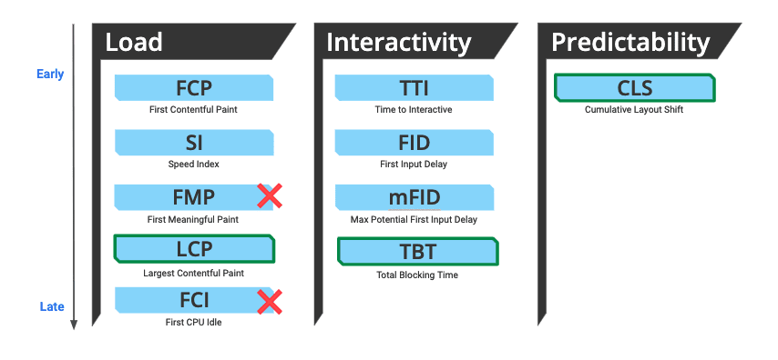
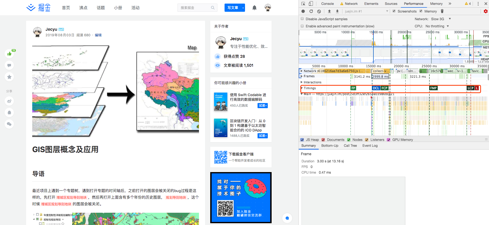
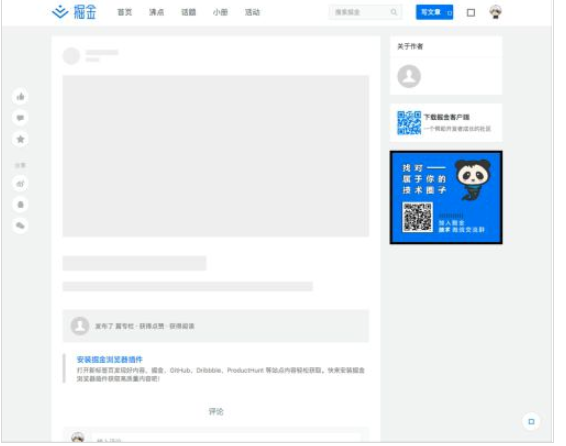
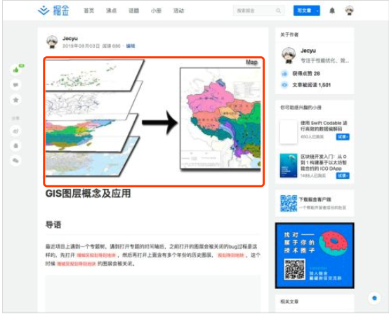
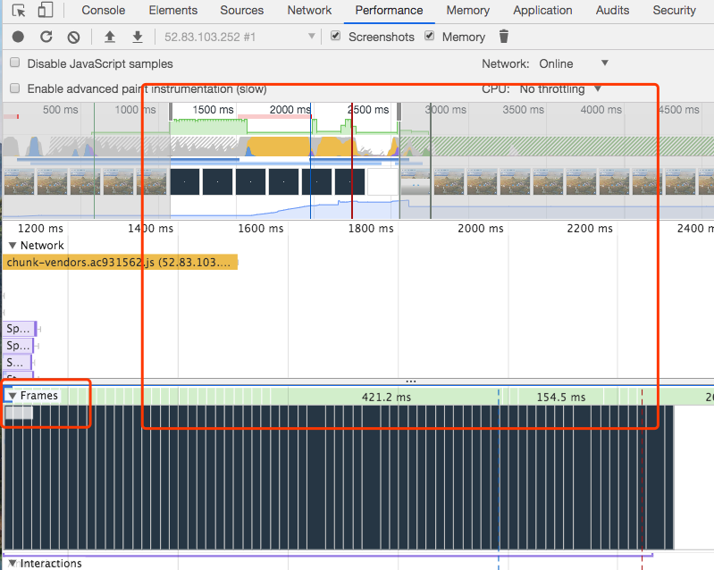
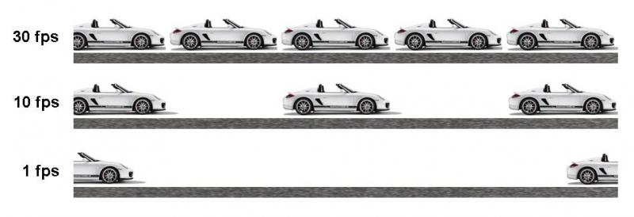
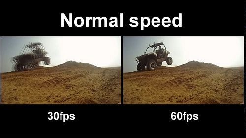

# 解读 Web 性能体验和质量指标



## 前言

衡量一个 Web 页面的体验和质量有很多的指标，性能指标从何而来？从一个网页的生命周期上来。而一个网页实际上就是一张张图片，在网页加载初始化的时候，至少会渲染一次。用户访问的过程中，还会不断重新渲染。

比如以下三种情况，都会导致网页重新渲染。

- 修改 DOM
- 修改样式表
- 用户事件（比如鼠标悬停、页面滚动、输入框输入文字、改变窗口大小等等）。

各种各样的网页性能指标的出现，目的是为了让网页加载和渲染过程中的耗时更加直观、数字化。

**目标读者**

- who：对于 web 繁多复杂的指标不知道如何入手的前端工程师。
- when：当他读完本文后，能够知道从哪些常用指标入手，进行对 Web 应用的性能分析。

本文主要介绍常用的性能指标，更多的指标可以参考 https://www.w3.org/TR/ 官方文档。

**文章大纲**

- 性能指标分类
- 用户体验方面
  - 传统指标
  - 新一代指标
- 如何选择合适的指标

## 性能指标分类

对 Web 应用性能指标如其多，要想做好全流程的优化，我们可以把指标分为以下 3 类：

- **应用方面**：主要从工程师的角度去衡量，比如后端的响应时间，当前并发的用户数、请求数，请求的错误率（500、502）等。
- **用户体验方面**：这类指标用来衡量用户的真实体验，从用户体验的角度触发，比如首屏时间、白屏时间，完全全加载时间之类，即用户能实际感受到网页加载延迟、交互响应延迟等。
- **服务器方面**：这类指标从服务器的角度触发，监测目前服务器的 CPU、内存、网络带宽、流量等物理资源，具体可以看 CPU 使用率情况、磁盘 IO 情况、网络 IO 情况。

## 用户体验指标

对于前端工程师来说，我们更加关注用户体验方面。而用户体验方面又可以分成三类指标：

- 文档加载相关（TTFB、DCL、L）
- 内容呈现相关（FP、FCP、FMP 等）
- 交互响应相关（FID、FPS 等）

<!-- unload 事件是？ -->

上面的分类不太直观，我们直接看看整体的流程：DNS -> TCP -> Requesting -> WebServer -> Transfering -> Parsing。

可以通过 Performance 接口可以获取到当前页面与性能相关的信息，与浏览器对应的状态如下图：


<!-- TODO 画左右红线。 -->

左边部分代表的是网络传输层面的过程，右边部分代表了服务器传输回字节后浏览器的各种事件状态，这个阶段包含了浏览器对文档的解析、DOM 树构建、布局、绘制等。

<!-- - **查找域名**：开始查找域名到查找结束，计算公式为（domainLookupEnd - domainLookupStart）
- **建立连接**：开始发出连接请求到连接成功，计算公式为（connectEnd - connectStart）
- **请求文档**：开始请求文档到开始接收文档，计算公式为（responseStart - requestStart）
- **接收文档**：开始接收文档到文档接收完成，计算公式为（responseEnd - responseStart）
- **domready**：开始解析文档到 DOMContentLoaded 事件被触发,计算公式为（domContentLoadedEventStart - domLoading）
- **load 事件持续**：load 事件被触发到 load 事件完成，计算公式为（loadEventEnd - loadEventStart）
- **完全加载**：开始解析文档到文档完全加载，计算公式为（domComplete - domLoading）
- **首屏加载**：开始解析文档到首屏加载完毕，计算公式为（firstscreenready - domLoading）
- **完全加载【全过程】**：此次浏览最开始时刻到完全加载完毕,计算公式为（domComplete - navigationStart）
- **首屏加载【全过程】**：此次浏览最开始时刻到首屏加载完毕,计算公式为（firstscreenready - navigationStart） -->

以上是 http 请求过程到页面显示的流程，接下来我们看看其中涉及到的具体指标。

### 传统指标 FP、FCP、LCP、DCL、FMP、L

随便打开一个网站如掘金网（PS：可以分别对比访问慢的网站与访问快的网站），然后打开 chrome 控制台，为了更好地查看性能的指标记录，我们设置 Network 为 Slow 3G。

1. 点击 performance 选项
2. 点击重新加载记录
3. 加载完毕，即可看到 Timings 时间线上，分别显示 FP、FCP、FMP、DCL、L、LCP 等几个指标，进行点击可以看到各个指标的使用时间。



#### TTFB（Time to First Byte）

浏览器从请求页面开始到接收第一字节的时间，这个时间段包括 DNS 查找、TCP 连接和 SSL 连接。

<!-- 待完善 -->

#### FP（First Paint） 首次渲染

`FP` 又称之为 First Non-Blank Pain，白屏时间，表示用户首次访问网站时，文档中任一元素首次渲染的时间。

它是时间（Timing）上的第一个“时间点”，代表浏览器第一次向屏幕传输像素的时间，也就是页面在屏幕上首次发生视觉变化的时间，即浏览器渲染任何在视觉上不同于导航前的屏幕内容的时间点。


这里说明下，在 FP 之前，整个界面是白色的，现在 FP 时，body 已经是灰色的背景。

#### FCP（First Contentful Paint） 首次内容渲染

`FCP`：首次内容绘制，标记的是浏览器渲染第一帧内容 **DOM** 的时间点，浏览器首次渲染任何文本，图像（包括背景图像），`SVG` 或者 `<canvas>` 等元素。

`FP` 与 `FCP` 这两个指标之间的主要区别是：`FP` 是当浏览器开始绘制内容到屏幕上的时候，只要在视觉上开始发生变化，无论是什么内容触发的视觉变化，在这一刻，这个时间点，叫做`FP`。


可以看到图片右下角出现了评论图标。

##### 如何改善 FCP

- 加速或减少 HTTP 请求消耗
- 延迟加载
- 压缩体积
- 浏览器渲染原理，减少阻塞渲染 的 JS、CSS

字体加载是影响 FCP 的一个重要因素，字体通常是需要一段时间才能加载的大文件，有些浏览器在加载字体之前会隐藏文本。

```css
@font-face {
  font-family: "Pacifico";
  font-style: normal;
  font-weight: 400;
  src: local("Pacifico Regular"), local("Pacifico-Regular"),
    url(https://fonts.gstatic.com/s/pacifico/v12/FwZY7-Qmy14u9lezJ-6H6MmBp0u-.woff2)
      format("woff2");
  font-display: swap;
}
```

对于自定义字体，还可以采用分段加载的方式，市面上可以使用 `.pbf` 格式，通常的字体库都是以 `ttf` 等格式的，但是 `ttf` 文件通常都比较大，比如宋体的 `ttf` 文件大小为 17.3 M，每次请求都要加载 17.3 M 的数据并且还要去解析，这个对于客户端以及服务端的压力都非常大。而 `pbf（protocol buffer` 是 google 的一个开源项目，用于结构化数据串行化。）分批请求，大大减小请求压力。

#### FMP（First Meaningful Paint）首次有效渲染

`FMP`：首次有效绘制，标记主角元素渲染完成的时间点，主角元素可以是视频网站的视频控件，内容网站的页面框架也可以是资源网站的头图等。
反映主要内容出现在页面上所需的时间，也侧面反映了服务器输出任意数据的速度。`FMP` 时间过长一般意味着 `JavaScript` 阻塞了主线程，也有可能是后端/服务器的问题。



#### DCL（DOMContentLoaded Event）

当 `DOMContentLoaded` 事件触发时，仅当 `DOM` 加载完成，不包括样式表，图片（譬如如果有 async 加载的脚本就不一定完成）。

<!-- ##### 如何改善 -->

#### LCP（Larget Contentful Paint）

表示`可视区“内容”最大的可见元素开始出现在屏幕上`的时间点，也就是下面的文章封面图的区域。



#### L（Onload Event）加载事件

当 `onload` 事件触发时，页面上所有的 `DOM`，样式表，脚本，图片都已经加载完成了。（渲染完毕了）

它跟 `DOMContentLoaded` 很类似，我们也可以在 js 脚本中监听：

```js
window.addEventListener("DOMContentLoaded", (event) => {
  console.log("DOM fully loaded and parsed");
});
window.addEventListener("load", (event) => {
  console.log("page is fully loaded");
});
```

`DomContentloaded`事件与 `onLoad` 事件的区别是，浏览器解析 `HTML` 这个操作完成后立刻触发 `DomContentloaded` 事件，而只有页面所有资源都加载完毕后（比如图片，CSS），才会触发 `onLoad` 事件。

### 重要指标

#### 首屏时间（FSP）

首屏时间是指用户通过终端浏览器打开网页开始到浏览器第一屏渲染完成的时间。最真实的首屏时间要完全基于用户真实显示器第一屏浏览器自然填充并自适应所有分辨率。

Chrome Performance 中的 Timing 没有记录 FSP（First Screen Paint）这个指标。个人认为这是因为这个首屏的记录灵活性很大，很大程度是由应用自身来确定。

因此，这个记录时间是由应用开发者来记录。

常见的打点记录以后端渲染和前端渲染区分有两种方式：



单页面应用使用的是第二种方式。浏览器解析 HTML 是按照顺序解析的，因此看需求决定解析或者渲染某部分的元素即算是首屏完成了，就记录这段时间。

<!-- 虽然没有直接的 FSP记录，但是我们也能通过 LCP、FID 等其他指标组合来评估。 -->

##### 如何改善 FSP

提升资源下载执行时间：

- 按需加载资源
- 把渲染逻辑抽离出来
- 资源压缩等

#### 白屏时间

白屏时间是指浏览器从响应用户输入网址地址，到浏览器开始显示内容的时间。这个通过 Performance 就有记录，也就是 FP（First Paint）。

##### 如何改善

常见的影响白屏时间影响因素有网络、服务端性能、前端页面设计等。比如，为了更快的显示内容，网址会采用骨架屏快速进行占位渲染。

如图（左：骨架屏 中：菊花进度条 右：白纸）


生成骨架屏的方式有：

1. 手写 HTML、CSS 的方式为目标页定制骨架屏。
2. 使用图片作为骨架屏。
3. 自动生成并自动插入静态骨架屏，可以使用插件 [page-skeleton-webpack-plugin](https://github.com/ElemeFE/page-skeleton-webpack-plugin)、[vue-skeleton-webpack-plugin](https://github.com/lavas-project/vue-skeleton-webpack-plugin)。

这里有个[在线例子 /examples/tool/skeleton]()可以看看（记得用 chrome dev 工具设置低速网络），这个示例使用 vue 框架代码，更进一步考虑是在框架代码解析之前就出现骨架屏，解决白屏问题，比如在 html 里直接写，这个看具体情况了。

<!-- 这个骨架屏跟 ssr 不冲突 -->

#### FPS 帧率

无论是传统指标还是新一代指标，它们都是对 FPS 帧率的另外的一个角度的反映。

FPS 是来自视频或者游戏里的概念，即是每秒的帧数，代表视频或者游戏的流畅度。帧率为 25fps，即一秒变化 25 次，而帧率为 100 fps，即一秒变化 100 次，帧率低的由于变化次数少，变化的速率太慢骗不过眼睛，会让玩家明显感觉画面卡顿不流畅。

那在前端开发领域，网页的 FPS 是什么呢？

网页内容在不断变化之中，这些变化发生在首屏渲染以及用户的操作交互的时候。网页的 FPS 是只浏览器在渲染这些变化时的帧率。帧率越高，用户感觉网页越流畅，反之则会感觉卡顿。最优的帧率是 60，即 16.5ms 左右渲染一次。

在浏览器中如何监控帧率呢？

##### 查看帧率

###### 第一种方法

打开 chrome 浏览器控制台，点击左上角工具栏，找到 `More Tools` 中的 `rendering`，勾选上 `FPS meter`。


即可看到左上觉出现帧率的面板显示。

注意，网页不是随时都需要刷新帧，这个工具看到的是每次更新的 `FPS` 值。

可以配合通过以下的操作，进行帧率的观察。

- 修改 DOM
- 修改样式表
- 用户事件（比如鼠标悬停、页面滚动、输入框输入文字、改变窗口大小等等）

###### 第二种方法

1. 打开 `performance` 面板工具，看到 `reload` 后，进行点击。
2. 等待加载完毕后，即可查看记录。



绿色的直方图即代表在页面重新绘制时的帧率，Frames 为每一帧渲染所花的时间。

##### 进行分析

很多时候，密集的重新渲染是无法避免的，比如 scroll 事件的回调函数和网页动画。

**网页动画的每一帧（frame）都是一次重新渲染。**每秒低于 24 帧的动画，人眼就能感受到停顿。**一般的网页动画，需要达到每秒 30 帧到 60 帧的频率，才能比较流畅。**如果能达到每秒 70 帧甚至 80 帧，就会极其流畅。



帧率为 25fps，即一秒变化 25 次，而帧率为 100 fps，即一秒变化 100 次，虽然基于时间的运动速度是一样，但是帧率低的由于变化次数少，变化的速率太慢骗不过眼睛，会让玩家明显感觉画面卡顿不流畅。

大多数显示器的刷新频率是 60Hz，为了与系统一致，以及节省电力，浏览器会自动按照这个频率，刷新动画（如果可以做到的话）。



所以，如果网页动画能够做到每秒 60 帧，就会跟显示器同步刷新，达到最佳的视觉效果。这意味着，**一秒之内进行 60 次重新渲染，每次重新渲染的时间不能超过 16.66 毫秒。**


**一秒之间能够完成多少次重新渲染，这个指标就被称为“刷新率”，英文为 FPS（frame per second）**。60 次重新渲染，就是 60 FPS。

##### 如何改善 FPS

如果想达到 60 帧的刷新率，就意味着 JavaScript 线程每个任务的耗时，**必须少于 16 毫秒**。一个解决办法就是使用 Web Worker，主线程只用于 UI 渲染，然后跟 UI 渲染不相干的任务，都放在 Worker 线程里。

FPS 是 web 性能优化中的一个重要指标，我们可以通过监控这个指标以此来指导优化。

##### 动画实现利器：requestAnimationFrame API

为了更好的理解帧率，我们可以使用 `requestAnimationFrame` 这个 API 实践，`requestAnimationFrame` 是官方推荐的用来做一些流畅动画所应用使用的 API，它的回调有两个特征：

- 在重新渲染前调用。
- 很可能在宏任务之后不调用。

要想实现动画，我们可以通过 `requestAnimationFrame` 来强制刷新帧，例如下面实现把一个方块移动到某一个位置，为了满足比较好的动画效果。需要推算 60 帧/秒（），从而得出一帧 16.7ms

```js
function animate() {
  const element = document.querySelector(".content");
  // 配置
  const during = 1000; // 持续时间
  const durFps = Math.ceil(during / 16.7); // 帧数
  // 动画运动实际上就是 0 ~ 动画总帧数 的过程
  let start = 0; // 开始帧
  const target = 400; // 目标距离
  const speed = Math.ceil(target / durFps); // 速度

  // 动画函数
  const goTo = () => {
    start++; // 帧数递增
    element.style.transform = // 当前的位置
      "translateX(" + Math.min(speed * start, target) + "px)";

    if (start <= durFps) {
      // 如果还没到达位置
      window.requestAnimationFrame(goTo);
    }
  };
  goTo();
}
```

可以使用监控工具查看对应的帧率。

<!-- 每一次调用 requestAnimationFrame 的时间是多长？这个函数会在浏览器每次重新渲染前调用，这个时间调用是不固定的。因此 
const scrollToTop = () => {
  const c = document.documentElement.scrollTop || document.body.scrollTop;
  if (c > 0) {
    window.requestAnimationFrame(scrollToTop);
    window.scrollTo(0, c - c / 8); // 这里是平滑移动，但是时间是看情况的。
  }
};
-->


<!-- 这里可能有同学问，使用 `settimeout` 也能实现，这可能是因为带着「宏任务之间一定会伴随着浏览器绘制」的误解，计算会得到预料之外的结果。

```js
      // 这里宏任务之间不会渲染
      setTimeout(() => {
        document.body.style.background = "red";
        setTimeout(() => {
          document.body.style.background = "blue";
        });
      });
      // 这里添加时间后，大概率渲染
      // setTimeout(() => {
      //   document.body.style.background = "red";
      //   setTimeout(() => {
      //     document.body.style.background = "blue";
      //   }, 1000);
      // });
``` -->

<!-- 这里我们主要关注帧。关于 requestAnimationFrame 深入可以看：[深入解析 EventLoop 和浏览器渲染、帧动画、空闲回调的关系](https://zhuanlan.zhihu.com/p/142742003)。 -->

<!-- 每一轮 Event Loop 都会伴随着渲染吗？
requestAnimationFrame 在哪个阶段执行，在渲染前还是后？在 microTask 的前还是后？
requestIdleCallback 在哪个阶段执行？如何去执行？在渲染前还是后？在 microTask 的前还是后？
resize、scroll 这些事件是何时去派发的。 -->

##### 问题

###### 正常情况下，浏览器不会一直刷新帧率渲染？只会在动画方面或下面提及的三种情况才会重新渲染？

以下三种情况，会导致网页重新渲染。

- 修改 DOM
- 修改样式表
- 用户事件（比如鼠标悬停、页面滚动、输入框输入文字、改变窗口大小等等）

针对这句话：提高网页性能，就是要降低"重排"和"重绘"的频率和成本，尽量少触发重新渲染。前面提到，DOM 变动和样式变动，都会触发重新渲染。但是，浏览器已经很智能了，会尽量把所有的变动集中在一起，排成一个队列，然后一次性渲染，尽量避免多次重新渲染。具体细节后续可以查看渲染篇。

具体来说就是：事件循环，可以看[HTML 官方规范](https://link.zhihu.com/?target=https%3A//html.spec.whatwg.org/multipage/webappapis.html%23task-queue)

- 从任务队列中取出一个宏任务并执行。
- 检查微任务队列，执行并清空微任务队列，如果在微任务的执行中又加入了新的微任务，也会在这一步一起执行。
  进入更新渲染阶段，判断是否需要渲染，这里有一个 rendering opportunity 的概念，也就是说不一定每一轮 event loop 都会对应一次浏览 器渲染，要根据屏幕刷新率、页面性能、页面是否在后台运行来共同决定，通常来说这个渲染间隔是固定的。（所以多个 task 很可能在一次渲染之间执行）
- 浏览器会尽可能的保持帧率稳定，例如页面性能无法维持 60fps（每 16.66ms 渲染一次）的话，那么浏览器就会选择 30fps 的更新速率，而不是偶尔丢帧。
- 如果浏览器上下文不可见，那么页面会降低到 4fps 左右甚至更低。
- 如果满足以下条件，也会跳过渲染：
- 浏览器判断更新渲染不会带来视觉上的改变。
  map of animation frame callbacks 为空，也就是帧动画回调为空，可以通过 requestAnimationFrame 来请求帧动画。

### 扩展：新一代指标 LCP、FID、CLS


从 chrome 83 版本起，又增加了几个性能指标，LCP、FID 以及 CLS，其中 LCP 在上文中已经提及。

#### LCP（Larget Contentful Paint）

最大内容绘制，衡量加载体验，为了提供良好的用户体验，LCP 应该在页面首次开始加载后的 2.5 秒内发生。

通常关注下面的元素：
- `` 元素
- `<image>` 元素内的 `<svg>` 元素
- 通过 `url()` 函数加载背景图片的元素
- 包含文本节点或其他内联文本元素子级的块级元素。

#### FID（First Input  Delay）

即记录用户和页面首次交互操作所花费的时间。FID 指标影响用户对页面交互性和响应性的第一印象。为了提供良好的用户体验，页面的 FID 应当小于 100 毫秒。

#### CLS（Cumlative Layout Shift）

衡量视觉稳定性，比如页面内容的意外移动，在阅读文章的同时文字突然移动了、你突然找不到你阅读的位置了、点按钮的时候按钮被移动到其他地方了，这些原因通常是由于异步加载资源或将 DOM 元素动态添加到现有内容上方的页面而发生的。

为了提供良好的用户体验，页面的 CLS 应保持小于 0.1。可以监测尺寸未知的图像或视频、渲染后的字体等。

#### 查看工具

- 可以安装 web-vitals npm 包
- 也可以使用 chrome 插件 web-vitals。


更多详细的消息可以进一步阅读这篇文章 [解读新一代 Web 性能体验和质量指标](https://segmentfault.com/a/1190000022744550)。

## 如何选择合适的指标

如何选择合适而见效的指标，如果是一般情况下的性能排查问题，白屏时间、首屏时间、FPS 是可以快速监测的，而对于特定情况下，比如需要弄一个性能监控平台，我们还需要记录更多的指标 LCP、FMP等，还包括新一代的指标比如 FID、CLS等。

## 小结

现在我们大概了解 `FP`、`FCP`、`FMP` 以及 `LCP` 这几个指标，`FP` 与 `FCP` 可以让我们知道，这个网站何时渲染；而 `FMP` 与 `LCP` 可以让我们了解我们的网站何时“有用”，站在用户的角度，`FMP` 与 `LCP` 可以表示我们的网站需要多久才能体现出价值。另外，除了使用 chrome Performance 可视化工具外，我们也可以`window.performance` API 进行代码层面自定义监控。

<!-- 其他 TTI、TTFB、Speed Index 可以看
w3c 性能优化工作组 - -->
